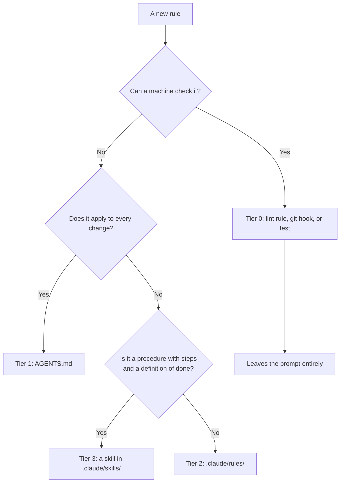

# Agent instruction architecture

AI coding agents read instructions from the repository. This page describes where those
instructions live and why they are split the way they are, so that adding a new rule has an
obvious home rather than landing in whichever file was open at the time.

:::note Source files
This page tracks `AGENTS.md`, `CLAUDE.md`, `.github/copilot-instructions.md`,
`.claude/rules/`, `.claude/skills/` and `.vscode/settings.json`. If you change any of them,
update this page in the same change.
:::

## The file tree

```
generative-art/
├── AGENTS.md                          Tier 1 — the constitution. Tool-neutral, read by
│                                      Claude Code, Copilot, Codex, Cursor and Gemini.
│                                      Non-negotiables, the definition-of-done checklist,
│                                      and an index of everything below.
├── CLAUDE.md                          Imports AGENTS.md. Claude-specific wiring only.
│
├── .claude/
│   ├── settings.json                  Shared tool permissions, committed.
│   ├── settings.local.json            Personal permissions, gitignored.
│   ├── rules/                         Tier 2 — area rules, each declaring a paths: glob so
│   │   │                              it loads only when a matching file is touched.
│   │   ├── vue-components.md          src/components/**, src/views/**, src/assets/styles/**
│   │   ├── lobby-ui.md                src/components/LobbyUI/**, src/views/Games/**
│   │   ├── threejs-views.md           src/views/**, packages/threejs/**, packages/animation/**
│   │   ├── packages.md                packages/**
│   │   ├── tests.md                   **/*.test.ts
│   │   └── docs.md                    documentation/**
│   └── skills/                        Tier 3 — procedures. Read natively by both Claude
│       │                              Code and Copilot.
│       ├── start-issue/SKILL.md       Read the issue, sync main, branch, post the plan.
│       ├── verify/SKILL.md            Drive the running app and confirm it looks right.
│       ├── perf-check/SKILL.md        The performance gate and its thresholds.
│       ├── open-pr/SKILL.md           Rebase, push, PR body, CI, abstraction review.
│       ├── journey-doc/SKILL.md       Decide whether a journey doc is needed, and write it.
│       ├── sync-docs/SKILL.md         Update tutorials that track a file you changed.
│       └── finish-change/SKILL.md     The definition-of-done sweep.
│
├── .github/
│   ├── copilot-instructions.md        Points at AGENTS.md. Copilot-specific wiring only.
│   └── pull_request_template.md       The single source for the PR body format.
│
├── .husky/
│   └── commit-msg                     Tier 0 — enforces the commit convention.
│
├── src/tests/                         Tier 0 — repo-wide contract tests.
│   ├── instructionLinks.test.ts       Every path an instruction file names resolves.
│   └── vitePackages.test.ts           Every package with source is in vite.config.ts.
│
└── documentation/docs/                Explanations, linked from the tier that needs them.
```

## Why it is split this way

Instructions were once a single always-on file set of roughly 950 lines, loaded in full for
every request. That volume is self-defeating: the more text that is always present, the less
weight any individual line carries, and a rule about game overlay dialogs has no business
being in the room for a one-line test fix.

The obvious fix is to tier by scope — universal rules always on, specific rules loaded when
relevant. That turns out to be the wrong axis. What matters is not how broadly a rule
applies but how likely it is to be **silently lost**, and that tracks enforceability instead:

- "Never use `:deep()`" applies everywhere, so scope-tiering keeps it always on. But
  stylelint already rejects it. Forgetting costs five seconds and a failed `pnpm lint:css`.
- "Every new LobbyUI component appears in the showcase" applies to one directory, so
  scope-tiering hides it. But nothing checks it, and a reviewer will not notice an _absent_
  row. Forgetting costs months of nobody knowing.

So rules are routed by `P(silently lost) x cost(loss)`, and the first question is always
whether a machine can check it.



A rule converted into a check leaves every agent's context permanently, works for humans
too, and cannot be forgotten by anyone. That is why Tier 0 sits above the rest.

## Obligations and explanations

The line between an instruction file and this documentation is what the sentence does. If it
tells an agent what it must or must not do, it is an obligation and belongs in a tier. If it
explains how something works, it belongs in `documentation/` and the tier links to it.

Applying that test is what keeps `AGENTS.md` short. The recommended ceiling for a file of its
kind is 150 lines, and the documented anti-pattern is letting it accumulate architecture
narrative, rationale and worked examples — all of which are real content, just not content
that needs to be in front of an agent on every request.

## How the tiers reach each tool

`AGENTS.md` is the cross-tool format, read natively by Claude Code, Copilot, Codex, Cursor,
Aider and Gemini CLI. In VS Code it needs `chat.useAgentsMdFile`, which this repo sets in
`.vscode/settings.json` along with `chat.useNestedAgentsMdFiles` and `chat.useAgentSkills`.

Tier 2 lives in `.claude/rules/`, which both tools discover: Claude Code loads a rule when
its `paths:` glob matches a file being read, and Copilot lists the same directory among its
instruction locations. That is why the rules are there rather than in `.github/instructions/`,
which only Copilot reads — the same reasoning that puts skills in `.claude/skills/`. One
directory, native scoping in both tools, and no pointer files bridging between them.

The one caveat is that `paths:`-scoped rules are not re-injected after `/compact`; they
reload the next time a matching file is touched. Anything that must hold for every request
regardless belongs in Tier 1, not here.

Tier 3 works because skills are selected by description. Only each skill's name and
description are loaded at startup; the body is read when the request matches. The description
is therefore the entire routing mechanism, and it has to state **when to reach for the
skill** rather than what the skill does, in third person, naming the words someone would
actually type. A skill whose description summarises its own workflow risks being followed
from the description instead of being opened.

## Adding to the architecture

Follow the decision tree above. Two rules of thumb keep it from degrading:

- **A skill is a procedure, not a document.** If there is nothing to execute and no
  definition of done, it is a guide in `documentation/` or a Tier 2 rule, not a skill.
- **Moving content means deleting the original.** Extracting a rule into a skill without
  removing the prose it came from produces two copies that will disagree, which is how the
  previous arrangement ended up with two different dev-server ports documented for the same
  task.

## Keeping it honest

The arrangement it replaced decayed quietly: a post-merge ritual pointed at an index file
that was never created, a styling rule named a stylesheet that did not exist, the canonical
worked example referenced a deleted view, and the accessibility rule required Tooltip
components that have never been in this repo. Nothing checked any of it.

Two things guard against a repeat. `instructionLinks.test.ts` fails the build when an
instruction file names a path that does not resolve, and also asserts that `AGENTS.md` stays
under its line ceiling and that every skill description is trigger-shaped. And every pull
request ends with an abstraction review — a section in the PR body asking what the work
produced that should become a rule, a skill, or a check. "Nothing generalizable" is a valid
and common answer; writing it down is what stops the section from becoming a place to invent
rules nobody needed.
