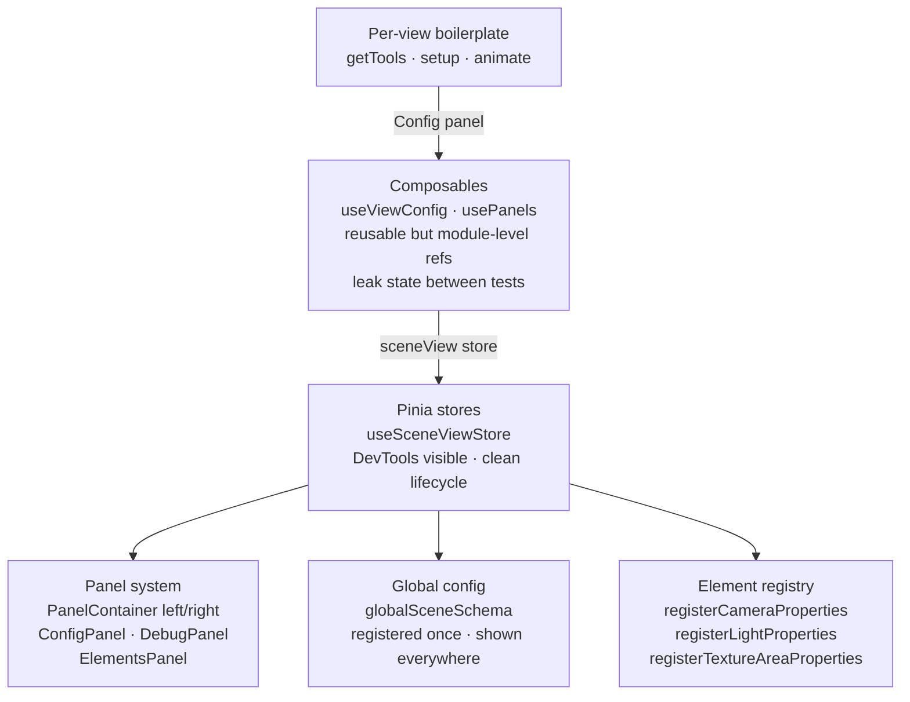
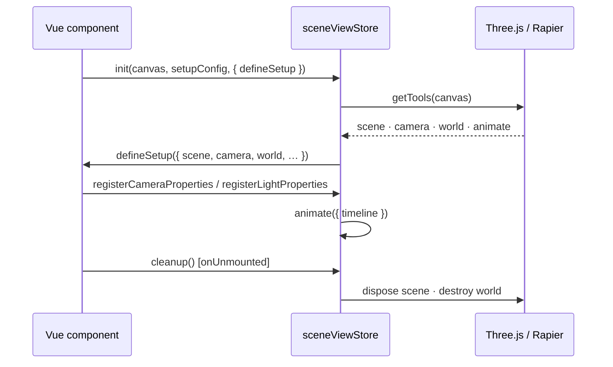
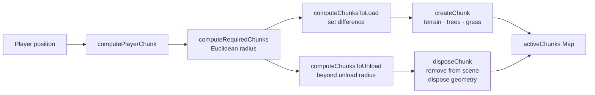

# Architecture Patterns

## Evolution

The codebase grew through three distinct stages: ad-hoc per-view setup, extraction into composables, and finally centralisation into Pinia stores.



---

## Scene Lifecycle

Every Three.js view uses `useSceneViewStore` which wraps `getTools → setup → animate` in a consistent lifecycle.



---

## Chunk Streaming



---

## Panel Registration

Panels are configuration-driven: views register a schema once and all panels update automatically. No per-component wiring needed.

```ts
registerCameraProperties(camera, orbitControls);
registerLightProperties(ambientLight, directionalLight);
```

The global `globalSceneSchema` (frame rate, text selection, bloom, vignette) is always present in every view's Config panel without any per-view registration.
