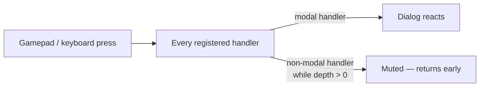

# Dialog Focus Trapping in LobbyUI

When a LobbyUI dialog opens over a game (a leave confirm, a race summary),
every input — keyboard, stick, d-pad, face buttons — must reach only the
dialog. This guide explains how that is achieved.

> **Source files**: `src/composables/useMenuNavigation.ts` (modal scope),
> `src/composables/useMenuFocus.ts` (row navigation),
> `src/composables/useDialogFocusTrap.ts` (the trap),
> `src/composables/useInputDevice.ts` (device tracking),
> `src/components/LobbyUI/LobbyUIConfirm.vue` (reference dialog).
> Update this guide when any of these change.

## The problem

Menu navigation is decentralized: the layout listens for cancel to open the
leave confirm, the header listens for cancel to go back, the editor overlay
has its own roving focus, and the dialog itself listens for confirm/cancel.
All of these register independent `useMenuNavigation` handlers on the same
physical inputs. Without coordination, one circle press can simultaneously
close the dialog, re-open it from the layout, and blur a control in the
background editor.

## The mechanism: a modal scope counter

`useMenuNavigation` keeps a single module-level counter of open modal scopes.

- A handler registered with `{ modal: true }` increments the counter on mount
  and decrements it on unmount.
- Every handler still receives raw input (so device tracking keeps working),
  but a **non-modal** handler returns early whenever the counter is above
  zero.
- Nesting works for free: two stacked dialogs hold the counter at two, and
  background handlers stay muted until the last dialog closes.

This is deliberately a singleton: modality is a property of the whole page,
not of any one component tree.

## The trap composable

`useDialogFocusTrap(dialogRef)` bundles everything a dialog needs:

1. It mounts `useMenuFocus` over the dialog element **as a modal handler**,
   so up/down/left/right move the roving focus across the dialog's
   `data-lui-row` rows and activate clicks the focused control — while every
   background handler is muted.
2. It intercepts Tab and Shift-Tab and cycles focus through the dialog's
   focusable controls, so keyboard focus can never escape into the page
   behind the dialog.
3. It returns the focus-hint state; the dialog renders `LobbyUIFocusHint`
   with it so gamepad users see the "✕ Confirm" chip beside the focused
   control.

A dialog that needs extra bindings on top (the confirm's cancel-on-circle)
registers its own additional handler with `{ modal: true }`, which keeps it
active inside the scope it created.

## Why press-and-hold does not leak

Three guards make opening and closing safe:

- The gamepad poller **primes** its button state on the first poll, so a
  button still held from the press that opened the dialog is recorded as
  held, not fired as a fresh press inside the dialog.
- The modal counter mutes the opener's own handler the instant the dialog
  mounts, so repeat presses cannot re-trigger the opening action underneath.
- Each handler polls the pad on its own interval, so the press that _closed_
  the dialog could still appear as a fresh edge to a background poller a few
  milliseconds after the scope ends. A short **release grace period** keeps
  background handlers muted just after the last modal closes, so that press
  cannot, for example, instantly re-open the dialog it dismissed.

## Device-aware key hints

`useInputDevice` keeps one global "last used device" value, reported from
every controls callback. `LobbyUIKeyPill` reads it and shows only the binding
set for that device — keyboard letters for keyboard players, pad buttons for
pad players — hiding entirely when the current device has no binding.
