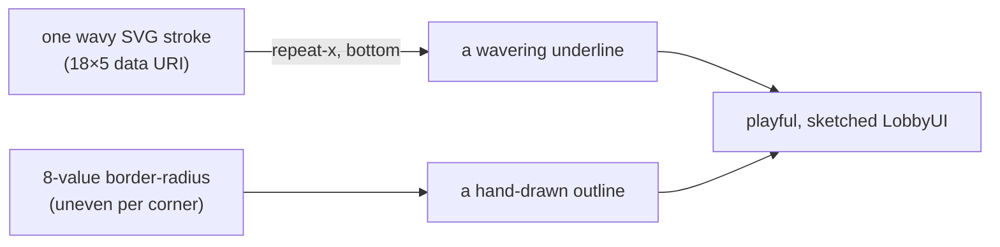

# LobbyUI: Hand-drawn Strokes and Squiggles

The LobbyUI kit pairs a playful hand-lettered font (Darumadrop One) with borders
and underlines that look drawn by hand rather than ruled with a straightedge.
This guide explains the two techniques behind that look — **sketch radii** and
**squiggle lines** — and how to use them.

> **Source files**: `src/assets/styles/lobby-ui.scss` (the tokens). Components
> consume them; new LobbyUI components must reuse these tokens rather than
> inventing their own strokes. Update this guide if the tokens change.

## Why not just a border

A crisp `1px solid` border reads as software chrome — it fights the wobbly,
child's-drawing personality of the font. Two problems had to be solved to make
strokes feel hand-drawn: **corners** that don't look machine-perfect, and
**lines** (underlines, dividers) that waver instead of ruling dead straight.
Both are solved with CSS tokens so every component gets the same treatment for
free.

## Sketch radii: wobbly corners from uneven border-radius

A rounded rectangle normally uses one radius on every corner. The trick is that
`border-radius` accepts **eight values** — a horizontal and a vertical radius
per corner — and making them all slightly different bends each corner by a
different amount, so the outline looks drawn by an unsteady hand instead of
stamped.

| Token                       | Use                                                  |
| --------------------------- | ---------------------------------------------------- |
| `--lui-radius-sketch`       | Buttons and larger controls                          |
| `--lui-radius-sketch-small` | Inputs, chips, small controls                        |
| `--lui-radius-sketch-round` | Circular controls (icon buttons) — a lopsided circle |

The round variant uses percentage radii near 50% but deliberately unequal
(`48% 52% 46% 54% / …`), which turns a perfect circle into a slightly squashed,
organic blob — the difference between a stamped dot and a hand-drawn one.

## Squiggle lines: a wavy stroke tiled as a background

Underlines and dividers use no border at all. Instead they set a **background
image** of one short wavy stroke and tile it horizontally, so the line waves
along its whole length.

The wavy stroke is a tiny inline SVG (a quadratic path, `M0 2.5 Q4.5 0.8 9 2.5 T18 2.5`)
embedded as a `data:` URI — no external file, no extra request. It comes in three
tints so the line can react to state without swapping elements:

| Token                  | Colour      | Typical state               |
| ---------------------- | ----------- | --------------------------- |
| `--lui-squiggle-faint` | 50% white   | resting underline / divider |
| `--lui-squiggle`       | solid white | hover                       |
| `--lui-squiggle-focus` | gold        | focus                       |

To apply one, tile it along the bottom edge:

```css
.control {
  background-image: var(--lui-squiggle-faint);
  background-repeat: repeat-x;
  background-position: left bottom;
  background-size: var(--lui-squiggle-size); /* 18px 5px — one wave */
  background-color: transparent;
}
.control:hover {
  background-image: var(--lui-squiggle);
}
.control:focus {
  background-image: var(--lui-squiggle-focus);
}
```

Because the underline is a background rather than a `border-bottom`, swapping the
image on hover/focus changes only the tint — the element's box and layout never
shift.



## Where they are used

Name and chat inputs draw their underline with a squiggle that brightens to gold
on focus; the multiplayer sidebar separates players with the faint squiggle
instead of a hairline rule; LobbyUI buttons, toggles, config fields and the
private-toggle checkbox all use a sketch radius for their outline. The rule for
new components is simple: **never rule a straight border or a flat underline** —
reach for a sketch radius or a squiggle so the stroke matches the lettering.
