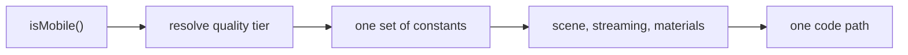

# Making a 3D scene run on a phone

A scene that runs at 60fps on a laptop can crawl on a phone for reasons that
never show up on desktop. This guide covers what is different about mobile, the
order to attack it in, and how to tier quality without forking the scene.

For general cost reduction that applies everywhere, see
[Reducing Triangles, Draw Calls, and Heap MB](./reducing-performance-costs.md).
This guide is about what to do _differently_ when the target is a phone.

## What actually differs

| Constraint         | Desktop          | Phone                                             |
| ------------------ | ---------------- | ------------------------------------------------- |
| Fill rate          | Rarely the limit | Usually the limit                                 |
| Pixel ratio        | 1–2              | 3–4, so 9–16× the fragments                       |
| VRAM               | Gigabytes        | Shared with system memory, often a few hundred MB |
| Draw call overhead | Low              | High — the classic mobile wall                    |
| Sustained load     | Fans             | Thermal throttling after a minute or two          |

The last row is the one most easily missed. A phone can hit 60fps for thirty
seconds and then settle at 30 once it warms up, so a scene tuned against a short
burst is tuned against a number the player will rarely see.

## The order to attack it in

Work down this list. Each step is roughly cheaper to do and bigger in effect
than the one below it.

### 1. Cap the pixel ratio

A phone at `devicePixelRatio` 3 renders nine times the fragments of one at 1.
Capping the renderer at 2 is usually invisible on a small screen and is the
single largest win available. This is a one-line change and should be the first
thing tried, before anything is cut from the scene.

### 2. Shrink textures before removing them

Texture memory is the most common cause of a phone reloading the tab. The trap
is that source size is not memory size: a compressed 300 KB WebP still uploads
as uncompressed RGBA on the GPU.

> A 1024×1024 RGBA texture is 4 MB in VRAM regardless of how small its file is.
> Five of them — a full PBR set — is 20 MB for one object.

Halving a texture's dimensions quarters its memory. Ask what the object actually
covers on screen: a 1K map on something a few dozen pixels across is resolution
nobody can see, and dropping to 512 costs nothing visually while returning 75%
of the memory.

### 3. Drop the maps that cost geometry

Not all PBR maps cost the same. Ranked by what they demand:

| Map            | Cost                                     | Mobile verdict                                 |
| -------------- | ---------------------------------------- | ---------------------------------------------- |
| Colour         | One texture fetch                        | Keep                                           |
| Normal         | One fetch, per-pixel                     | Keep — it carries most of the perceived detail |
| Roughness / AO | One fetch each                           | Consider merging or dropping AO                |
| Displacement   | A fetch **plus** enough vertices to move | Drop first                                     |

Displacement is the expensive one because it is not just a texture — it forces a
subdivided mesh to have anything to act on. Dropping it lets the geometry come
down with it, and a normal map alone carries most of the same impression.

### 4. Reduce geometry that exists only for a dropped map

Segment counts chosen to support displacement are pure waste once displacement
is gone. A sphere at 192 segments is roughly 37,000 triangles; at 32 it is
around 2,000, and at the size the object usually appears the difference is
invisible.

### 5. Cut draw calls before instance counts

Instanced meshes make thousands of objects cheap, but only within one call. A
streamed world usually pays one call per chunk per texture, so the count grows
with the streaming window rather than with how much is on screen.

Shortening the lookahead cuts draw calls and instance counts together, and it is
free wherever the fog closes in before the far edge of the window — geometry
beyond the fog is paid for and never seen. Check the two numbers against each
other before reaching for anything else.

### 6. Thin the scatter last

Reducing how much scenery is placed is the most visible change, so it comes
last. When it is needed, prefer cutting the frequency of small props over
removing a whole layer: a wood with fewer bushes still reads as a wood, one with
no bushes reads as unfinished.

## Tiering without forking the scene

Resist writing a second code path for phones. Two paths means two sets of bugs
and one of them is the one you never look at.

Keep a single scene and vary the numbers it is built from. Constants live in
`config.ts` already; a mobile tier is a second set of values chosen at startup
from `isMobile()` in `@webgamekit/controls`, which the games already use for
touch controls. Everything downstream reads the resolved value and knows
nothing about which tier it came from.

That keeps the difference between tiers auditable in one file, and means a
setting can be tuned for phones without anyone reading the render loop.

## Measure, do not guess

Take the numbers before choosing what to cut. The Debug panel reports live
triangles, draw calls and heap; for anything streamed, work out the counts
arithmetically first, because the streaming window may hold far more than the
frame shows.

A worked example from Rock Runner, an endless runner that streams its world:

| Cost         | Measured                         | Note                                               |
| ------------ | -------------------------------- | -------------------------------------------------- |
| Rock PBR set | 20 MB VRAM                       | Five 1K maps for a ball a few dozen pixels across  |
| Rock sphere  | ~37,000 triangles                | 192 segments, to carry a displacement of 0.06      |
| Scatter      | ~5,000 billboards, 66 draw calls | Six areas across eleven live chunks                |
| Track        | 56 meshes                        | Fourteen chunks, each deck plus terrain plus walls |

Reading that table, the order is obvious and is not the order intuition
suggests: the textures and the sphere are the problem, and the five thousand
billboards — the thing that _looks_ extravagant — are already instanced and cost
sixty-six calls rather than five thousand.

That is the general lesson. The expensive thing is rarely the thing that looks
expensive, and an afternoon spent thinning scenery can return less than one line
capping the pixel ratio.
