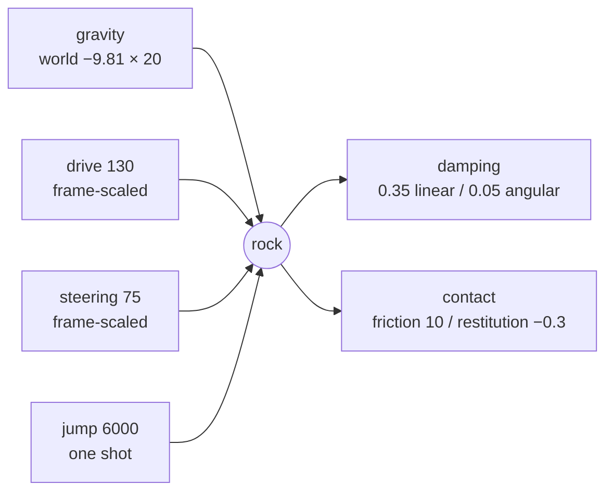

# Every force acting on the rock

A catalogue of what moves Rock Runner's ball, what resists it, and which numbers
govern each. Every figure is the shipped default from
`src/views/Games/RockRunner/config.ts`, and all of them are editable live from
the Player rock element in the elements panel, or from the config panel for the
body's own settings.

For why these values are what they are — particularly why mass is not the weight
lever — see [What it actually takes to make a rolling ball feel
heavy](../journey/rock-runner-weight.md).

## What is simulated at all

Less than the scene suggests. Only two things exist to the physics engine:

| Thing                       | Physics                                                       |
| --------------------------- | ------------------------------------------------------------- |
| The player's rock           | One dynamic ball body                                         |
| The track                   | One fixed trimesh collider per chunk, deck and walls together |
| Other players' rocks        | None — placed from network positions each frame               |
| Debris chips                | None — a hand-rolled particle sim, see below                  |
| Trees, bushes, grass, rocks | None — decoration the rock rolls straight through             |

So every force below acts on exactly one body.

## Continuous forces

These act every frame without anything asking them to.

| Force              | Value      | Notes                                                                                                    |
| ------------------ | ---------- | -------------------------------------------------------------------------------------------------------- |
| World gravity      | −9.81 on Y | Set once for the whole world by the shared Three.js tooling                                              |
| Rock gravity scale | 20         | A multiplier on the world's, giving the rock ≈196 m/s²                                                   |
| Linear damping     | 0.35       | Bleeds off travel; also why apex does not scale with the square of the jump impulse                      |
| Angular damping    | 0.05       | Deliberately low — a gripping ball puts most of its drive into spin, so damping the spin damps the drive |

Gravity scale is the rock's weight. It is a multiplier rather than an
acceleration because a rigid-body world has one gravity and bodies scale it, and
it is worth repeating that it scales acceleration and **not** mass.

## Impulses applied per frame

An impulse is momentum, so each is divided by the rock's mass to become a speed
change. Both of these are applied on every frame the player is driving.

| Impulse  | Value | Direction                                      |
| -------- | ----- | ---------------------------------------------- |
| Drive    | 130   | Along the path tangent                         |
| Steering | 75    | Along the path's right vector, signed by input |

Both are **frame-scaled** before being applied:

```
applied = magnitude × min(delta, 1/20) × 60
```

Without that, an impulse applied once per frame is momentum per _frame_ rather
than per second: the same tuning accelerates twice as hard at 120fps as at 60,
and crawls on a machine dropping frames. The clamp at a twentieth of a second
stops a long frame after a stall catapulting the rock.

### What stops them

Neither impulse is applied unconditionally. The drive stops at a speed cap that
climbs with distance, so a run gets faster the longer it lasts:

| Cap                           | Value |
| ----------------------------- | ----- |
| Starting top speed            | 22    |
| Final top speed               | 46    |
| Distance to ramp between them | 4000  |

Steering stops at a lateral speed cap of 12, **and** at the wall itself. The
second condition is not redundant: a rock held against a wall never gains lateral
speed, so a speed cap alone never engages and the game presses into the wall at
full force for as long as the key is held — which is enough to stall the rock
against its own grip.

## The jump

| Value         |       |
| ------------- | ----- |
| Jump impulse  | 6000  |
| Cooldown      | 0.25s |
| Coyote window | 0.12s |
| Input buffer  | 0.15s |

The jump impulse is applied **once** and is deliberately not frame-scaled, since
it is a single event rather than a per-frame push.

The two grace windows exist because a strict ground test refuses the jump exactly
when a player expects it. Measured along the real track, the rock clears its
resting height on roughly half of all frames purely from rolling over the
undulations. The coyote window keeps a press valid shortly after leaving the
ground; the buffer remembers a press made shortly before landing.

## Contact

Friction and restitution belong to a pair of surfaces, not to one, and Rapier
combines the two colliders' values.

| Property     | Rock | Track |
| ------------ | ---- | ----- |
| Friction     | 10   | 1.4   |
| Restitution  | −0.3 | 0.05  |
| Contact skin | —    | 0.04  |

Restitution below zero is deliberate. A ball that returns none of an impact still
skips off a seam; a negative value absorbs it, which is what reads as heavy stone
rather than rubber.

## Debris

The chips behind the rock are not simulated by Rapier at all — they are a pooled
particle field with its own integration, which is why they have their own
gravity rather than sharing the world's.

| Quantity                   | Value |
| -------------------------- | ----- |
| Gravity                    | −22   |
| Launch speed, backwards    | 4     |
| Launch speed, upwards      | 6     |
| Lateral spread             | 6     |
| Spin                       | 9     |
| Minimum rock speed to emit | 1.2   |

## Quick reference


