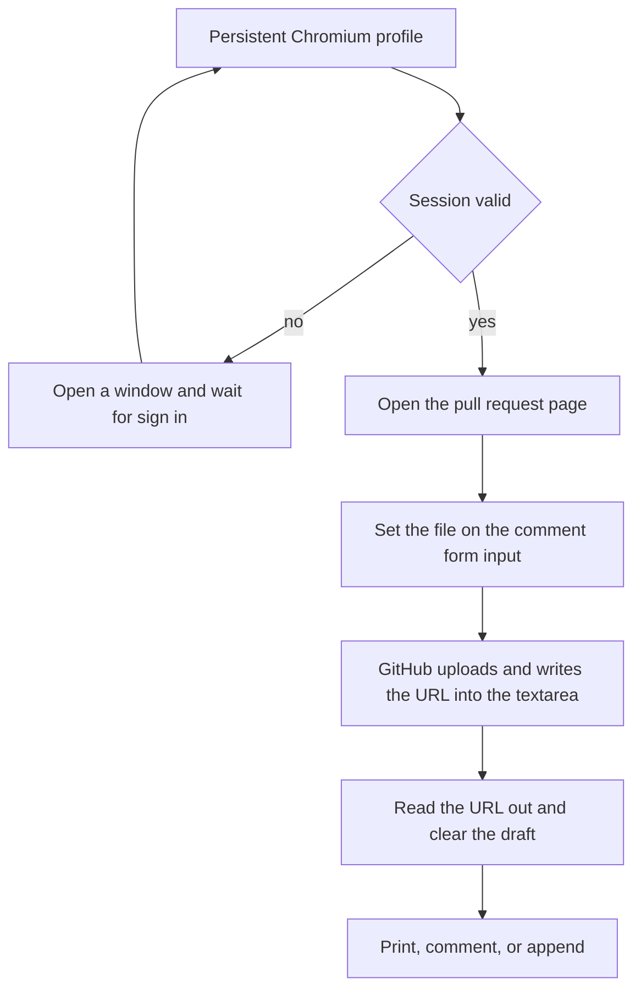

# Showing a video in a pull request

A pull request that changes something moving is reviewed better with a recording of it than with
a still frame and a paragraph. GitHub plays video inline, but only from its own attachment store,
and getting a file in there takes a browser session.

:::note Source files
`scripts/gh-video.mjs`, `scripts/gh-video.test.mjs`
:::

## Use it

```bash
node scripts/gh-video.mjs clip.mp4 --pr 270            # print the asset URL
node scripts/gh-video.mjs clip.mp4 --pr 270 --comment  # post it as a comment
node scripts/gh-video.mjs clip.mp4 --append            # add it to the pull request body
```

Several files in one run upload in one browser session, and their URLs print one per line.
Without `--pr`, the pull request of the current branch is used. Nothing is posted unless
`--comment` or `--append` is passed, so the default run is safe to repeat: it hands back a URL to
paste wherever you want it.

The first run opens a browser window and waits for you to sign in to GitHub. The session lives in
`~/.cache/gh-media-upload` and every later run is headless. When it expires, the window comes
back on its own.

Convert to `.mp4` first. GitHub accepts `.webm` as an upload but will not play it inline, so a
`.webm` clip recorded for the documentation needs a second encode for the pull request:

```bash
ffmpeg -i clip.webm -c:v libx264 -pix_fmt yuv420p -an clip.mp4
```

## Why a browser and not the API

There is no REST or GraphQL endpoint for attachments. Every alternative fails against GitHub's
real comment renderer, which is stricter than the `/markdown` API endpoint:

| What                                                       | What GitHub does               |
| ---------------------------------------------------------- | ------------------------------ |
| `<video src>` or `<video><source>` in markdown             | stripped to an empty paragraph |
| A link to an `.mp4` on `raw.githubusercontent.com`         | stays a plain link             |
| A link to a release asset                                  | stays a plain link             |
| A `user-attachments/assets/<uuid>` URL with a made-up UUID | stays a plain link             |

The player is not something the markdown can ask for. GitHub looks the attachment up in its own
database, finds a video content type, and emits the `<video>` element itself, pointing at a
short-lived signed URL on `private-user-images.githubusercontent.com`. So the file has to be a
real upload through `/upload/policies/assets`, and that endpoint authenticates by web session
only. A `gh` token cannot reach it.

## How the script gets there



The upload happens on the pull request page because that page still serves the old
`<file-attachment>` comment form, which contains a real `input[type=file]` that Playwright can
set directly. The new issue composer has already migrated away from it and exposes no file input
at all, so the same trick there uploads nothing and times out. If a run starts failing on
`#fc-new_comment_field`, that migration has reached the pull request page too, and the upload has
to move to a drag-and-drop `DataTransfer` on the editor instead.

Reading the URL back out of the comment textarea is what makes the file addressable. The draft is
then cleared, so an unsent half-written comment is never left sitting on the pull request.

## Where the clip comes from

[Capturing screenshots and video for the docs](./capturing-documentation-media.md) covers
recording the app with Playwright and cutting the seconds that matter out of the recording. The
same clip serves both purposes: `.webm` for the documentation, a second `.mp4` encode for the
pull request.
