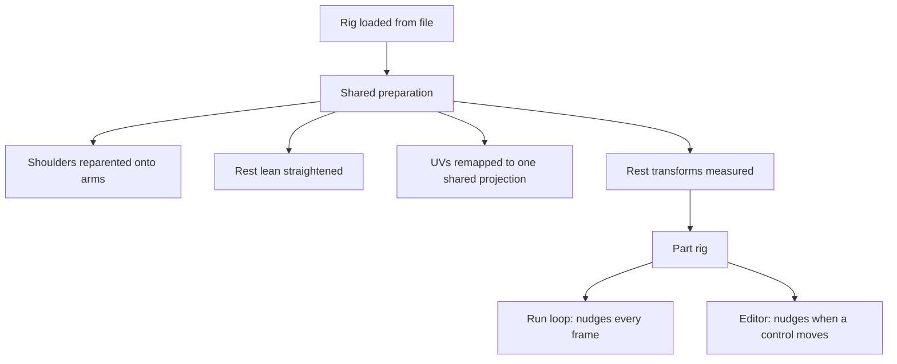
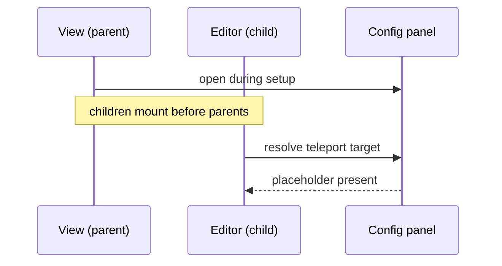

# Avatar Editor

## Goal

Give the stickman rig a single place to be dressed and reshaped: paint every one
of its material maps directly on the model, and nudge each limb's position and
size, without leaving the view or editing the model file.

Two pieces of behaviour already existed, in places that could not see each
other. Texture painting lived in a sphere-based material playground, where the
paint target happened to be a primitive. Limb resizing lived inside the Rock
Runner run loop, where it had grown up as a way to close gaps a texture revealed
on a running character. Neither was reusable where the other was.

## Splitting the rig from the game that grew it

The limb logic was never really about running. It measures each named node's
rest transform once, then offsets position and multiplies scale against that
fixed baseline, so a repeated apply never compounds onto the previous frame's
result. Nothing in that depends on a track, a physics body or a race.

Pulling it into a shared module left the game reading exactly the same
behaviour it always did, and gave the editor the same guarantees for free: the
same rest baseline, the same arm spread default, the same one-time preparation
of the rig before anything else touches it.

That preparation turned out to be the part worth sharing most. The rig arrives
in a state that is subtly wrong for both consumers in identical ways — its
shoulder caps are parented to the torso rather than to the arms they sit
against, its arms rest at a slight outward lean, and every mesh part carries its
own full-range UVs. Each of those has to be corrected before a limb nudge or a
painted texture reads correctly, and getting one of them wrong is invisible
until a texture is applied.

## Painting onto a rig instead of a primitive

Painting works by casting a ray at the model and reading the surface coordinate
where it lands. On a sphere that coordinate is well defined everywhere. On a
rig, it is only meaningful because every part was already remapped onto one
shared front-and-back projection — the same remapping that makes a flat texture
read as one picture wrapped around the body rather than as the whole image
squeezed onto each limb independently.

That projection has a documented blind spot: faces pointing sideways, up or
down have no place in a flat front-or-back layout, so they are all parked on a
single coordinate. Left alone, clicking the edge of a limb dumps paint in the
corner of the texture instead of where it was aimed. Treating that parked
coordinate as "not a paintable surface" is enough to make the edges simply
ignore the brush.

The same projection explains why the default texture is a body template rather
than a blank sheet. Because the layout is fixed by the rig's own proportions,
an outline drawn in that layout lands exactly on the limbs it describes, which
turns a blank canvas into something with landmarks to aim at.

## Two rendering assumptions that do not survive an orthographic camera

A flat, straight-on view is the right camera for painting a front-and-back
projection: what is drawn maps to what is seen without foreshortening in the
way. Two things behaved differently under it than expected.

An environment image set as the scene backdrop is projected through the camera,
and that projection assumes perspective. Under an orthographic camera it
resolves as a misplaced patch floating in the middle of the frame rather than
as surroundings. The image is still correct as a reflection probe — the
material samples it fine — so the fix was to keep it as a probe only and put a
flat colour behind the rig, which is also the more honest backdrop for judging
a texture against.

Framing was the second. A constant frustum size only ever fits one rig at one
scale. Measuring the model's own bounds after it loads, centring it, and sizing
the view to that measurement keeps the framing correct regardless of what the
model turns out to measure.

## A teleport target that does not exist yet

The editor renders its painting toolbar into the config panel, which is
elsewhere in the application's tree, by teleporting into a placeholder that the
panel provides. The view that opens that panel is the editor's parent.

Children mount before parents. With the panel opened from the parent's mount
hook, the child had already tried to find the placeholder and found nothing —
surfacing as an obscure failure about setting a property on nothing, with the
whole painting interface silently absent while the 3D view itself looked
perfectly healthy.

Opening the panel while the parent is still setting up, rather than after it
mounts, puts the placeholder in the same render pass the child resolves against.

The general shape is worth remembering: whenever a child teleports somewhere a
parent is responsible for creating, the parent has to create it before mounting
begins, not during its own mount.
