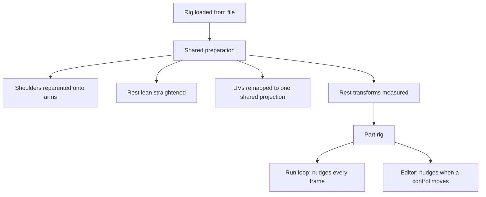
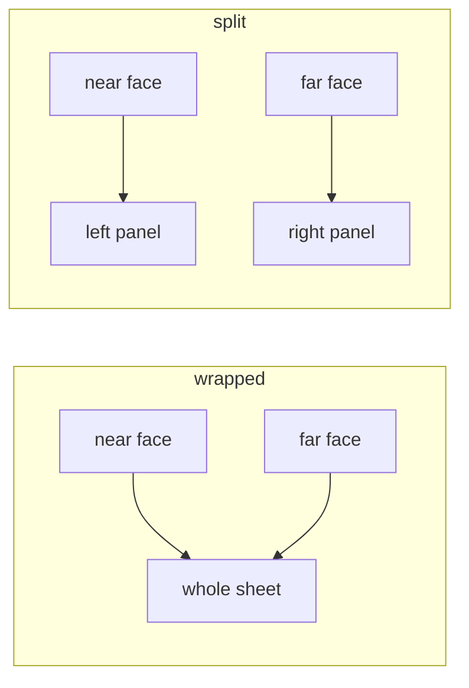
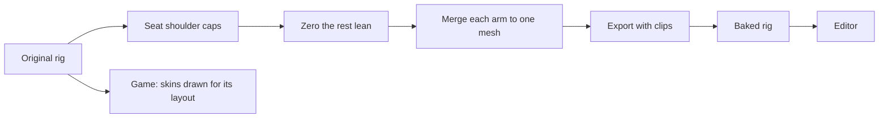
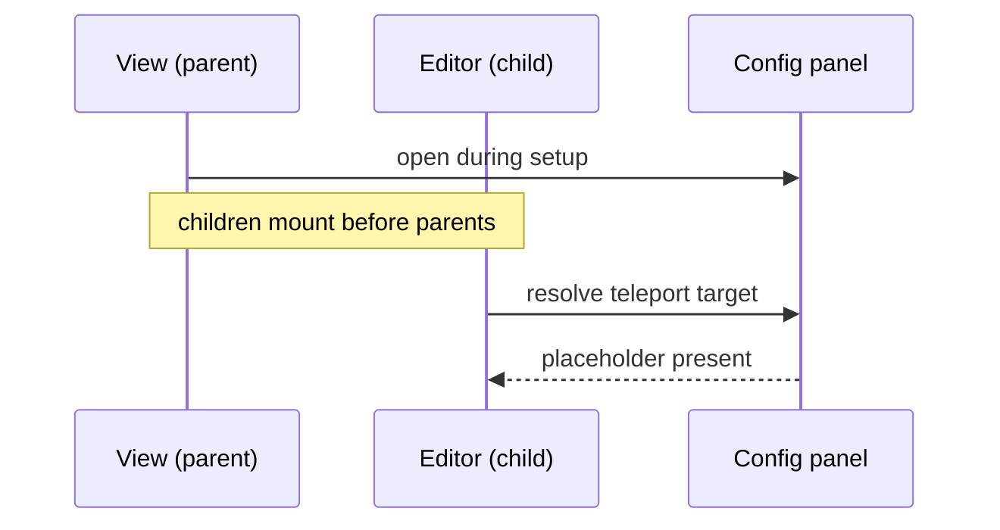

# Avatar Editor

## Goal

Give the stickman rig a single place to be dressed and reshaped: draw on it
directly, front and back, and nudge each limb's position and size, without
leaving the view or editing the model file.

Two pieces of behaviour already existed, in places that could not see each
other. Texture painting lived in a sphere-based material playground, where the
paint target happened to be a primitive. Limb resizing lived inside the Rock
Runner run loop, where it had grown up as a way to close gaps a texture revealed
on a running character. Neither was reusable where the other was.

## Splitting the rig from the game that grew it

The limb logic was never really about running. It measures each named node's
rest transform once, then offsets position and multiplies scale against that
fixed baseline, so a repeated apply never compounds onto the previous frame's
result. Nothing in that depends on a track, a physics body or a race.

Pulling it into a shared module left the game reading exactly the same
behaviour it always did, and gave the editor the same guarantees for free: the
same rest baseline, the same arm spread default, the same one-time preparation
of the rig before anything else touches it.

That preparation turned out to be the part worth sharing most. The rig arrives
in a state that is subtly wrong for both consumers in identical ways — its
shoulder caps are parented to the torso rather than to the arms they sit
against, its arms rest at a slight outward lean, and every mesh part carries its
own full-range UVs. Each of those has to be corrected before a limb nudge or a
painted texture reads correctly, and getting one of them wrong is invisible
until a texture is applied.

## Painting onto a rig instead of a primitive

Painting works by casting a ray at the model and reading the surface coordinate
where it lands. On a sphere that coordinate is well defined everywhere. On a
rig, it is only meaningful because every part was already remapped onto one
shared front-and-back projection — the same remapping that makes a flat texture
read as one picture wrapped around the body rather than as the whole image
squeezed onto each limb independently.

That projection has a documented blind spot: faces pointing sideways, up or
down have no place in a flat front-or-back layout, so they are all parked on a
single coordinate. Left alone, clicking the edge of a limb dumps paint in the
corner of the texture instead of where it was aimed. Treating that parked
coordinate as "not a paintable surface" is enough to make the edges simply
ignore the brush.

The same projection explains why the default texture is a body template rather
than a blank sheet. Because the layout is fixed by the rig's own proportions,
an outline drawn in that layout lands exactly on the limbs it describes, which
turns a blank canvas into something with landmarks to aim at.

## Giving the two faces a half each

The projection was built to fold one image around the rig like paper: one face
samples the sheet mirrored against the other, so whichever side is being looked
at reads the right way round. Turning the rig through half a turn produced a
pixel-identical view, which is the technique working exactly as designed.

It is also the wrong thing for an editor. Both faces share every texel, so a
mark painted on the chest appears on the back as well, and no amount of care
lets a character have a face on one side and a backpack on the other. The
projection gained a second layout: rather than sending both faces to the same
coordinates, each is landed on its own half of the sheet, keeping the mirroring
within that half so each side still reads correctly from its own viewpoint.

The two layouts are mutually unintelligible: a texture painted for one is
nonsense on the other. That is why the choice is a parameter with the original
as default rather than a change of behaviour — the running game's three skins
are authored as single sheets, and switching them over would mean redrawing
each as two panels. The consequence to keep in mind is that the editor and the
game currently disagree, so a texture authored here does not yet drop into the
game unchanged.

The sheet became two squares side by side rather than one square split down the
middle, so each face keeps the full resolution and proportions it had before
instead of being squeezed into half the width. That change is what surfaced a
bug hiding in the painting code: canvas coordinates were derived by scaling both
axes by the canvas _width_, which is indistinguishable from correct for as long
as the canvas stays square. On a sheet twice as wide as it is tall, every stroke
landed at twice the depth it was aimed at — a brush aimed at the chest painting
the shin. Worth remembering as a class of bug rather than an incident: a square
default hides every place where one dimension was used to mean both.

## Two rendering assumptions that do not survive an orthographic camera

A flat, straight-on view is the right camera for painting a front-and-back
projection: what is drawn maps to what is seen without foreshortening in the
way. Two things behaved differently under it than expected.

An environment image set as the scene backdrop is projected through the camera,
and that projection assumes perspective. Under an orthographic camera it
resolves as a misplaced patch floating in the middle of the frame rather than
as surroundings. The image is still correct as a reflection probe — the
material samples it fine — so the fix was to keep it as a probe only and put a
flat colour behind the rig, which is also the more honest backdrop for judging
a texture against.

Framing was the second. A constant frustum size only ever fits one rig at one
scale. Measuring the model's own bounds after it loads, centring it, and sizing
the view to that measurement keeps the framing correct regardless of what the
model turns out to measure.

## A walk cycle that turns the model around

The rig ships its own clips, and the shared helper that binds them to a mixer
does one more thing on the way past: it turns the model a half-turn. That is
correct for the context it grew up in, where a character runs away from the
camera down a track, and exactly wrong for one being painted from the front —
binding the animation would have quietly shown the rig's back.

Building the clip map directly avoids the turn while still handing off to the
shared playback helper for the part that carries real logic: fading between
actions and advancing the mixer. The lesson is narrower than "avoid the
helper" — it is that a helper doing setup plus an unrelated orientation fix is
two jobs, and only one of them travels.

Stopping the cycle returns the rig to the pose the model file authored, which
has to be captured before any clip has written over it and restored for the
whole rig rather than only the limbs the panel names — a clip writes to
whatever nodes it likes. The root is deliberately left out of that capture: it
carries what the view owns rather than the model, the camera's framing and
however far the pointer has turned the figure, and restoring it too yanked the
rig back to front and centre every time the walk stopped. The panel's own limb
nudges are re-applied rather than restored from the capture, or stopping would
silently undo any slider moved while it was running. They are reasserted after
each animated frame, because the clip drives rotation on exactly the nodes
whose position and scale the panel owns.

## Baking the fixes into a rig of its own

Two of the rig's quirks were being corrected at load time on every run: the
shoulder caps reseated onto their arms, and the rest lean straightened. A third
could not be fixed that way at all.

The arms are authored as three separate meshes — a body and a cap at each end,
where the shoulder cap is its own piece sized for the torso it used to hang
from. Matching the two ends by handing the shoulder the far cap's geometry does
make them look alike, and is wrong for a subtler reason: two meshes then share
one UV attribute, and the projection writes UVs per geometry, so whichever mesh
it reached last would decide the coordinates for both. The fix that actually
holds is to stop having two meshes.

Merging is not something to redo sixty times a second, or even once per load,
so the prepared rig was exported as its own model. The recipe, for whenever it
needs regenerating: load the original, seat each shoulder cap on its arm, zero
the arms' rest lean, then for each arm bake every descendant mesh's transform
into its vertices, merge them into one geometry, and hang the single result off
the arm node. Export with `GLTFExporter`, and hand it the clips explicitly —
it does not walk the model for animations, and a rig that has lost its walk
cycle is not the rig you started with.

The game keeps loading the original, because its three skins are drawn against
that layout. The load-time corrections therefore stay in the shared preparation
for the game's sake, and simply find nothing to do on the baked rig.

## A seam that only showed from an angle

The shoulder caps sat slightly behind the arms they belong to, visible from
every viewpoint except dead ahead — which is exactly the viewpoint the editor
opens on, and why it survived being looked at for so long.

Reparenting a cap onto its arm preserves world transform, which is normally the
right thing and is why the caps travel with a spread arm at all. It also
faithfully preserves any discrepancy that was already there. Reading the model
file's own node table rather than guessing showed one: both caps are authored as
children of the torso at depth zero, while both arm sockets sit a fraction
forward of that. The reparent kept the gap perfectly.

Seating each cap on its arm's own origin — which is the socket — closes it, and
has a second benefit: a child at the origin does not swing when its parent
rotates, so the cap now turns about its own centre through the walk cycle
instead of orbiting a lever arm.

The general lesson is about measurement. The fix took one look at the authored
transforms and was obvious from them; it would have taken a long time to reason
out from the rendered result, where a two-centimetre offset on a stylised rig
reads as "something looks slightly off".

## A teleport target that does not exist yet

The editor renders its painting toolbar into the config panel, which is
elsewhere in the application's tree, by teleporting into a placeholder that the
panel provides. The view that opens that panel is the editor's parent.

Children mount before parents. With the panel opened from the parent's mount
hook, the child had already tried to find the placeholder and found nothing —
surfacing as an obscure failure about setting a property on nothing, with the
whole painting interface silently absent while the 3D view itself looked
perfectly healthy.

Opening the panel while the parent is still setting up, rather than after it
mounts, puts the placeholder in the same render pass the child resolves against.

The general shape is worth remembering: whenever a child teleports somewhere a
parent is responsible for creating, the parent has to create it before mounting
begins, not during its own mount.
