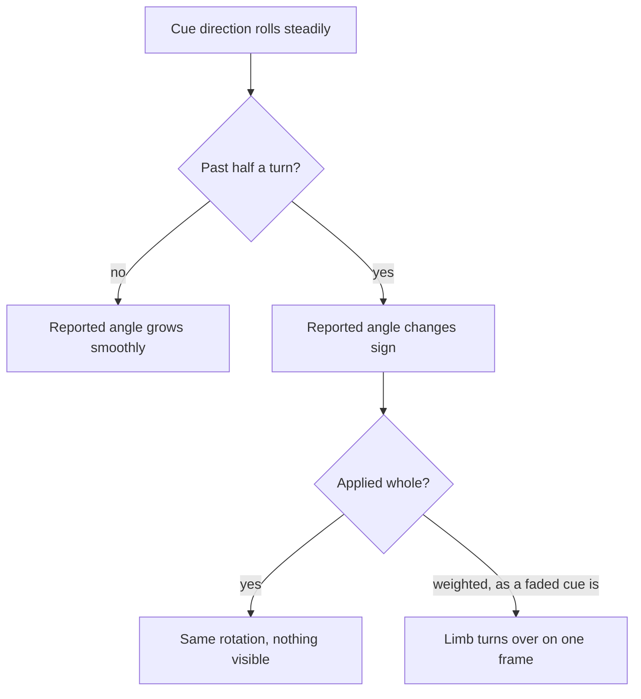

# The Roll That Turns a Limb Over

Why an arm in a camera capture would spin half a turn on a single frame and stay there, why
slowing it down did not help, and what finally told a flip apart from a movement.

## Two directions cannot say more than half a turn

A bone's swing, where it points, comes from the detected body directly: the upper arm points at
the elbow, the thigh at the knee. Its roll, how it is turned about its own length, has no
landmark of its own. It is inferred from a second direction, a cue: which way the forearm swings
off a bent elbow, which way the palm faces, where the kneecap points. The roll applied is the
angle from where that cue sits in the rig's rest pose to where the detection puts it.

An angle measured between two directions is only ever reported within half a turn of zero. The
measurement has no way to distinguish a cue that has travelled a hundred and eighty-one degrees
one way from one that has travelled a hundred and seventy-nine the other, because as geometry
they are the same pair of directions. So as a limb rolls steadily past that point, the reported
angle does not continue past it. It changes sign.

That alone would not matter if the roll were always applied whole, because a rotation of plus
and minus the same angle about the same axis are the same rotation once you go all the way
round. But the cue is weighted: a limb barely bent carries almost no information about its roll,
so its cue is faded in as the bend grows. A partial roll of plus a hundred and seventy-nine
degrees and a partial roll of minus a hundred and seventy-nine degrees are nowhere near each
other. The limb turns over between one frame and the next.

## Slowing it down hides it and does not fix it

The first instinct is to cap how fast a joint may turn, which the capture already does for other
reasons. It makes the failure worse rather than better. A cap turns a single wrong frame into a
slide: the limb takes several frames to arrive at the flipped pose instead of one, which looks
less like a glitch and more like a deliberate movement, and once it arrives nothing pulls it
back. The same is true of smoothing. Both spread the error over time; neither has any opinion
about whether the reading was wrong.

A threshold on the size of the step does not work either, because a real limb genuinely can roll
a long way in a few frames, and it does so exactly during the fast movements where a capture is
most worth having.

## What the bone already knows

The missing information is not in the frame. It is in the frames before it: the direction the
roll was already travelling in, and how fast.

Carrying that forward answers both halves of the problem at once. A reading beyond half a turn
is continued rather than mirrored, because the equivalent angle nearest to where the roll was
heading is the one on the far side, not the one that changed sign. And a reading that departs
from that heading by more than a right angle is not applied at all: the bone holds the roll it
had, until enough frames in a row agree, at which point the departure is a real turn and is let
through. The same confirm-or-hold shape the hand tracker already uses for a palm that appears to
flip over.

The last piece is a cap on the remembered speed. Without one, a single accepted jump leaves the
track predicting a position no limb could reach, and every good reading after it is measured
against that prediction and held back.

## The same cue, one step later

A take that has already been recorded carries its flipped frames with it, and the polish pass
made them worse: smoothing a keyframe toward its neighbours drags the clean neighbours toward
the bad one. Here the direction of travel is not a remembered velocity but the pair of keyframes
either side, which describe exactly where the bone was going across that span.

The signature is what distinguishes the case. A flip is almost entirely a turn about the bone's
own length, with hardly any swing; a limb genuinely swinging hard turns the bone somewhere else
entirely. Splitting the change between a keyframe and the movement its neighbours describe into
those two parts separates a spike to discard from a peak to keep, which no threshold on the
overall size of the change can do.
