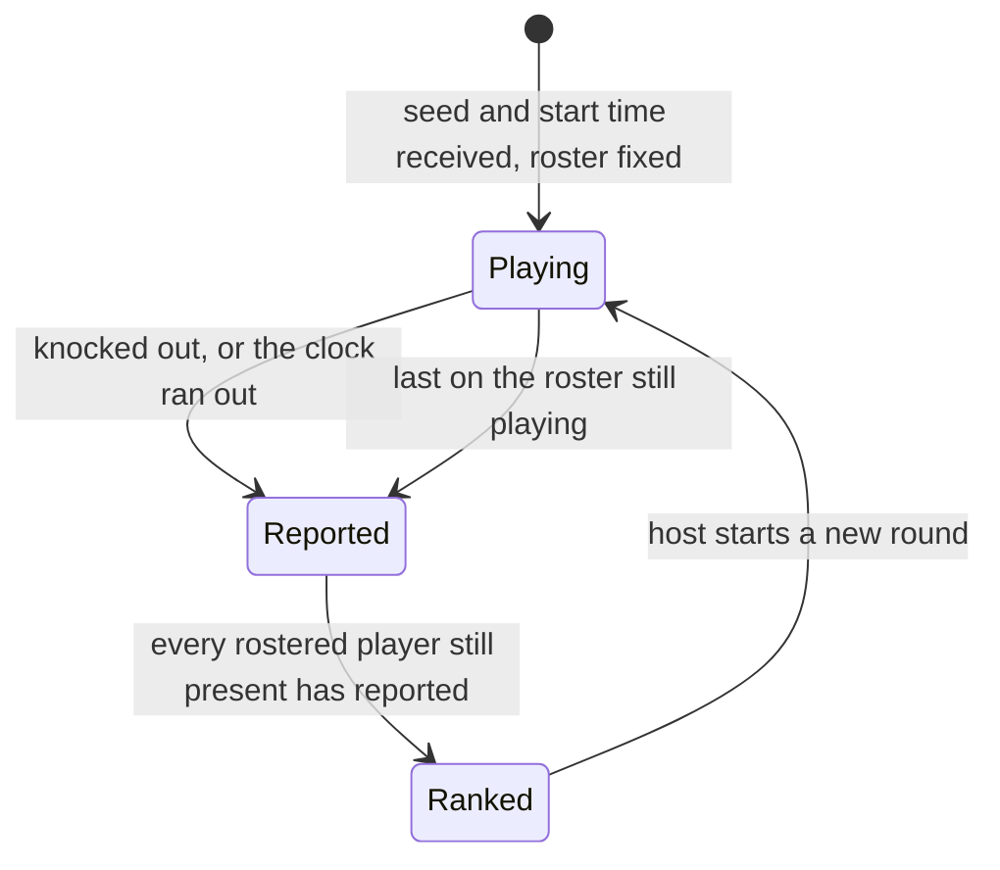

# Brick Breaker: One Seed, No Referee

The brick breaker is the first game of the arcade roadmap, and the first built on the shared
seeded round flow the later games reuse. Every player clears their own copy of the same wall;
breaking bricks pushes garbage rows down onto every rival's wall; the last player standing wins.

## Why the ball does not use Rapier

The repo's other ball games run on Rapier, so the obvious build was a dynamic sphere bouncing
off fixed cuboids. It was rejected because a multiplayer match here only works if every peer
plays an identical game from the seed alone, and a physics step depends on the frame timing
each machine happens to run at.

The ball is instead a pure function of its previous state, the frame duration, the paddle and
the bricks. That makes the whole run reproducible in a unit test, with no scene at all.

| Concern     | How it is handled                                                                                                                       |
| ----------- | --------------------------------------------------------------------------------------------------------------------------------------- |
| Tunnelling  | Each frame is split into substeps of at most a tenth of a unit, under half the ball's radius, so a slow frame cannot skip over a brick. |
| Bounce axis | The side the ball entered from decides it: whichever of the two offsets to the brick's nearest edge is larger.                          |
| Double hits | A brick can take at most one hit per frame, so a two-hit brick never breaks from a single contact that spans two substeps.              |
| Aiming      | Where the ball lands on the paddle sets the outgoing angle, up to about sixty degrees, and the speed is kept whatever the angle.        |

## Nothing geometric crosses the network

The host sends one number, the seed, and three things come out of it on every peer:

| Drawn from               | Builds                                             |
| ------------------------ | -------------------------------------------------- |
| seed and walls cleared   | each fresh wall, including which bricks are tough  |
| seed and garbage batches | where the gap sits in each garbage row             |
| the paddle position      | the serve, which always launches at the same angle |

So a garbage attack is a count of rows, never a layout, and the receiving peer works out the
gaps itself. Two players who received the same number of batches see the same gaps.

## Ending a match without a referee

No peer decides who won. Each player reports one result when they are knocked out, or when a
sprint's clock runs out, and every peer ranks the same set of results the same way: players
still standing by score, then knocked-out players from the last to fall to the first.

The match is over once everyone in it has reported. Two cases made "everyone in it"
non-obvious, and both left the match hanging forever in the first version:

- **A player who joins mid-round** is in the room but never got the seed, so never reports.
- **A rival who leaves without reporting** used to leave the survivor waiting for a result that
  could not come, because "last one standing" was counted against the room, not the match.

The fix is a roster taken when the round starts. Newcomers are not on it and sit the round out;
leavers drop off it; and the survivor check compares against how many players the match
started with, not how many are still present.

## A fixed pool of brick meshes

Walls refill and garbage arrives from inside the animation loop, where creating meshes is not
allowed. The scene instead creates one pool at start, sized for the deepest wall a player can
survive, and each change of the wall reassigns positions and materials to the first bricks'
worth of meshes and hides the rest. A tough brick that has taken its first hit swaps to its
row's colour, which is the only damage feedback the player needs.

## Framing around the touch buttons

On a phone the paddle is steered with two round buttons in the bottom corners. A fixed camera
put the paddle's track at the same height as the buttons, so thumbs covered the paddle at
either edge of a portrait screen. The camera is now fitted to the canvas instead: it backs off
until the whole frame fits, and when the buttons would overlap the field it keeps a strip clear
at the bottom and lifts the field above it. On a wide screen the buttons sit beside the field,
so no strip is kept and the field uses the full height.

Fitting to the canvas also exposed that the shared resize handler measures the canvas itself,
which the renderer has already pinned to its old pixel size, so a rotated phone kept a
portrait-width canvas. The game sizes the renderer from the canvas's container instead.

