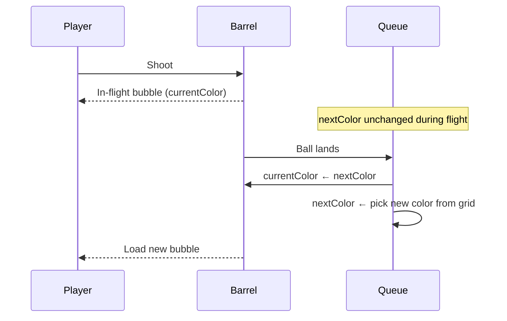
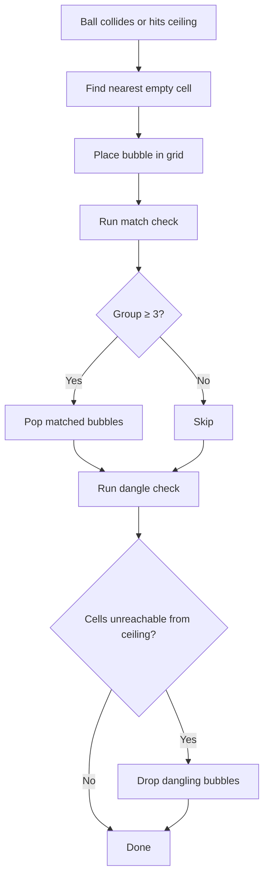
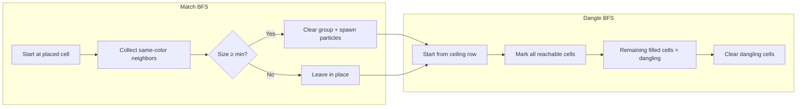
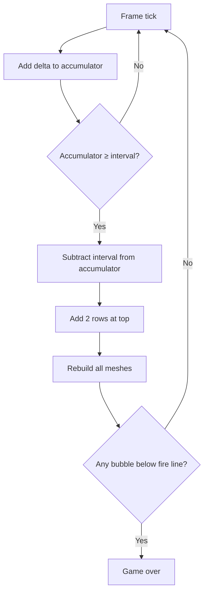
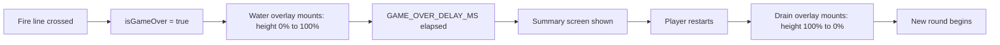
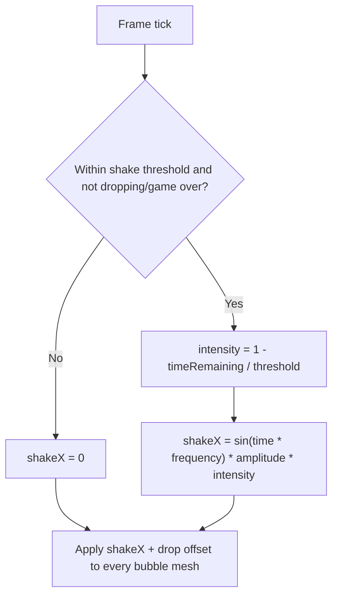
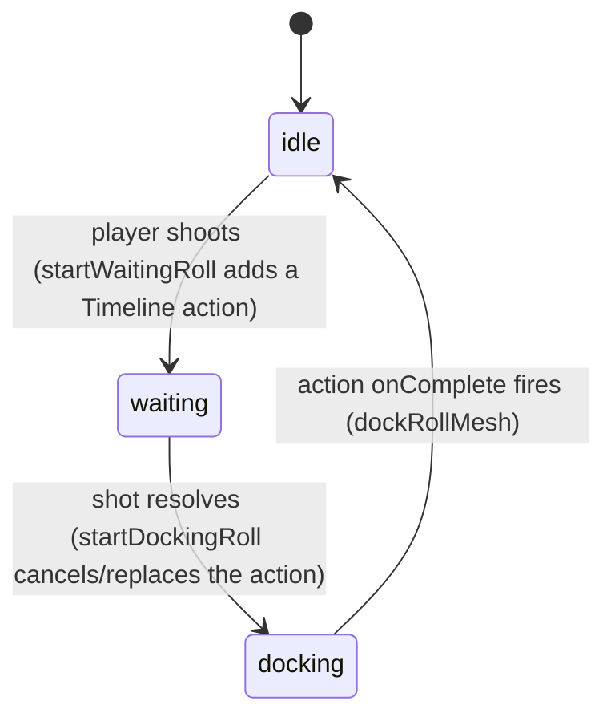
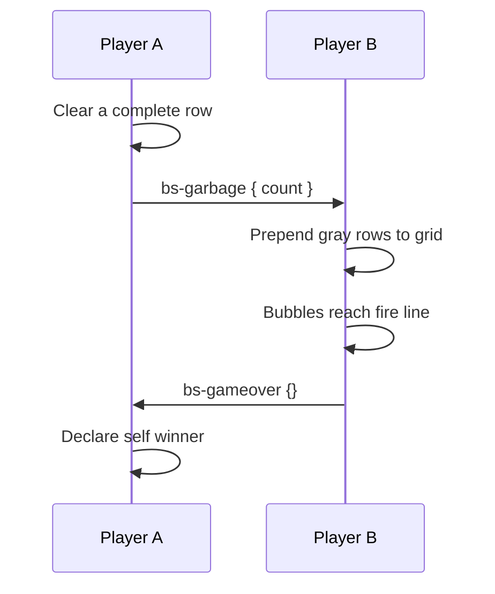
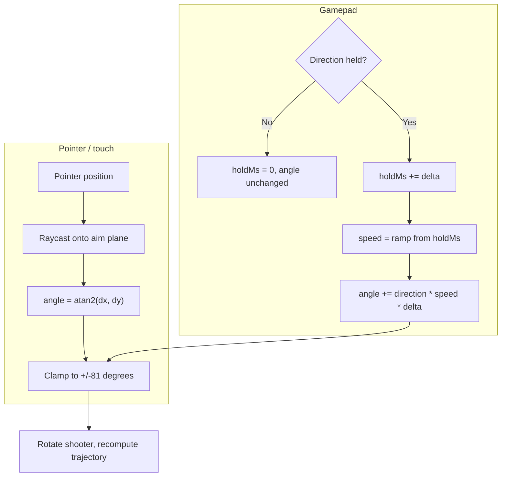
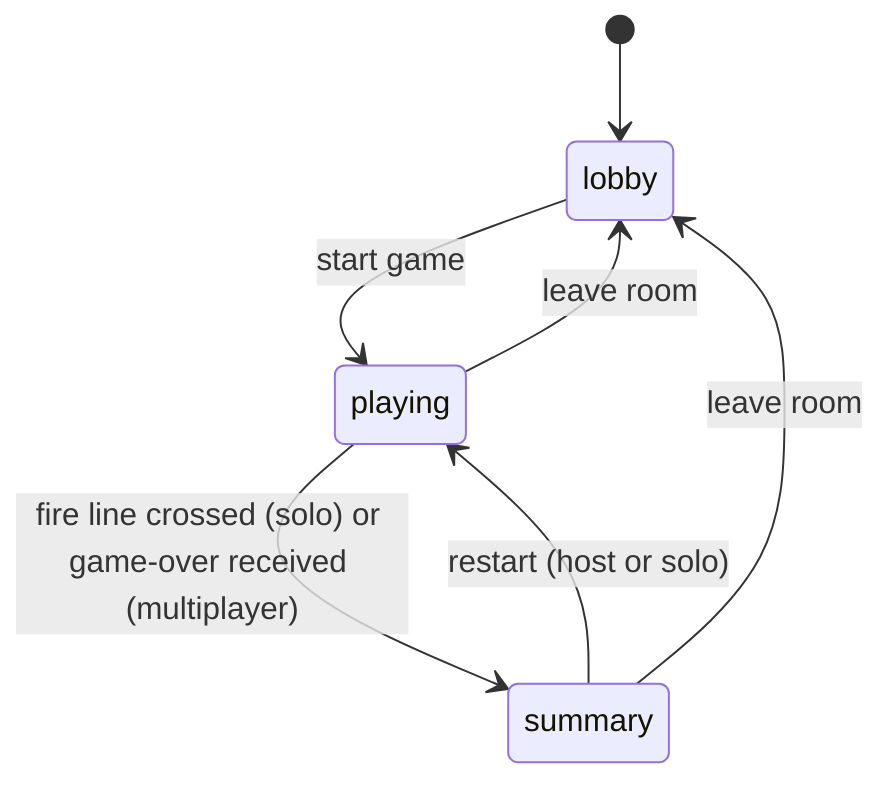

# Bubble Shooter: Hex Grid, Snap, Match, and Row Pressure

This documents the non-obvious problems encountered while building the Bust-a-Move / Puzzle Bobble style bubble shooter (PR #145).

## Hex grid: odd-row overflow

The grid is 9 columns wide. Odd rows are offset right by half a bubble diameter to create the classic honeycomb pattern. The first implementation placed 9 bubbles in every row — but the rightmost bubble in an offset row exceeds the wall boundary by half a radius, causing balls to clip through the wall.

The fix: odd rows hold one fewer column than even rows. A single helper encapsulates this rule, and every function that touches grid columns — creation, snapping, garbage insertion, row addition — delegates to it. Forgetting it in any one place reintroduces the overflow.

## Row drop parity: always add two rows

When the grid descends under time pressure, adding a single row flips the odd/even parity of every existing row. A bubble that was in an even row (straight alignment) becomes an odd row (offset by half a cell) — it visually jumps sideways. This looks like a glitch and corrupts all snapping calculations.

The invariant: **always add rows in multiples of 2**. Adding two rows preserves the parity of all existing cells and is the only valid call site for the row-addition utility.

## Camera aspect ratio: bypassing `getTools()`

The shared Three.js environment helper initialises the camera aspect ratio from the full window dimensions. When a sidebar is present, the actual canvas is several hundred pixels narrower than the window, making the aspect ratio too wide — the grid appears shifted to the right and partially off-screen.

The fix is to bypass the shared helper entirely and read the canvas element's own dimensions at init time. A `ResizeObserver` then watches the canvas and corrects the camera aspect whenever the sidebar is toggled.

## Bubble generation: two-slot color queue

The HUD shows two circles: the bubble loaded in the barrel (fires next) and a preview of the one after. The first implementation refilled both slots the moment the player fired — the preview changed mid-flight, making ahead planning impossible.

The correct model shifts the queue **on landing, not on shoot**:

On shoot, the loaded mesh is hidden and the in-flight mesh takes its place. `currentColor` does not change until the ball lands and snaps.

## Stick logic: snapping to the nearest empty cell

When the in-flight bubble collides with a grid bubble or reaches the ceiling, it snaps to the nearest valid empty hex cell. The snap function iterates all grid cells, converts each to world coordinates, and picks the one with the shortest distance to the hit point. Cells beyond the column limit for their row are excluded.

## Explode logic: BFS match and dangle

Two breadth-first searches run on every landing, in sequence.

**Match (pop):** Starting from the placed cell, BFS collects all connected cells of the same color. If the group reaches the minimum size (3), every cell in the group is cleared and removed from the scene. Each popped bubble spawns a small burst of particles.

**Dangle (fall):** A second BFS starts from every filled cell in the top row (the ceiling). Any filled cell not reachable from the ceiling is dangling — it has no structural path upward. Dangling cells are cleared and removed. This handles the classic chain reaction where popping a cluster drops a hanging group below it.

## Advance logic: row pressure and game over

**Row pressure:** on a configurable interval (30 s slow / 20 s medium / 12 s fast), two new rows of randomly colored bubbles are prepended to the top. An accumulator tracks elapsed time per frame to avoid drift — no `setInterval`. After each addition, the grid checks whether any bubble has crossed the fire line.

**Game over trigger:**

**Fire line position:** the fire line Y coordinate is derived from the grid dimensions — `top position minus (rows − 2) × row height`. An earlier version hardcoded it to a fixed value that sat below the grid's actual bottom, so the game-over check never triggered. The formula ensures the line is always just above the last playable row, regardless of grid size.

## Game-over transition: CSS water rise, not WebGL

When the fire line is crossed, a full-screen "flooding" effect plays before the summary screen appears. This is a plain HTML/CSS overlay layered on top of the canvas, not a Three.js effect — a gradient panel grows from `height: 0%` to `height: 100%` over a fixed duration, with a wavy strip riding its top edge using two looping background-position/transform keyframe animations (one for the ripple texture scrolling, one for a side-to-side sway).

The duration is a single shared constant, exposed to the CSS via a custom property set inline (`--bs-gameover-duration`). Re-entering the game (returning from the summary screen to a fresh round) plays the same overlay in reverse — a "drain" variant that animates `height` from `100%` back to `0%` using the same keyframes with start/end swapped, rather than a second set of keyframes.

Keeping this in CSS rather than the WebGL scene means it can run independently of the render loop and isn't affected by camera or canvas resizing — it simply sits in a `position: absolute; inset: 0` layer above the canvas.

## Row-pressure shake: a state-driven vibration, not a one-shot animation

As the next forced row-drop approaches, the entire bubble grid trembles with increasing intensity — a visual countdown that warns the player before new rows are prepended. This is implemented as a continuous per-frame offset applied to every bubble mesh's base position, not a triggered animation with a start and end.

Each frame, the time remaining until the next row drop is compared against a threshold window. Once inside that window, an intensity value ramps from 0 to 1 as the deadline approaches. The horizontal offset itself is a sine wave sampled from the wall-clock time (so all bubbles oscillate in phase), scaled by both a fixed amplitude and the current intensity. Outside the window — or while a row-drop animation or game over is in progress — the offset is zero and meshes sit at their exact grid position.

This is a good fit for a hand-rolled per-frame offset rather than a timeline action: it has no fixed start or end, its intensity is continuously derived from unrelated game state (the row-drop accumulator), and it must reset to exactly zero the instant a row drops — a one-shot animation would need to be restarted every frame to track a moving target.

## Ball roll: a Timeline action driven by a derived frame counter

The "next bubble" preview rolls along the ground track in two legs: first from off-screen into the waiting spot beside the cannon (triggered the moment the player shoots), then from the waiting spot up into the loaded position (triggered once the in-flight shot resolves and the queue advances). Both legs share one mesh, distinguished by a `rollPhase` state (`idle | waiting | docking`), and are each driven by a `@webgamekit/animation` `Timeline` action added to a per-game `TimelineManager`.

Each Timeline action carries a `start` frame, a fixed `duration` in frames, an `action` callback that runs every frame while active, and an `onComplete` callback that fires once. Inside `action`, progress is `(frame - start) / duration`, passed through a smoothstep curve (`t² (3 − 2t)`) for ease-in/ease-out, and used to `lerpVectors` the mesh between the leg's start and end positions (with a parallel scale lerp on the first leg, growing the preview-sized mesh to full size). To make the ball look like it is physically rolling — not sliding — the mesh's Z-rotation is advanced each frame by the horizontal distance travelled divided by the bubble radius (rolling-without-slipping), so the marble texture visibly spins in the direction of travel. `onComplete` snaps the mesh exactly to the end position/scale and either clears the action reference (end of the waiting leg) or removes/resets the roll mesh (end of the docking leg, via `dockRollMesh`).

**Frame counter, not `getTools()`'s `simulationFrame`:** other games using `Timeline`/`animateTimeline` (Minigolf, Marble Madness) run through `getTools()`'s `animate()` loop, which steps a fixed-rate `simulationFrame` counter every physics tick. BubbleShooter intentionally bypasses `getTools()` (see "Camera aspect ratio" above) and drives its own `requestAnimationFrame` loop with a clamped wall-clock `delta`. To keep `Timeline.duration` meaningful in real time, BubbleShooter maintains its own `ctx.frame` counter, advanced each tick by `delta * 60` (a 60fps-equivalent), and passes it to `animateTimeline`. A roll leg's duration is expressed as `0.3 * 60` frames — the same real-world 0.3s duration as before, just expressed as a frame count derived from elapsed time rather than an `requestAnimationFrame`-tick count.

Starting a new leg cancels any in-flight action for the roll mesh (`cancelRollAction`) before adding the next one, so a docking roll that interrupts an unfinished waiting roll snaps the mesh to the waiting position first and continues from there — the same interruption behavior as the original hand-rolled state machine, now expressed as add/remove calls on the `TimelineManager`.

## Multiplayer: separate grids, garbage rows

Each player manages their own local grid. The opponent's grid is never transmitted — only their score is broadcast over the network.

Gray (garbage) bubbles participate in snap and dangle but not in match — they cannot form a color group and cannot be popped directly.

## Aim rotation: raycaster-to-angle and gamepad ramping

The shooter's barrel rotation is driven by a single radians value, the aim angle, clamped to a fixed cone of ±81° either side of straight up. Two completely different methods feed this value depending on input device, and they meet at the same step that rotates the shooter group and recomputes the trajectory preview.

**Pointer and touch:** the pointer position is unprojected through the camera with a raycaster onto a flat plane positioned at the same depth as the trajectory dots and the in-flight bubble. The angle is then the arctangent of the horizontal and vertical offset from the shooter's position to that intersection point. Because this is a direct geometric mapping, the aim follows the pointer exactly — there is no smoothing or stepping. The only way this becomes imprecise is if the raycast plane drifts out of sync with the depth the bubble actually travels at, which is why both are defined from the same constant.

**Gamepad:** there is no absolute position to map, so the angle is integrated frame by frame. Holding a direction starts at a slow rotation speed and ramps linearly to a faster one over a fixed ramp duration; releasing the direction resets the ramp immediately. This gives coarse, fast sweeps for long holds and fine, single-frame adjustments for taps.

To make the gamepad aim more precise — i.e. allow finer single-tap adjustments without slowing down long sweeps — lower the minimum ramp speed so a single frame moves the barrel less, or extend the ramp duration so the speed stays low for longer before reaching the maximum. To make pointer aim more precise, the only lever is the raycast plane depth: it must stay equal to the depth used for the trajectory dots and the in-flight bubble, otherwise the visual aim and the actual shot direction diverge.

## Game phases: lobby, playing, summary

The whole view is driven by a single phase value (lobby / playing / summary) held in the shared store. Each phase swaps which child component is rendered; the Three.js scene itself is only ever created in the playing phase and is fully torn down and rebuilt on every transition into it.

- **lobby** — the wizard for name/color/room settings and game options. No canvas, no scene.
- **playing** — the game canvas and HUD render, and a transition into this phase (whether from the lobby or from a restart) re-initialises the renderer, scene, controls and game context from scratch.
- **summary** — the game-over screen renders as a transparent overlay on top of the still-mounted game canvas, so the final board state and the CSS "water rise" background animation remain visible underneath the score panel.

**Why the summary is an overlay, not a separate screen:** earlier the game-over screen replaced the canvas entirely, so the final grid state — and the in-progress water-rise flood animation — disappeared the instant the timer expired. The summary component now renders with a transparent background on top of the unchanged game view, fading in while the flood animation continues underneath. The canvas, HUD and water overlay stay mounted; only a translucent panel with the scores and "Play again" button is layered above them.

## Known gap: pointer/touch input bypasses `@webgamekit/controls`

Gamepad input goes through `@webgamekit/controls` with a mapping that only covers aim-left, aim-right and fire — keyboard, touch and mouse are explicitly disabled in that configuration. Aiming and shooting with the mouse or a finger are instead wired up as raw pointer and touch listeners attached directly to the canvas.

This split exists because aiming by pointer needs an absolute screen position to raycast toward, which the action-based mapping in `@webgamekit/controls` isn't designed to express — it maps discrete inputs to named actions, not continuous pointer coordinates. The result is two independent input pipelines: one action-based (gamepad), one raw-coordinate-based (pointer/touch), with no keyboard aiming at all.

This is a known deviation from the project's "always use `@webgamekit/controls`" convention. A future pass could extend the package with a continuous "pointer position" or "aim toward" action type so all input devices share one pipeline. Until then, any change to aiming behaviour (e.g. adjusting the clamp angles or the raycast plane) needs to be applied to the pointer/touch handlers and the gamepad step function separately.
