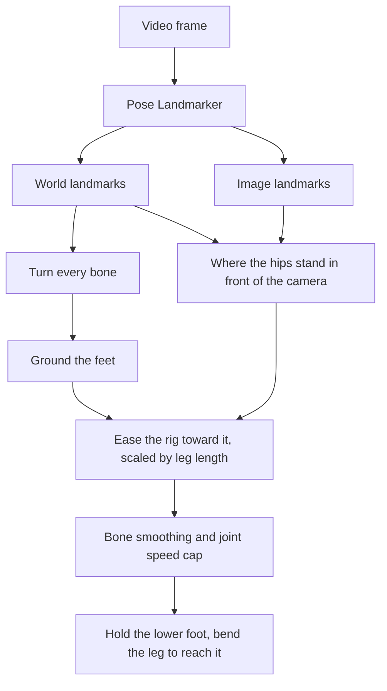

# Carrying a Capture Across the Floor

Why the Rig Animator's camera capture now walks the rig across the floor and holds a planted foot
still, which recent research that came from, and what the two attached clips showed that the
papers did not.

## What was missing

MediaPipe's world landmarks are metric but centred on the hips. They say how a body bends and
turns, never where it is, so the capture turned and crouched the rig on one spot. The dance clip
opens with the dancer walking about a metre toward the camera; the rig ignored it, and every step
she took skated a planted foot across the floor instead. A recorded take also kept rotations only,
so even the lowered hips of a crouch were lost on playback.

## What recent work does

Recovering a body's path through the world from one video is where most of the recent effort in
human motion capture has gone. Every method below runs a network far heavier than a browser can
afford next to the detectors, so none could be used as is. What they share is a small set of
steps that can be.

| Work                                                | Venue              | What it does                                                                                                                                                                                          | What it contributed here                                                                                               |
| --------------------------------------------------- | ------------------ | ----------------------------------------------------------------------------------------------------------------------------------------------------------------------------------------------------- | ---------------------------------------------------------------------------------------------------------------------- |
| [GVHMR](https://zju3dv.github.io/gvhmr/)            | SIGGRAPH Asia 2024 | Pose in a frame set by gravity and the view direction; for a still camera, a post-process that keeps the body near its in-camera position, holds joints judged stationary and solves the legs to them | The recipe: body position from how large the body looks, focal length from the image diagonal, stationary feet, leg IK |
| [WHAM](https://wham.is.tue.mpg.de/)                 | CVPR 2024          | Lifts 2D keypoints with a motion prior and refines the path with foot contact probabilities                                                                                                           | That foot sliding is removed from contacts, not from smoothing                                                         |
| [TRAM](https://yufu-wang.github.io/tram4d/)         | ECCV 2024          | Takes metric scale from the scene via SLAM, then regresses the body                                                                                                                                   | Why a moving camera stays out of reach: it needs the background tracked                                                |
| [HumanMM](https://zhangyuhong01.github.io/HumanMM/) | CVPR 2025          | World paths across shot changes, with an integrator against foot sliding                                                                                                                              | The same target, foot sliding, as the measure of a path                                                                |
| [GENMO](https://github.com/NVlabs/GENMO)            | ICCV 2025          | Treats estimation as generation constrained by what was observed                                                                                                                                      | A learned motion prior is what closes the gaps the steps here leave                                                    |
| [OnlineHMR](https://arxiv.org/abs/2603.17355)       | CVPR 2026          | A fully causal world-grounded method, about three readings a second on a workstation GPU                                                                                                              | Working frame by frame is the hard constraint; everything here is causal by construction                               |
| [AMOR](https://chkim1011.github.io/AMOR/)           | SIGGRAPH 2026      | Physically consistent flight for jumps and acrobatics                                                                                                                                                 | Where the rule "the lower foot is planted" stops holding                                                               |
| [UnderPressure](https://arxiv.org/abs/2208.04598)   | SCA 2022           | Learns foot contact from pressure insoles                                                                                                                                                             | That height and speed thresholds miss contacts a learned detector catches                                              |

VNect's skeleton fit (SIGGRAPH 2017) is being tried in a
[separate experiment](https://github.com/cnotv/generative-art/issues/316) and was not reused here.

## The first attempt: travel from the feet

Every one of those methods lets the feet decide how far the body moved: a foot on the ground does
not move, so the body travels by whatever the foot pushes against. That reads cleanly in any
direction and needs nothing from the picture, which is why it was tried first. On the clips it
failed twice over.

| Clip                    | What the picture showed         | Travel from planted feet alone                   |
| ----------------------- | ------------------------------- | ------------------------------------------------ |
| Dance, first 140 frames | about a metre toward the camera | less than a tenth of a leg length, the wrong way |
| Running preset, 4 s     | the character on one spot       | more than four leg lengths of drift              |

The walk toward the camera is a sweep of the stance foot backwards, which is a change in depth,
and MediaPipe's depth for the feet is the weakest thing it reports: the legs barely swept at all.
The Running preset turned out to be a treadmill cycle, its stance foot sweeping back under a body
that never moves, so anchoring on the feet read it as running forward at about a metre a second,
which is exactly what that motion would do on real ground.

## The picture anchors the travel

The picture is what knows where the body is. World landmarks carry the body's real size, the
image landmarks its apparent size, and their ratio is its distance: fitting one to the other
through a camera with GVHMR's uncalibrated focal length, the image diagonal, gives the hip
centre's place in front of the lens. The two readings share their axes, correlating at 0.99 on
both clips, so a single scale fits them.

That reading is noisy. Its depth jitters by two to five centimetres from frame to frame, and
the running character, standing on one spot, reads as drifting 22 cm away over four seconds from
its changing pose alone. Easing toward it over a quarter of a second keeps the walk and drops the
jitter; the rig's movement is the performer's scaled by the ratio of the two leg lengths, so a
stride is the rig's stride.

## Holding the feet still

Moving the body from the picture does nothing for a planted foot: it still slides wherever the
captured leg puts it, now plus whatever the travel adds. GVHMR's answer, and the classic footskate
cleanup before it, is to hold the foot and bend the leg to reach it. The lower foot is taken as
planted, measured by how far each has risen above where it stands at rest, and let go once it
lifts, easing back over a tenth of a second.

The first version also let go of a foot the leg had to stretch too far to reach. On the dance
clip that made a sawtooth: held for eight frames while the leg and the travel drifted apart, then
a burst of slide back. The two keep drifting apart for the same reason the first attempt failed,
the legs barely sweep in depth, so the limit was always reached. Dragging the held position along
at the limit instead turns each burst into a slow creep:

| Reach, share of the leg | Let go at it: slide, mean and 90th percentile | Dragged at it: slide | Dragged: leg bones turned, mean and 95th percentile |
| ----------------------- | --------------------------------------------- | -------------------- | --------------------------------------------------- |
| 0.1                     |                                               | 1.9% and 5.7%        | 5° and 12°                                          |
| 0.15                    | 2.3% and 7.2%                                 | 1.4% and 4.5%        | 7° and 18°                                          |
| 0.2                     |                                               | 1.1% and 3.2%        | 10° and 26°                                         |
| 0.3                     | 1.4% and 7.0%                                 | 0.9% and 2.7%        | 19° and 52°                                         |

Slide is how far a planted ankle moves across the floor between frames, as a share of the leg.
A larger reach holds the foot better and bends the leg further from what the camera saw; 0.15
keeps the legs within about 18° of the capture while more than halving the slide.

## What the clips showed, together

| Clip and setting                         | Planted-foot slide, mean | 90th percentile | Leg bones turned by pinning           |
| ---------------------------------------- | ------------------------ | --------------- | ------------------------------------- |
| Dance, rig on one spot (before)          | 3.2%                     | 7.2%            |                                       |
| Dance, travel                            | 3.8%                     | 7.8%            |                                       |
| Dance, travel and pinned feet            | 1.4%                     | 4.5%            | 7.5° mean, 18° at the 95th percentile |
| Running preset, rig on one spot (before) | 9.9%                     | 19.1%           |                                       |
| Running preset, travel                   | 9.8%                     | 18.1%           |                                       |
| Running preset, travel and pinned feet   | 6.1%                     | 16.6%           | 6.6° mean, 22° at the 95th percentile |

Travel alone slides a planted foot slightly more than standing still, since the body now moves
and the leg does not know it. Pinning is what brings it down. The running preset keeps sliding by
design: a treadmill cycle on a body that stays put has to slide its feet, and it does on a real
treadmill too.

## The dance clip's camera moves

Tracking the background of the dance clip showed its camera is handheld: the street shrinks by
about 0.6% a second as the camera backs away or zooms out, and pans by up to 70 pixels in half a
second.
Nothing in the body can tell that apart from the dancer moving, so the rig follows her position
relative to the camera, not the street. WHAM, TRAM and GVHMR all run SLAM on the background for
exactly this; it does not fit beside the detectors in a browser.

## How the numbers were measured

Both clips were run through MediaPipe's lite pose model in VIDEO mode in headless Chromium, one
frame at a time, keeping both the world and the image landmarks. The readings were replayed 33 ms
apart through the tool's own capture, smoothing, retargeting, travel and pinning, onto the
default character's real skeleton, with the Config panel's defaults. The dance clip's positions
are kept in the training clip fixture, and two tests replay it: the walk-in carries the rig more
than a leg length toward the viewer, and pinning more than halves the slide. The camera motion
came from tracking background features outside the dancer's outline between frames.

## Limits

- **A still camera is assumed.** A camera that pans or backs away reads as the performer moving.
- **The lower foot is always planted.** A jump holds the lower foot to the floor rather than
  flying, and a contact is judged by height alone.
- **The focal length is assumed.** A lens wider or narrower than a 53° diagonal scales the whole
  path by the same factor.
- **The start is one reading.** Its noise offsets the whole take by up to a quarter of a leg; the
  running preset's chart line sits just below zero for that reason.
- **Legs out of view, no travel.** A webcam framed on the upper body has nothing to scale the
  travel by, and the rig stays where it last was.
