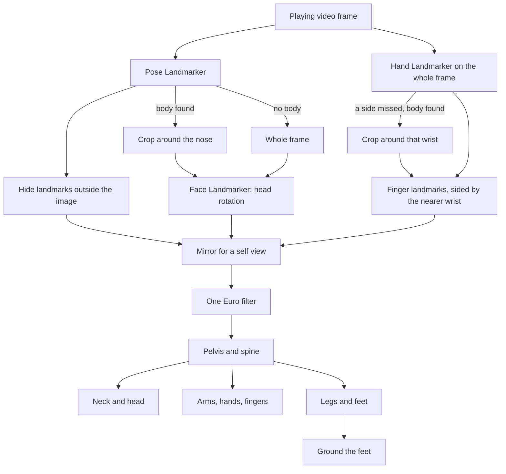

# Copying a Performer onto a Rig

Why the Rig Animator's camera capture stopped placing hands and feet at scaled positions and
started turning every bone instead, what the existing libraries and papers do, and what a real
dance clip showed that reasoning alone did not.

## What the first mapping did

The first mapping treated the camera as a source of target positions. It took five landmarks,
the nose, both wrists and both ankles, measured each from the detected shoulder or hip centre,
scaled that offset by the ratio of the rig's shoulder or hip width to the performer's, and
handed the result to the same two-bone IK solve a mouse drag uses. Elbows, knees and the ear
midpoint could optionally steer which way a chain bent. Every limitation people ran into traces
back to that design.

| What people saw                                         | Why                                                                                                                                                                                            |
| ------------------------------------------------------- | ---------------------------------------------------------------------------------------------------------------------------------------------------------------------------------------------- |
| A T-pose never stretched fully straight                 | The wrist target was scaled by shoulder width. A rig whose arms are longer or shorter relative to its shoulders than a person's either fell short and bent the elbow, or overshot and clamped. |
| The back never bent, and the head pulled the chest      | The nose is not a joint. The head's IK chain started at the upper spine, so aiming it at the nose bent the chest toward the face.                                                              |
| The head never turned, the hands and feet never rotated | IK only rotates a chain's two upper bones. The end bone always kept its rest rotation.                                                                                                         |
| Turning around tangled the limbs                        | Nothing rotated the hips, so the limbs reached behind a torso that still faced the camera.                                                                                                     |
| Fingers only curled                                     | Each joint was one bend angle about a fixed axis: no spread, no thumb opposition, no palm direction.                                                                                           |
| A hand filmed on its own did nothing                    | A frame without a body was never applied at all.                                                                                                                                               |
| Move Hips to Photo changed nothing                      | World landmarks are centred on the hips, so the detected hip midpoint is always the origin.                                                                                                    |

## What others do

| Source                                                                                                       | How it maps                                                                                                                         | What it contributed here                                                         |
| ------------------------------------------------------------------------------------------------------------ | ----------------------------------------------------------------------------------------------------------------------------------- | -------------------------------------------------------------------------------- |
| [Kalidokit](https://github.com/yeemachine/kalidokit) (JS)                                                    | Euler angles per segment from pairs of landmarks, with per-side scale factors and clamps tuned by hand for VRM avatars              | Confirms rotations beat positions, but its constants are tied to one bone layout |
| [three-mediapipe-rig](https://github.com/bandinopla/three-mediapipe-rig) (JS)                                | Angle based so any skeleton size works, but expects the bone roll of its own reference rig                                          | Proportions drop out once only angles are copied                                 |
| [retargeting-threejs](https://github.com/upf-gti/retargeting-threejs/blob/main/docs/Algorithm.md) (JS)       | Put both skeletons in a shared bind pose and transfer rotations as world-space changes from it                                      | The rest-relative idea that makes each rig's own local bone axes irrelevant      |
| [three-vrm normalized bones](https://pixiv.github.io/three-vrm/docs/classes/three-vrm.VRMHumanoid.html) (JS) | Every pose expressed as rotations away from a T-pose whose rest rotations are the identity                                          | The same idea, formalised as a standard                                          |
| [BlendArMocap](https://github.com/cgtinker/BlendArMocap) (Python, Blender)                                   | Rotations computed from landmark vectors at runtime, driving a Rigify rig                                                           | The same family of solution outside the browser                                  |
| [Dollars MoCap notes](https://www.dollarsmocap.com/blog/mediapipe-to-3d-avatar)                              | Look rotations from a direction plus a helper axis, compensation for bone axes, twist from the bend plane, filtering before solving | A practical checklist of where roll and jitter come from                         |
| [HybrIK](https://arxiv.org/abs/2011.14672) (CVPR 2021)                                                       | Swing solved analytically from 3D joints; twist, one rotation about the bone's own length, predicted by a network                   | The split used here: the swing is exact, the twist needs a separate cue          |
| [BlazePose GHUM Holistic](https://arxiv.org/abs/2206.11678)                                                  | World landmarks in metres, centred on the hips, trained against a fitted body model                                                 | Why depth is usable and why there is no global position to read                  |
| [One Euro filter](https://gery.casiez.net/publications/CHI2012-casiez.pdf) (CHI 2012)                        | A low-pass filter whose cutoff rises with speed                                                                                     | Jiggle at rest and lag in motion stop being the same trade                       |

Full body model fitting, the SMPL and HybrIK class of networks, was ruled out: those models are
far heavier than a browser can run live, and BlazePose's landmarks are already the output of a
fitted body model.

## The conclusion: rotate bones, never place joints

Every bone is asked one question: how far has it turned from its own rest pose, in world space.
The rest pose is measured once, the moment the rig is adopted, so a Mixamo arm whose local axis
runs along the arm and a generated skeleton with no rest rotation at all are handled the same way.

- **Swing.** The smallest rotation that carries the bone's rest direction, as its already posed
  parent left it, onto the direction the performer's matching segment points. It copies the
  direction exactly and never moves a joint, so a segment cannot stretch and the rig's proportions
  stop mattering: a T-pose is straight on any rig.
- **Twist.** A roll about the segment's own length, which a direction alone cannot show. Each limb
  takes it from whatever does show it: which way the forearm swings off the upper arm, since an
  elbow only bends one way; which way the kneecap and the foot point for the thigh; the line
  across the index and pinky knuckles for the forearm and hand. A straight limb shows no bend, so
  that cue fades out rather than snapping as the limb straightens.
- **Frames.** The pelvis, chest, head and hand are each fixed by two directions, one they run along
  and one they lean toward, built the same way on the performer and on the rig at rest. The
  rotation between the two frames is the turn.
- **Sharing.** The pelvis takes part of the torso's lean and the spine bones split the rest evenly,
  so a back bends rather than hinging at the hips. The neck takes half of the head's turn away
  from the chest.
- **Seen, not guessed.** BlazePose still reports a position for a body part out of frame, the
  legs below a webcam framed on the upper body say. A landmark outside the image counts as out of
  view, and the bones it would drive keep their rest pose. Detection itself only runs while the
  source is live, so a paused video stops posing the rig rather than repeating one frame.
- **Hands first.** A hand found on the whole frame wins over anything the body suggests about it,
  and takes its side from the body's nearer visible wrist.
- **Grounding.** With nothing in the landmarks saying how high the body is, the whole rig is
  raised or lowered so its lowest foot stays where it stands at rest, which turns a crouch into
  lowered hips rather than feet folded up off the floor.

Smoothing follows the same research: a landmark held still is smoothed over a set number of
milliseconds, and the faster it moves the less it is held back, so the jiggle of a performer
standing still settles without a fast arm swing trailing behind. Because the filter works from
elapsed time, the same setting holds whether detection manages fifteen readings a second or sixty.

## What the clip showed

Most of the constants and two of the design decisions came from running the detectors over the
attached dance clip rather than from documentation.

| Finding                                                                                                                      | Consequence                                                                                                 |
| ---------------------------------------------------------------------------------------------------------------------------- | ----------------------------------------------------------------------------------------------------------- | --- | ------------------------------------------------------------------------------------------------- | ------------------------ |
| The Face Landmarker found the face in 0 of 162 full frames, and in 139 of the same frames cropped around the pose's own nose | Face and hands are detected in crops around the body, the way MediaPipe's holistic pipeline does internally |
| The Hand Landmarker found a hand in 25 of 162 full frames                                                                    | A hand found on the whole frame wins; a side it missed is looked for again in a crop around that wrist      |
| The hand detector's left/right label disagreed with the nearest wrist about half the time                                    | A hand's side comes from the body's nearer visible wrist, the label only when no wrist is in view           |
| The face matrix's yaw agreed in sign with the yaw read from the ears, and looking into the lens reads as no rotation         | Its rotation is used with no axis conversion                                                                |
| A level gaze read about 19° downward from the ears and nose alone                                                            | That reading is tipped back up by a measured offset                                                         |
| A wrist dropped below the visibility threshold while its shoulder and elbow stayed clear                                     | The upper arm and thigh are driven on their own; only the segments below wait                               |     | The ankle to toe direction matched the rig's foot bone within a few degrees, even in heeled boots | No foot offset is needed |

Nine frames of that clip are kept as a test fixture alongside the default character's real
skeleton. Every visible limb segment lands within a degree of the dancer's, the head matches the
face reading exactly, and the hips face within a few degrees of the dancer's.

## Two traps outside the mapping

Mixamo's Y Bot has two skinned meshes, and the loader hangs the second mesh's skeleton at zero
offset beneath the first one's bones of the same name. The tool had adopted the lower copies.
Turning one of those turns only the vertices bound to it, never the limb below it, so the model
came apart at every joint. The tool now adopts the topmost bone of each same-named pair, which
carries the real hierarchy and drags every copy beneath it along.

The webcam and an uploaded video share one video element. A webcam start still waiting on
permission when a clip was uploaded eventually cleared the element's stream, and assigning an
empty stream reloads the element even when it held none, rewinding and pausing the clip while
Record Motion kept sampling a frozen frame. The start now notices it was cancelled, and a stream
is only cleared when one was actually set.

## Limits

- **Front or back.** Mid turn, the lite pose model sometimes decides the wrong side faces the
  camera for a few frames, and the rig follows it.
- **No travel.** World landmarks are centred on the hips, so the rig turns and crouches in place
  but never walks across the floor. Grounding also moves the root, and recorded keyframes store
  rotations only, so a recorded crouch plays back without the lowered hips.
- **No shrug.** Nothing in the landmarks separates a raised clavicle from a tilted chest.
- **No expressions.** The bundled models carry no face blend shapes, so the face drives the head's
  rotation only.
