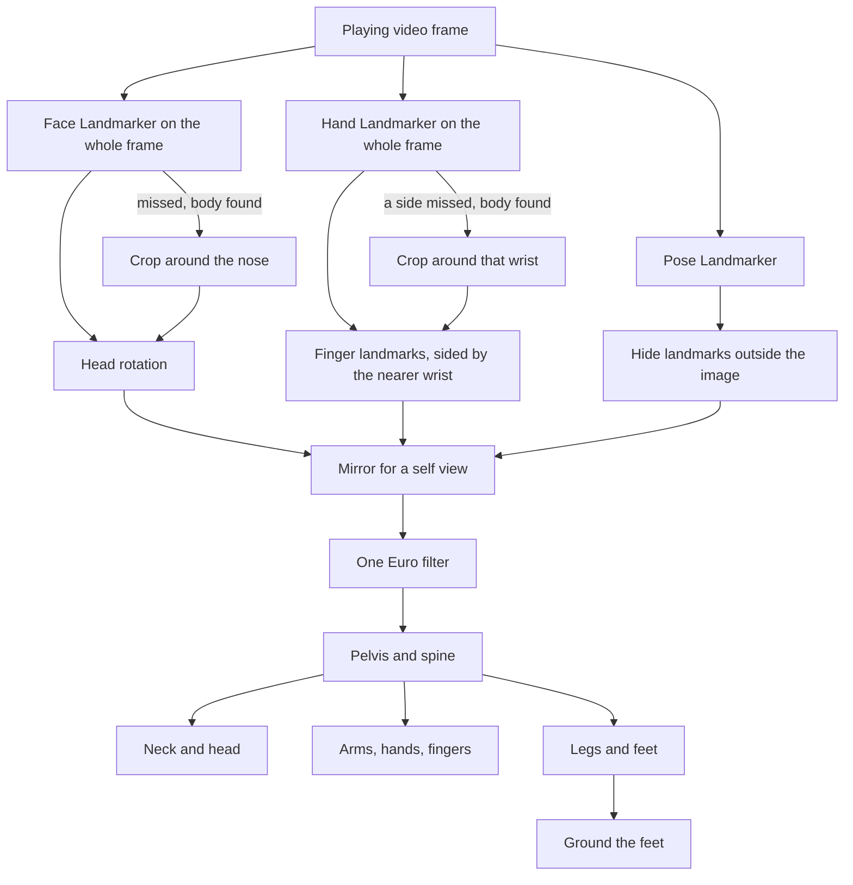

# Copying a Performer onto a Rig

Why the Rig Animator's camera capture stopped placing hands and feet at scaled positions and
started turning every bone instead, what the existing libraries and papers do, and what a real
dance clip showed that reasoning alone did not.

## What the first mapping did

The first mapping treated the camera as a source of target positions. It took five landmarks,
the nose, both wrists and both ankles, measured each from the detected shoulder or hip centre,
scaled that offset by the ratio of the rig's shoulder or hip width to the performer's, and
handed the result to the same two-bone IK solve a mouse drag uses. Elbows, knees and the ear
midpoint could optionally steer which way a chain bent. Every limitation people ran into traces
back to that design.

| What people saw                                         | Why                                                                                                                                                                                            |
| ------------------------------------------------------- | ---------------------------------------------------------------------------------------------------------------------------------------------------------------------------------------------- |
| A T-pose never stretched fully straight                 | The wrist target was scaled by shoulder width. A rig whose arms are longer or shorter relative to its shoulders than a person's either fell short and bent the elbow, or overshot and clamped. |
| The back never bent, and the head pulled the chest      | The nose is not a joint. The head's IK chain started at the upper spine, so aiming it at the nose bent the chest toward the face.                                                              |
| The head never turned, the hands and feet never rotated | IK only rotates a chain's two upper bones. The end bone always kept its rest rotation.                                                                                                         |
| Turning around tangled the limbs                        | Nothing rotated the hips, so the limbs reached behind a torso that still faced the camera.                                                                                                     |
| Fingers only curled                                     | Each joint was one bend angle about a fixed axis: no spread, no thumb opposition, no palm direction.                                                                                           |
| A hand filmed on its own did nothing                    | A frame without a body was never applied at all.                                                                                                                                               |
| Move Hips to Photo changed nothing                      | World landmarks are centred on the hips, so the detected hip midpoint is always the origin.                                                                                                    |

## What others do

| Source                                                                                                       | How it maps                                                                                                                         | What it contributed here                                                         |
| ------------------------------------------------------------------------------------------------------------ | ----------------------------------------------------------------------------------------------------------------------------------- | -------------------------------------------------------------------------------- |
| [Kalidokit](https://github.com/yeemachine/kalidokit) (JS)                                                    | Euler angles per segment from pairs of landmarks, with per-side scale factors and clamps tuned by hand for VRM avatars              | Confirms rotations beat positions, but its constants are tied to one bone layout |
| [three-mediapipe-rig](https://github.com/bandinopla/three-mediapipe-rig) (JS)                                | Angle based so any skeleton size works, but expects the bone roll of its own reference rig                                          | Proportions drop out once only angles are copied                                 |
| [retargeting-threejs](https://github.com/upf-gti/retargeting-threejs/blob/main/docs/Algorithm.md) (JS)       | Put both skeletons in a shared bind pose and transfer rotations as world-space changes from it                                      | The rest-relative idea that makes each rig's own local bone axes irrelevant      |
| [three-vrm normalized bones](https://pixiv.github.io/three-vrm/docs/classes/three-vrm.VRMHumanoid.html) (JS) | Every pose expressed as rotations away from a T-pose whose rest rotations are the identity                                          | The same idea, formalised as a standard                                          |
| [BlendArMocap](https://github.com/cgtinker/BlendArMocap) (Python, Blender)                                   | Rotations computed from landmark vectors at runtime, driving a Rigify rig                                                           | The same family of solution outside the browser                                  |
| [Dollars MoCap notes](https://www.dollarsmocap.com/blog/mediapipe-to-3d-avatar)                              | Look rotations from a direction plus a helper axis, compensation for bone axes, twist from the bend plane, filtering before solving | A practical checklist of where roll and jitter come from                         |
| [HybrIK](https://arxiv.org/abs/2011.14672) (CVPR 2021)                                                       | Swing solved analytically from 3D joints; twist, one rotation about the bone's own length, predicted by a network                   | The split used here: the swing is exact, the twist needs a separate cue          |
| [BlazePose GHUM Holistic](https://arxiv.org/abs/2206.11678)                                                  | World landmarks in metres, centred on the hips, trained against a fitted body model                                                 | Why depth is usable and why there is no global position to read                  |
| [One Euro filter](https://gery.casiez.net/publications/CHI2012-casiez.pdf) (CHI 2012)                        | A low-pass filter whose cutoff rises with speed                                                                                     | Jiggle at rest and lag in motion stop being the same trade                       |

Full body model fitting, the SMPL and HybrIK class of networks, was ruled out: those models are
far heavier than a browser can run live, and BlazePose's landmarks are already the output of a
fitted body model.

## The conclusion: rotate bones, never place joints

Every bone is asked one question: how far has it turned from its own rest pose, in world space.
The rest pose is measured once, the moment the rig is adopted, so a Mixamo arm whose local axis
runs along the arm and a generated skeleton with no rest rotation at all are handled the same way.

- **Swing.** The smallest rotation that carries the bone's rest direction, as its already posed
  parent left it, onto the direction the performer's matching segment points. It copies the
  direction exactly and never moves a joint, so a segment cannot stretch and the rig's proportions
  stop mattering: a T-pose is straight on any rig.
- **Twist.** A roll about the segment's own length, which a direction alone cannot show. Each limb
  takes it from whatever does show it: which way the forearm swings off the upper arm, since an
  elbow only bends one way; which way the kneecap and the foot point for the thigh; the line
  across the index and pinky knuckles for the forearm and hand. A straight limb shows no bend, so
  that cue fades out rather than snapping as the limb straightens.
- **Frames.** The pelvis, chest, head and hand are each fixed by two directions, one they run along
  and one they lean toward, built the same way on the performer and on the rig at rest. The
  rotation between the two frames is the turn.
- **Sharing.** The pelvis takes part of the torso's lean and the spine bones split the rest evenly,
  so a back bends rather than hinging at the hips. The neck takes half of the head's turn away
  from the chest.
- **Seen, not guessed.** BlazePose still reports a position for a body part out of frame, the
  legs below a webcam framed on the upper body say. A landmark outside the image counts as out of
  view, and the bones it would drive keep their rest pose. Detection itself only runs while the
  source is live, so a paused video stops posing the rig rather than repeating one frame.
- **Hands first.** A hand found on the whole frame wins over anything the body suggests about it,
  and takes its side from the body's nearer visible wrist.
- **Grounding.** With nothing in the landmarks saying how high the body is, the whole rig is
  raised or lowered so its lowest foot stays where it stands at rest, which turns a crouch into
  lowered hips rather than feet folded up off the floor.

Smoothing follows the same research: a landmark held still is smoothed over a set number of
milliseconds, and the faster it moves the less it is held back, so the jiggle of a performer
standing still settles without a fast arm swing trailing behind. Because the filter works from
elapsed time, the same setting holds whether detection manages fifteen readings a second or sixty.

## What the clip showed

Most of the constants and two of the design decisions came from running the detectors over the
attached dance clip rather than from documentation.

| Finding                                                                                                                                     | Consequence                                                                                                 |
| ------------------------------------------------------------------------------------------------------------------------------------------- | ----------------------------------------------------------------------------------------------------------- |
| The Face Landmarker found the face in 0 of 162 full frames, and in 139 of the same frames cropped around the pose's own nose                | Face and hands are detected in crops around the body, the way MediaPipe's holistic pipeline does internally |
| The Hand Landmarker found a hand in 25 of 162 full frames                                                                                   | A hand found on the whole frame wins; a side it missed is looked for again in a crop around that wrist      |
| The hand detector's left/right label disagreed with the nearest wrist about half the time                                                   | A hand's side comes from the body's nearer visible wrist, the label only when no wrist is in view           |
| With a face crop sized off the shoulder span, a webcam close-up could miss a face filling the frame, leaving the weak ear reading in charge | The whole frame is searched for the face first, the crop only when that misses                              |
| With an arm across the face, the face reading flipped round by about 150° for a frame                                                       | A face reading turned further from the chest than a neck can turn is dropped for the ears                   |
| The face matrix's yaw agreed in sign with the yaw read from the ears, and looking into the lens reads as no rotation                        | Its rotation is used with no axis conversion                                                                |
| A level gaze read about 19° downward from the ears and nose alone                                                                           | That reading is tipped back up by a measured offset                                                         |
| A wrist dropped below the visibility threshold while its shoulder and elbow stayed clear                                                    | The upper arm and thigh are driven on their own; only the segments below wait                               |
| The ankle to toe direction matched the rig's foot bone within a few degrees, even in heeled boots                                           | No foot offset is needed                                                                                    |

Nine frames of that clip are kept as a test fixture alongside the default character's real
skeleton. Every visible limb segment lands within a degree of the dancer's, the head matches the
face reading exactly, and the hips face within a few degrees of the dancer's.

## Copying exactly is not copying a body

Copying every direction exactly put each segment where the landmarks said, and that was the
problem. A recorded take of the whole clip, measured against the rig's rest pose, showed readings
no body produces, and each one showed on the model:

| Joint                          | Worst reading, copied exactly | A human joint | What it looked like                                 |
| ------------------------------ | ----------------------------- | ------------- | --------------------------------------------------- |
| Thigh, roll about its length   | 149°                          | about 45°     | a hand sinking into the hip, trousers back to front |
| Forearm, roll about its length | 173°                          | about 90°     | the forearm wrung flat at the elbow                 |
| Hand, roll against the forearm | 171°                          | about 60°     | a wrist spun round                                  |
| Finger middle joint, sideways  | 126°                          | none, a hinge | fingers waving like tentacles                       |

None of these are depth noise that smoothing can iron out. They come from single readings that are
wrong as a whole: a palm read back to front, a knee and a foot that disagree mid spin, a finger's
knuckles jittering across its own width. A One Euro filter smooths each landmark, not a wrong
answer, so they went straight through.

The fix follows what every character solver does after the solve: clamp each joint to what a body
can reach. Each bone's turn away from its own rest pose is split into a swing off its rest
direction and a roll about its own length, and each is capped separately, since a shoulder swings
almost anywhere yet rolls barely a quarter turn. A finger's middle and last joints keep only the
part of their turn about the flexion axis, the same axis the hand pose presets already curl
around, because anatomically that is all they can do. The limits are applied parent first, so a
child bone is solved on top of its already limited parent and still reaches the detected
direction whenever a real joint could.

A range alone still lets a misreading jump from one end of it to the other in a single frame. A
per-joint speed cap catches that: a real dancer rarely turns a joint faster than about 700° a
second, while a flipped roll asks for several thousand. Capped, the flip is spread over a few
readings and the next good reading mostly undoes it before it shows.

## Hands that turn over

Joint ranges kept a hand from spinning past what a wrist can do, but it still turned over inside
that range, often and suddenly. There are two detections a hand could be read from, so the first
question was which one flipped it.

| Finding on the dance clip                                                                 | Left hand  | Right hand |
| ----------------------------------------------------------------------------------------- | ---------- | ---------- |
| Frames where the Hand Landmarker found the hand (whole frame, or a crop around the wrist) | 183 of 486 | 200 of 486 |
| Frames where the palm fell back to BlazePose's wrist, pinky and index                     | 272        | 253        |
| Frames with both, where the two palms disagreed by more than 90°                          | 64 of 183  | 98 of 192  |
| Dropouts of the Hand Landmarker lasting three frames or fewer                             | 18 of 35   | 20 of 39   |
| Consecutive Hand Landmarker readings whose palm turned more than 60°                      | 37 of 159  | 19 of 172  |
| Consecutive Hand Landmarker readings whose pointing direction turned more than 45°        | 5 of 159   | 14 of 172  |

So it was both, in different ways. BlazePose's palm is simply poor: its pinky and index points sit
a hand's width apart and jitter by centimetres, and the hand turned over every time the capture
switched between it and the Hand Landmarker, which on this clip was every few frames. The Hand
Landmarker points the hand the right way almost always but misreads which way the palm faces for
a frame or two at a time.

One tempting explanation did not survive measuring. The Hand Landmarker's left or right label
disagrees with the wrist a hand is attached to about a third of the time, and its 3D points match
its label: the thumb sits on the side the label predicts in about nine hands out of ten. That
suggested a hand labelled for the wrong side comes back mirrored in depth, and flipping its depth
would fix the palm. Doing so made the hand jumpier on both sides (consecutive readings turning
more than 60°: left 37 became 43, right 22 became 38), because the label itself flickers from
frame to frame.

What worked, measured on the whole clip against the rig's forearm and wrist:

| Measure, both hands together                           | Before | Hold a lost hand, confirm a sharp turn, no BlazePose palm |
| ------------------------------------------------------ | ------ | --------------------------------------------------------- |
| Frames where the forearm's target turned more than 90° | 85     | 36                                                        |
| Frames where the wrist's target turned more than 60°   | 67     | 35                                                        |
| Frames where the wrist actually moved more than 15°    | 328    | 196                                                       |
| Total wrist rotation over the clip                     | 10163° | 6923°                                                     |

Holding the last hand reading through a short dropout did most of it, since it stops the switching.
Ignoring a palm that turns more than 45° from the last trusted reading until three readings agree
removed most of the single frame misreads. Two further ideas were measured and dropped: easing a
roll that exceeds its joint range back toward neutral near a half turn removed a seam at 180° but
turned a real palm up pose back to palm down, and splitting the palm's roll evenly between forearm
and hand only moved the flips from one bone to the other.

## How the counts were measured

Every number above comes from the same 16 second, 30 frames a second dance clip, run through the
tool's own code rather than a reimplementation of it.

**Joint ranges.** The clip was uploaded in the running app and recorded with Record Motion, once
with the joint limits and speed cap on and once with both off. Each take's keyframes were read
back from the autosave in local storage. For every bone in every keyframe, its rotation away from
the default character's rest pose, taken from the same skeleton the tests use, was split into a
swing off the bone's length and a roll about it, and the worst roll or sideways finger bend over
the take is what the first table reports. Turn per frame is the angle each bone moved between two
keyframes divided by the frames between them.

**Hands.** A live take samples only as fast as detection keeps up, a few readings a second in a
headless browser, which hides frame to frame flips. So the detection was run frame by frame
instead: the dev server served the tool's own detection module to a headless browser page, which
seeked the video to each of its 486 frames in turn and ran the pose, hand and crop detectors on
it exactly as a live capture does. The hand detector was wrapped to record, for every call,
whether it read the whole frame or a crop, and the label and score of each hand it returned.
Every frame's detection was saved, and a throwaway test then replayed the saved frames through
the tool's own hand steadying, landmark smoothing, retargeting and joint speed cap onto the
default character, 33 ms apart, reading each hand's source, the forearm and wrist rotations, and
how far each moved between frames. A target is where retargeting put a bone before the speed cap
eased it; a flip counts when a target turned further than the stated angle in one frame. Wrist
rotation is the hand's turn relative to the forearm, so a whole arm swinging does not count
against it. The before column replays the same frames with the steadying off and the BlazePose
palm on.

Neither the saved frames nor the harness are kept in the repository: the frames are several
megabytes and the harness is a one off. Repeating the measurement means running the same two
steps against a new clip.

## Two traps outside the mapping

Mixamo's Y Bot has two skinned meshes, and the loader hangs the second mesh's skeleton at zero
offset beneath the first one's bones of the same name. The tool had adopted the lower copies.
Turning one of those turns only the vertices bound to it, never the limb below it, so the model
came apart at every joint. The tool now adopts the topmost bone of each same-named pair, which
carries the real hierarchy and drags every copy beneath it along.

The webcam and an uploaded video share one video element. A webcam start still waiting on
permission when a clip was uploaded eventually cleared the element's stream, and assigning an
empty stream reloads the element even when it held none, rewinding and pausing the clip while
Record Motion kept sampling a frozen frame. The start now notices it was cancelled, and a stream
is only cleared when one was actually set.

## Scoring a capture against a recording of the rig itself

A clip of a real performer can only be compared with what a detector read from it, which puts the
detector's own mistakes into the reference. A screen recording of the Rig Animator playing one of
its own presets does not have that problem: the preset is the exact motion on screen, bone for bone,
so a capture of the recording can be scored against the truth. The **Running** preset, recorded for
four seconds from an oblique front view, is the first such clip.

Two things have to be settled before any score means something. The recording starts wherever the
loop happened to be, so the preset is slid along its own 0.7 second loop to the start that best
fits the detection. The camera looks at the character from the side, so both bodies are turned
about the vertical by the single angle that lines them up best across the whole take, not frame by
frame: a per-frame fit would also forgive a body leaning the wrong way.

The scores use the terms of pose estimation benchmarks, each chosen for what the others miss.

| Measure                                                                     | Reads                                    | Blind to                             |
| --------------------------------------------------------------------------- | ---------------------------------------- | ------------------------------------ |
| Mean limb segment angle                                                     | which way each bone points, in 3D        | limb length, so proportions are fair |
| Percentage of correct keypoints at a fifth of a torso, in the camera's view | what the recording would look like       | depth, which one camera reads worst  |
| Correlation of each knee's bend over time                                   | a stride reproduced as a stride, in step | how deep each bend goes              |

What the first recording showed, with the Config panel as it starts:

| Limb     | Detector against the preset | Capture, lost limb reset | Capture, lost limb held |
| -------- | --------------------------- | ------------------------ | ----------------------- |
| Legs     | 14°                         | 13°                      | 13°                     |
| Near arm | 23°                         | 22°                      | 22°                     |
| Far arm  | 33°                         | 68°                      | 39°                     |

Where the detector sees a limb, the capture is as good as the detector and slightly better, since
smoothing takes out some of its jitter. The far arm is the exception, and not because of the
mapping. The lite model reports its elbow and wrist at 0.2 to 0.6 visibility, under the 0.5 cut-off,
so on most frames the capture treats them as not detected and returns the arm to rest: a T-pose arm
swinging nowhere in a run. Read at any visibility, the same arm follows the detection within 7°.
The detector's guesses for a limb it cannot see were better than the fallback, which is the case
for holding a lost limb rather than resetting it.

Holding it is what the capture now does: a frame no longer drives a limb bone whose landmarks it
cannot see, so the bone is neither reset nor posed and keeps the last confident reading. The far
arm came in from 68° to 39°, close to the detector's own 33°, with nothing else moving. The rest
of the gap is the arm standing still through the part of the stride it spends behind the body,
where the preset keeps swinging it.

<video controls loop muted playsinline width="720" poster="/img/animation/rig-running-reproduction.webp" src="/video/animation/rig-running-reproduction.webm">
  The recording, the default character posed by the camera capture, and the same character posed by
  the Running preset, side by side for four seconds. Legs and the near arm follow the preset; the far
  arm holds its last seen pose while it is behind the body, instead of dropping to its rest pose.
</video>

Two more things the recording showed about the detectors. On a side view the pose model swaps the
legs for a few frames every stride, the full model as much as the lite one, so a heavier model is no
fix. And the face landmarker finds no face on the stylised character in any frame, sunglasses and
all, so a capture of a rendered character gets no head rotation from it.

## Limits

- **Limits are per rig, not per person.** The ranges are one body's, measured from a Mixamo rest
  pose. A contortionist is clamped, and a rig whose rest pose is not a T-pose starts its ranges
  from a different place.
- **Front or back.** Mid turn, the lite pose model sometimes decides the wrong side faces the
  camera for a few frames, and the rig follows it.
- **No travel.** World landmarks are centred on the hips, so the rig turns and crouches in place
  but never walks across the floor. Grounding also moves the root, and recorded keyframes store
  rotations only, so a recorded crouch plays back without the lowered hips.
- **No shrug.** Nothing in the landmarks separates a raised clavicle from a tilted chest.
- **No expressions.** The bundled models carry no face blend shapes, so the face drives the head's
  rotation only.
