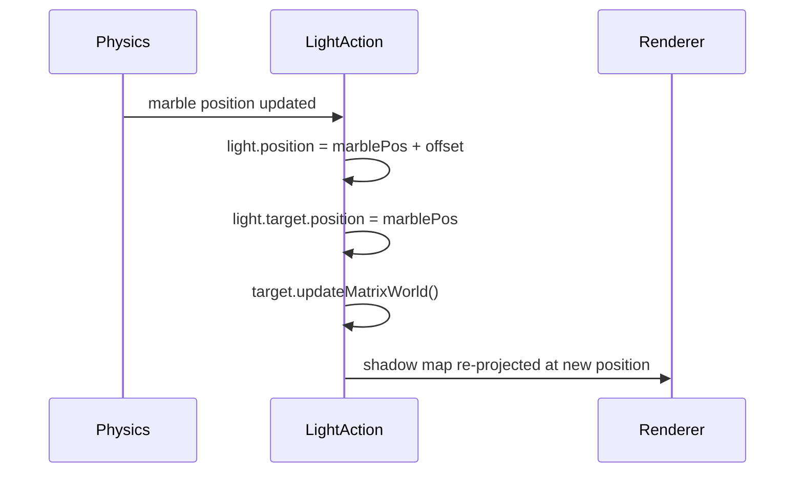

# Crisp Directional Shadows in Three.js Games

## The default is blurry and wasteful

Out of the box, a `DirectionalLight` with `castShadow: true` places its shadow camera frustum at ±150 world units. A 4096×4096 shadow map over 300 units gives roughly 13 pixels per unit — so a 1-unit marble casts a 13-pixel smear. Multiply that by `PCFSoftShadowMap`'s blur kernel and the shadow becomes a hazy halo rather than a crisp contact shadow.

## The tight-frustum principle

The shadow map is a fixed budget of pixels. Halving the frustum doubles the pixel density — at no extra GPU or memory cost. Shrinking from ±150 to ±25 yields about 82 px/unit, a **6× improvement with zero overhead**.

```
±150 frustum → 13 px/unit  (smeared shadow)
±25  frustum → 82 px/unit  (crisp contact shadow)
```

The constraint is that the frustum must cover everything that needs to cast or receive a shadow inside it. When the light follows the player, ±25 comfortably encloses a typical game arena around the current position.

## bias = 0 eliminates the halo

The "missing shadow halo" (a ring of light between a mesh and its shadow) is caused by shadow acne correction going too far. A negative `bias` pushes the shadow toward the surface to eliminate acne — but if it overshoots, it detaches the shadow from the base of the mesh. At `±25` with `radius: 1`, `bias: 0` is the correct value: the tight frustum already provides enough resolution that acne does not appear, so no offset is needed.

```
bias: -0.005  →  halo visible (shadow detaches from mesh base)
bias:  0      →  crisp shadow flush with the mesh
```

## radius = 1 removes PCF softening

`light.shadow.radius` controls the PCF (Percentage Closer Filtering) kernel size. The default of `1` means a single sample — no blur. Any value above 1 intentionally softens edges. For game contact shadows, always set `radius: 1`.

## The light must follow the player

A tight frustum only stays useful if it tracks where the action is. A stationary light with a ±25 frustum will shadow only the small patch of ground directly beneath it. Moving both `light.position` and `light.target.position` each frame — with a fixed world-space offset — keeps the frustum centered on the player without changing the shadow angle.



The shadow angle is constant because the offset vector is constant. Only the shadow map origin moves.

## Reusable timeline action factories

`src/utils/gameTimelineActions.ts` exports factory functions for the most common per-frame game actions:

```
createPhysicsSyncAction       — sync Rapier body → Three.js mesh
createDirectionalLightFollowAction — move light + target to track a mesh
createCameraFollowAction      — smooth camera follow with orbit bypass
createTimerAction             — accumulate elapsed time, stop when finished
createFallCheckAction         — trigger respawn when mesh drops below Y
```

Each factory returns a `{ name, category, start, action }` object ready for `timeline.addAction()`. Compose them in `buildTimeline` rather than writing raw action objects.

## Config snapshot (MarbleMadness)

| Setting              | Value | Why                                         |
| -------------------- | ----- | ------------------------------------------- |
| frustum              | ±25   | Covers ~50 units around the marble          |
| far                  | 300   | Enough for platform shadows below the track |
| bias                 | 0     | No acne at this resolution                  |
| radius               | 1     | No PCF blur                                 |
| light follows marble | yes   | Keeps frustum centered on the action        |
