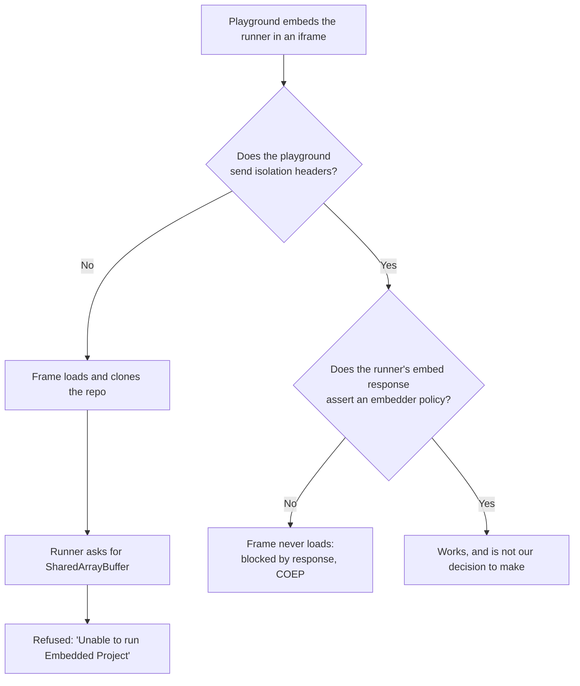

# Embedding a Repository Runner: The Isolation Deadlock

The GitHub example loader was meant to run someone else's starter inside the playground: pick a
repository from a search, watch it boot in a frame, never leave the app. It ships instead as a
search that hands back a link and a clone command. What closed the door is a constraint that no
amount of reading our own code would reveal, because it lives entirely in the headers of two
servers neither of which we control.

## What a browser runner actually needs

Services that install and serve an arbitrary repository in the browser do it inside a virtual
machine built on `SharedArrayBuffer`. Since Spectre, browsers only hand that primitive to a page
that is **cross-origin isolated**, which a page earns by sending two headers: an opener policy
that severs its relationship with whatever opened it, and an embedder policy that promises every
subresource it pulls has opted in to being embedded.

Isolation is not a property a page can claim alone. It is negotiated down the whole frame tree.

## The deadlock

The negotiation has a rule that only bites when the runner is in an iframe rather than a tab: a
nested document inside an isolated parent must itself assert an embedder policy, or the browser
refuses to load the frame at all. So the parent's two choices lead to two different failures.

The cruel part is that the two failures look nothing alike. Without the headers the runner gets
far enough to clone the repository and print progress, so the frame looks alive and the error
reads like a runner problem. With the headers there is no frame at all, no progress, and a
console message naming a policy rather than a service. It is easy to read the second state as a
regression caused by the first fix, and to spend the next attempt loosening the headers again.

The permissive embedder policy is a trap here for the same reason. It exists precisely so that
cross-origin subresources keep working without each one opting in, which makes it the obvious
gentler choice, and it does nothing at all for this case: the rule it relaxes covers
subresources, not nested documents. A frame still needs its own policy either way.

## Why the escape hatches are not there

| Route                                         | Why it fails                                             |
| --------------------------------------------- | -------------------------------------------------------- |
| Set the headers only while the loader is open | Isolation is a property of the document, fixed at load   |
| Ask the runner to send the missing policy     | Their embed response, their decision                     |
| Use a runner that builds server side instead  | The anonymous import path for the obvious one now 422s   |
| Build the repository in the page ourselves    | A TypeScript toolchain in the browser, to preview a link |

The last row is the one worth naming out loud. Every alternative to embedding is some amount of
compiler shipped to the client, and the thing being bought is a preview pane.

## The shape that survived

Splitting the feature along the line the browser drew turned out to cost nothing. Search,
autocomplete and the repository reference all live in the shell, where they were always going to
live; only the running of the code moved out, to a tab for the browser route and to a clone
command for the terminal. The terminal route is the one that was actually asked for, and it never
needed a frame.

Two smaller things fell out of it. The autocomplete is a native datalist, which means the browser
owns filtering, keyboard navigation and dismissal; the only selection signal it gives back is the
chosen value appearing in the field, so a complete owner-and-name is what triggers a load, and
pasting one by hand works for free. And an unauthenticated repository search is rate limited to
ten requests a minute and reports exhaustion with a status that also means refusal, so the
request is debounced and the message distinguishes the two cases by hand.

## The general lesson

Before designing around an embed, check what the embedded document sends, not just whether it
renders. A service can be perfectly embeddable in the sense that it refuses no frames, and still
be unusable because the thing it needs to do inside that frame is gated on a negotiation both
ends have to join. The headers are the contract; the rendering is not evidence of one.
