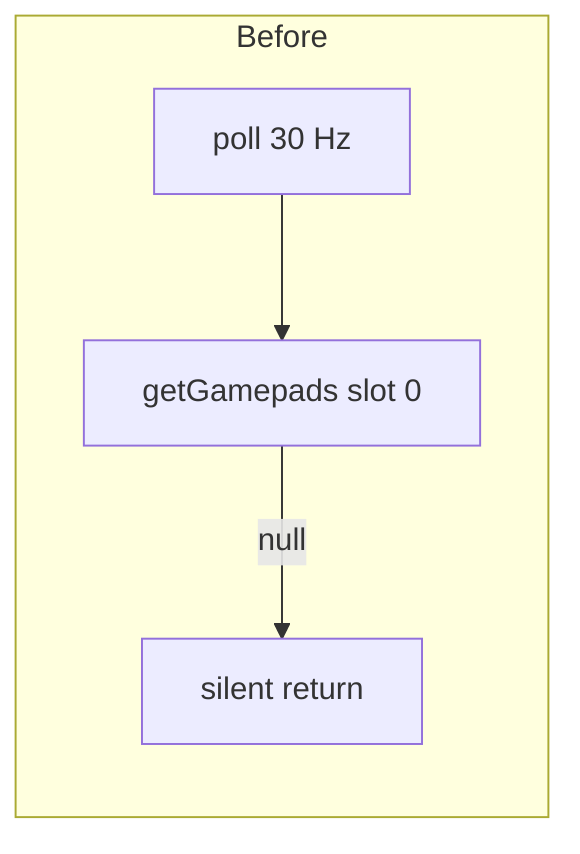
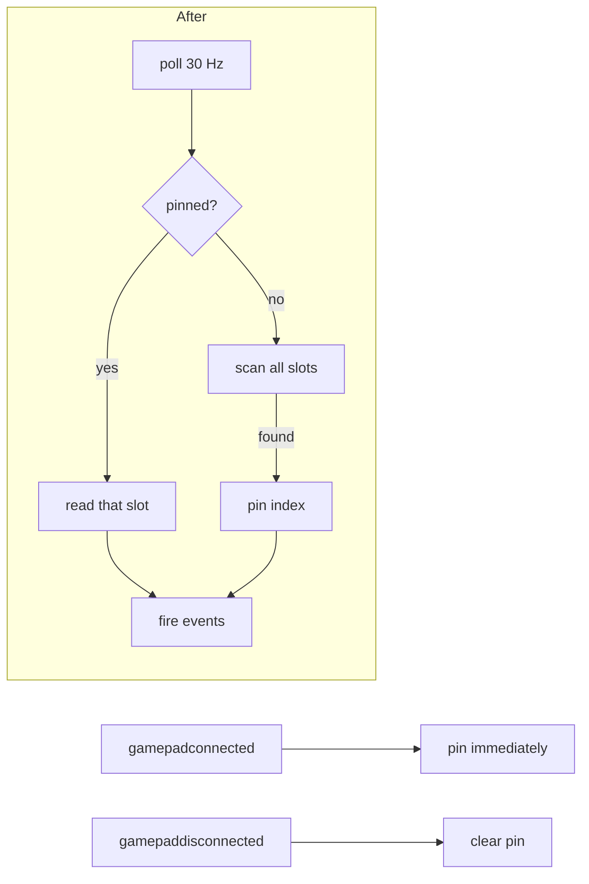

# Gamepad controls, hotkey tooltips, and multi-view navigation

How the project grew from keyboard-only lobby screens to a unified system where a DualShock or Xbox controller navigates every screen — lobby, wizard, gameplay, and header — with consistent visual feedback and no per-view boilerplate.

---

## The starting point

The games already had gamepad support for in-game movement through `@webgamekit/controls`, but the surrounding UI — picking a game, configuring a lobby, navigating back — was mouse-and-keyboard only. A controller player was stuck the moment they left the Three.js canvas.

The first symptom surfaced in MarbleMadness: the KEYBOARD_MAPPING constant had no `gamepad` block at all, so pressing the left stick did nothing.

---

## Part 1 — Getting the controller to talk to the browser

### The silent slot-0 bug

Before any UI work, the gamepad poller itself had a latent bug. `createGamepadController` called `bind(index = 0)` and read `navigator.getGamepads()[0]` every tick. When an OS, Bluetooth stack, or other device occupies slot 0, the controller lands at slot 1 or 2. The poller saw `null`, returned silently, and nobody knew.



The investigation used a temporary `console.warn` layer at every step — `bind()`, first detection, every button press. With a DualShock 4 on a Mac sharing Bluetooth with AirPods, the controller consistently landed at slot 1. The fix: scan all slots on each tick and pin lazily once a controller appears. Two `window` event listeners handle hot-plug and disconnect.



The lesson: never trust the array index to be stable. Always scan; pin on first hit; clear on disconnect.

---

## Part 2 — Menu navigation as a shared composable

Rather than adding gamepad-handling code to every view, a single composable — `useMenuNavigation` — translates raw controller input into semantic actions (`up`, `down`, `left`, `right`, `activate`, `cancel`, `decrease`). It wraps `createControls` from `@webgamekit/controls` with a mapping that covers four input methods simultaneously:

| Physical input         | Semantic action          |
| ---------------------- | ------------------------ |
| Arrow keys             | up / down / left / right |
| Enter                  | activate                 |
| Escape                 | cancel                   |
| D-pad                  | up / down / left / right |
| Left stick (axes 0/1)  | left-right / up-down     |
| Right stick (axes 2/3) | left-right / up-down     |
| Cross / A              | activate                 |
| Square / X / Y         | decrease                 |
| Circle / B             | cancel                   |

The composable also exposes a `MenuSource` — `'keyboard'` or `'gamepad'` — in the handler callback. This let consumers distinguish inputs without adding their own device-detection logic.

---

## Part 3 — Row/column focus grid

Every view that needs gamepad navigation follows the same DOM pattern. Focusable groups are marked with a data attribute (`data-lui-row` or `data-nav-row`). A local query function collects these rows in DOM order and exposes them as a flat array. A `focusRow` integer and `focusCol` integer track the cursor.

```
[row 0]  [Name input]
[row 1]  [Red] [Orange] [Green] [Purple] [Gray]   ← color swatches
[row 2]  [Race] [Rush]                             ← mode toggle
[row 3]  [marble 1] [marble 2] ... [marble 9]     ← image grid
[row 4]  [Track dropdown]
[row 5]  [Laps number input]
[row 6]  [Private checkbox]
[row 7]  [Start]
```

Up/Down increments `focusRow`; Left/Right increments `focusCol` within the current row. After every navigation step `applyFocus()` calls `.focus()` on the target element and updates the tooltip rect.

The same logic runs in three separate places:

- **`LobbyUIWizard.vue`** — the game lobby wizard used by all multiplayer games
- **`Lobby.vue`** — the main hub's game picker cards and sidebar section toggles
- **`LobbyUIShowcase.vue`** — the developer test page

Each location mounts `useMenuNavigation` independently. Because the composable uses `onMounted` / `onUnmounted` to bind and clean up the controls instance, multiple views can coexist (lobby inside a game overlay, for example) without event listener collisions.

---

## Part 4 — Special handling for cyclable controls

Dropdowns (`<select>`) and number inputs (`<input type="number">`) need a two-step interaction to avoid accidental changes:

1. **Idle** — Up/Down navigates rows. Tooltip shows `↕ Change`.
2. **Edit mode** — X enters edit mode. Up/Down cycles the value. Tooltip flips to `✕ Confirm`.
3. **Confirm** — X again commits and advances to the next row.

This required an `editingElement` ref that tracks which control is currently in edit mode. The `describeControl` function reads it to pick the right tooltip parts. Row navigation clears `editingElement` so switching rows always resets to idle.

The `<select>` picker also had to be suppressed: browsers open the native OS dropdown on Enter, Space, and F4. `useMenuNavigation` calls `event.preventDefault()` for those keys when a `<select>` is focused.

---

## Part 5 — Hotkey tooltip chip

The yellow confirmation chip is a `position: fixed` element that tracks the focused control's bounding rect. It only renders when `inputSource === 'gamepad'` — keyboard and mouse users see only the native focus ring.

```
[← Lobby]  [Track  Long Road ↕ Change]  [Start]
                            ^^^^^^^^^^^
                            chip appears here
```

The chip position is computed from `getBoundingClientRect()` each time focus moves. Height is fixed (driven by `padding-block` and `line-height: 1`) so it looks consistent across small inputs and large buttons. A `focusout` event on the panel clears the hint whenever focus leaves the component tree.

---

## Part 6 — Back navigation with O / circle

The `cancel` semantic action maps to the circle/B button. Rather than handling it in every game view, two shared components absorb it:

**`GameHeader.vue`** (used by all multiplayer games) wires `useMenuNavigation` and calls its existing `handleBack()` on cancel. `handleBack` already knows whether to navigate back in the router (lobby mode) or emit `leaveRoom` (standalone mode).

**`LobbyLayout.vue`** (the grid wrapper shared by all game screens) also mounts `useMenuNavigation`. If the rules/help panel is open, cancel closes it. Otherwise, it emits `leaveRoom` for the parent game to handle.

**`MarbleMadnessGame.vue`** adds a third instance specifically for the in-game canvas, where `cancel` emits `escape` → goes back to the lobby phase. A yellow "O Back" chip appears top-right whenever `gamepadActive` is true.

Because each component mounts its own `useMenuNavigation` instance, the cancel hierarchy is naturally scoped: the rules panel eats the event before the header does; the game canvas eats it before the layout does.

---

## Part 7 — Font and visual consistency

The `LobbyUI` kit depends on two CSS custom property blocks: `--lui-*` tokens (defined in `lobby-ui.scss`) and the `--font-playful` + `--shadow-text-game-large` tokens (defined in `game-ui.scss`). Since `lobby-ui.scss` uses `@use 'game-ui'`, any component that imports `lobby-ui.scss` pulls both.

`GameHeader.vue` and `LobbyLayout.vue` import `lobby-ui.scss` directly so the tokens are available during gameplay — not just in the lobby phase when the wizard is mounted.

Focus states are purely CSS: `color: var(--lui-focus-color)` (`#ffd700`) on hover/focus-visible, with no outline ring. Text children use `color: inherit` so the yellow propagates through without per-child rules.

---

## What this pattern enables

Each new game that uses `GameHeader` + `LobbyLayout` + `LobbyUIWizard` gets:

- Joypad navigation through the whole lobby at no cost
- O/circle to go back from anywhere
- Yellow focus indicators matching the kit
- Hotkey tooltips when a gamepad is detected

Adding gamepad support to a new view means placing `data-nav-row` markers on its focusable groups and calling `useMenuNavigation` once. The controls package, the button map, the tooltip chip, and the back-navigation are all inherited.
