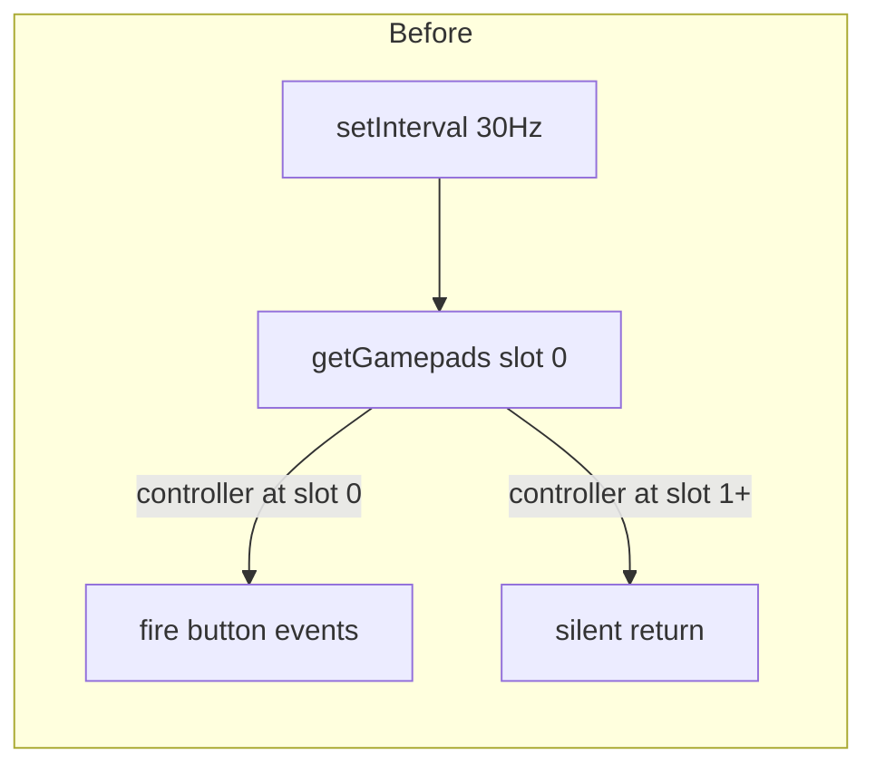
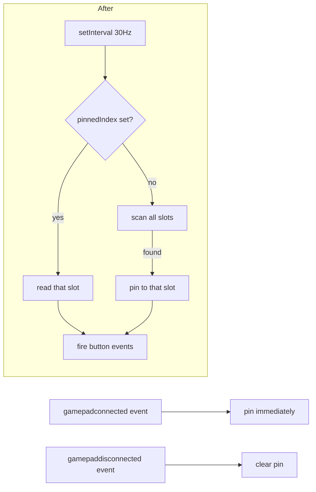

# Gamepad detection: from silent failure to multi-slot scan

The `@webgamekit/controls` package shipped with a polling loop that assumed every connected controller would land at slot 0 of `navigator.getGamepads()`. For a while this held — most users plug a single device in and the OS dutifully assigns it index 0. Then the kit started failing intermittently in pages where it had worked the day before: ForestGame, MixamoPlayground, MarbleMadness. Buttons did nothing, and no log explained why.

## The browser's gamepad API is a sparse array

`navigator.getGamepads()` returns a fixed-length array — typically four slots. Each slot is either a `Gamepad` object or `null`. The slot a controller occupies depends on the order it appeared, OS bookkeeping, and whether something else (Steam, DS4Windows, a Bluetooth dongle, an Apple Magic Trackpad sharing the bus) reserved a lower index. Reconnects can shuffle the assignment without notice.

The original poller pinned its read to slot 0 the moment `bind()` was called and never reconsidered. When a controller arrived at slot 1 or later, the read returned `null`, the function exited silently, and the kit looked broken.

There was a second, subtler bug. The poller never listened for `gamepadconnected`. A user who plugged a controller in _after_ the page loaded would not be detected until the next 30 Hz tick — and even then only if the device landed at slot 0. The kit had no idea a controller had appeared.

## The investigation needed visible signal

The cost of silence is that no one trusts a reproduction step. Was the controller dead? Was the page broken? Was the kit in some unbound state? To break the deadlock, the poller was temporarily instrumented with `console.warn` at every meaningful event: `bind()` start, first detection in a poll, every `gamepadconnected` and `gamepaddisconnected` event, and every button press as it crossed from the package into consumer code.

That diagnostic pass made the failure obvious in seconds: with a DualShock 4 on a Mac that also has AirPods paired, the controller routinely landed at slot 1. The poller saw nothing because it never looked. With the cause identified, the logs were removed and the fix made minimal and permanent.

## Resolution: pin lazily, scan eagerly

The new shape is small. `bind()` no longer takes a default index of 0 — instead it accepts an optional explicit slot, defaulting to "unpinned." A helper called `findActiveGamepad` returns the first non-null slot, or — if a pin is already set — that slot directly. The first successful poll pins to whatever slot the controller occupies, and that pin persists until disconnect.

The two new `window` listeners cover the hot-plug case. A controller plugged in after the page loaded is pinned the moment the browser fires `gamepadconnected`, so the next poll cycle delivers button events without anyone waiting for a manual rebind. Disconnect clears the pin so the next controller — possibly at a different slot — can take over without a stale read in between.

## What the fix deliberately leaves untouched

The poll interval stays at 30 Hz, because that's already well above the 60 Hz frame rate ceiling most games run at and reducing it more would burn battery on idle pages. The button-name map and axis-threshold defaults are unchanged. The public `bind()` and `unbind()` surface keeps the same arguments — `bind()` simply treats `undefined` as "auto-detect" instead of "slot 0."

The persistent debug logs that proved so useful during the investigation are not part of the shipped package. They lived only in a throwaway branch. Re-instrumenting the package next time something seems silently broken is the right pattern: add `console.warn` lines, find the failure mode, write a test, then strip the logs in the same commit. Permanent logging in a hot poll loop hurts more pages than it helps.

## Tests that protect the fix

A unit test under `packages/controls/src/gamepad.test.ts` exercises three scenarios:

- Empty `navigator.getGamepads()` results in no calls to consumer handlers.
- A controller at slot 2 is detected and pinned on the first poll.
- A `gamepaddisconnected` event for the pinned slot clears the pin so the next poll can pick up a new controller.

These are intentionally narrow. They cover the regression path — the original code would fail the slot-2 case — without coupling to the polling cadence or the button name map.
