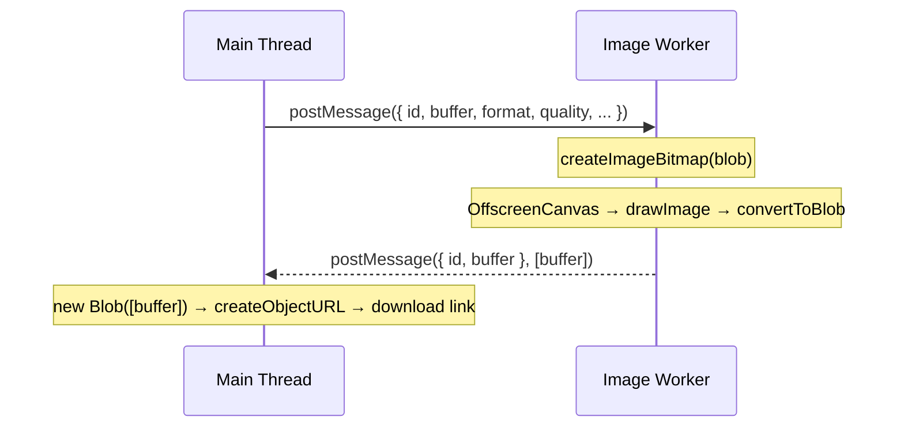

# Image Converter: Client-Side Conversion via Web Worker

This documents the design decisions behind the image converter tool (issue #37).

## The constraint: everything must stay in the browser

The goal was to convert and compress images — PNG to WebP, resize on the fly, adjust quality — without sending files to a server. Two reasons drove this: privacy (users should not need to upload personal images to a third party) and simplicity (no backend, no storage, no auth).

The browser has had the building blocks for years: `FileReader`, `Canvas`, and `toBlob`. The missing piece was keeping the main thread free during conversion of large files or batches.

## Why a Web Worker?

Decoding a 10 MB PNG, scaling it, and re-encoding it to WebP can take hundreds of milliseconds. Running that on the main thread freezes the UI — the file list stops updating, animations stutter, and the browser may show a "page unresponsive" warning on slower devices.

A dedicated Worker runs on a separate OS thread. The main thread posts a message and continues rendering; the Worker does the heavy lifting and posts the result back when done.



Each file gets its own message round-trip. The Worker processes them sequentially (one active job at a time) and signals completion via the result's `id`, which the main thread uses to match the result back to the correct file entry.

## OffscreenCanvas as the conversion engine

`HTMLCanvasElement.toBlob()` is the classic approach to re-encode an image in a browser. But `HTMLCanvasElement` is a DOM object and cannot be used inside a Worker.

`OffscreenCanvas` is the Worker-compatible equivalent. It has the same 2D drawing API and — crucially — a `convertToBlob()` method that returns a Promise with the encoded result in whatever format and quality you request.

```mermaid
flowchart LR
    A[ArrayBuffer] --> B["new Blob([buffer])"]
    B --> C[createImageBitmap]
    C --> D["OffscreenCanvas\n.getContext('2d')\n.drawImage"]
    D --> E["canvas.convertToBlob\n({ type, quality })"]
    E --> F[ArrayBuffer via .arrayBuffer()]
    F --> G[transferred to main thread]
```

`createImageBitmap` handles decoding — it accepts a `Blob` directly, respects EXIF orientation, and returns a hardware-accelerated `ImageBitmap` that can be drawn to canvas in one call. The bitmap is then closed to free GPU memory.

## Transferable ArrayBuffers: zero-copy across threads

Blobs cannot be transferred between threads — they can only be structured-cloned, which copies the underlying bytes. A large image file copied twice (once to the Worker, once back) would double the peak memory usage.

The output is instead read into an `ArrayBuffer` (`outputBlob.arrayBuffer()`) which is transferred using the second argument to `postMessage`:

```typescript
self.postMessage(result, [outputBuffer])
```

Transferring an `ArrayBuffer` hands ownership to the receiving thread without copying — the Worker's reference becomes detached (zero bytes) the moment the transfer completes. The main thread reconstructs a `Blob` from the received buffer for the download link.

The input buffer is not transferred to the Worker — it is structured-cloned. This is intentional: the original buffer stays valid on the main thread so "Re-convert all" can resend it with new settings without re-reading the file from disk.

## Format support and AVIF detection

`convertToBlob` accepts any MIME type the browser supports for encoding. WebP and JPEG are universally supported in modern browsers. AVIF encoding requires Chrome 94+ or Firefox 113+.

Rather than silently producing a PNG fallback when AVIF is unavailable, the Worker lets the `convertToBlob` call reject. The error propagates back to the main thread as a `ConvertError` message, and the file entry shows the browser's own error text. This makes the limitation explicit rather than surprising the user with an unexpected output format.

## Object URL lifecycle

Each converted file gets a temporary object URL (`URL.createObjectURL`) pointing to its output Blob. These URLs are revoked:

- When the user removes a file from the list
- When "Clear all" is clicked
- When "Re-convert all" replaces them with fresh results
- On `onUnmounted`, which also terminates the Worker

Without explicit revocation, object URLs persist for the lifetime of the document and the underlying Blobs are never garbage-collected — a steady memory leak for users processing many images in one session.
