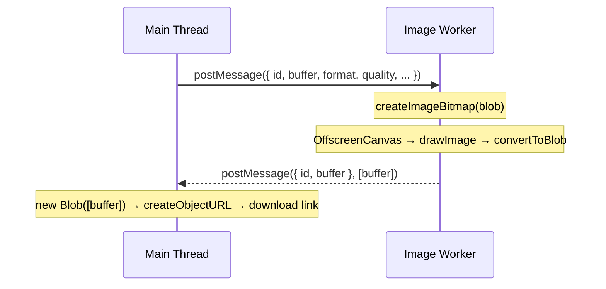
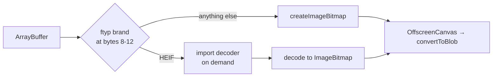

# Image Converter: Client-Side Conversion via Web Worker

This documents the design decisions behind the image converter tool (issue #37).

## The constraint: everything must stay in the browser

The goal was to convert and compress images — PNG to WebP, resize on the fly, adjust quality — without sending files to a server. Two reasons drove this: privacy (users should not need to upload personal images to a third party) and simplicity (no backend, no storage, no auth).

The browser has had the building blocks for years: `FileReader`, `Canvas`, and `toBlob`. The missing piece was keeping the main thread free during conversion of large files or batches.

## Why a Web Worker?

Decoding a 10 MB PNG, scaling it, and re-encoding it to WebP can take hundreds of milliseconds. Running that on the main thread freezes the UI — the file list stops updating, animations stutter, and the browser may show a "page unresponsive" warning on slower devices.

A dedicated Worker runs on a separate OS thread. The main thread posts a message and continues rendering; the Worker does the heavy lifting and posts the result back when done.


```mermaid
sequenceDiagram
    participant Main as Main Thread
    participant Worker as Image Worker

    Main->>Worker: postMessage({ id, buffer, format, quality, ... })
    Note over Worker: createImageBitmap(blob)
    Note over Worker: OffscreenCanvas → drawImage → convertToBlob
    Worker-->>Main: postMessage({ id, buffer }, [buffer])
    Note over Main: new Blob([buffer]) → createObjectURL → download link
```

Each file gets its own message round-trip. The Worker processes them sequentially (one active job at a time) and signals completion via the result's `id`, which the main thread uses to match the result back to the correct file entry.

## OffscreenCanvas as the conversion engine

`HTMLCanvasElement.toBlob()` is the classic approach to re-encode an image in a browser. But `HTMLCanvasElement` is a DOM object and cannot be used inside a Worker.

`OffscreenCanvas` is the Worker-compatible equivalent. It has the same 2D drawing API and — crucially — a `convertToBlob()` method that returns a Promise with the encoded result in whatever format and quality you request.

```mermaid
flowchart LR
    A[ArrayBuffer] --> B["new Blob([buffer])"]
    B --> C[createImageBitmap]
    C --> D["OffscreenCanvas\n.getContext('2d')\n.drawImage"]
    D --> E["canvas.convertToBlob\n({ type, quality })"]
    E --> F[ArrayBuffer via .arrayBuffer()]
    F --> G[transferred to main thread]
```

`createImageBitmap` handles decoding — it accepts a `Blob` directly, respects EXIF orientation, and returns a hardware-accelerated `ImageBitmap` that can be drawn to canvas in one call. The bitmap is then closed to free GPU memory.

## Transferable ArrayBuffers: zero-copy across threads

Blobs cannot be transferred between threads — they can only be structured-cloned, which copies the underlying bytes. A large image file copied twice (once to the Worker, once back) would double the peak memory usage.

The output is instead read into an `ArrayBuffer` (`outputBlob.arrayBuffer()`) which is transferred using the second argument to `postMessage`:

```typescript
self.postMessage(result, [outputBuffer])
```

Transferring an `ArrayBuffer` hands ownership to the receiving thread without copying — the Worker's reference becomes detached (zero bytes) the moment the transfer completes. The main thread reconstructs a `Blob` from the received buffer for the download link.

The input buffer is not transferred to the Worker — it is structured-cloned. This is intentional: the original buffer stays valid on the main thread so "Re-convert all" can resend it with new settings without re-reading the file from disk.

## Format support and AVIF detection

`convertToBlob` accepts any MIME type the browser supports for encoding. WebP and JPEG are universally supported in modern browsers. AVIF encoding requires Chrome 94+ or Firefox 113+.

Rather than silently producing a PNG fallback when AVIF is unavailable, the Worker lets the `convertToBlob` call reject. The error propagates back to the main thread as a `ConvertError` message, and the file entry shows the browser's own error text. This makes the limitation explicit rather than surprising the user with an unexpected output format.

## Object URL lifecycle

Each converted file gets a temporary object URL (`URL.createObjectURL`) pointing to its output Blob. These URLs are revoked:

- When the user removes a file from the list
- When "Clear all" is clicked
- When "Re-convert all" replaces them with fresh results
- On `onUnmounted`, which also terminates the Worker

Without explicit revocation, object URLs persist for the lifetime of the document and the underlying Blobs are never garbage-collected — a steady memory leak for users processing many images in one session.

## HEIF input: the decoder the browser does not have

Adding `.heic` support (issue #256) looked like three separate bugs and was one. Chrome and
Firefox ship no HEIF decoder, so `createImageBitmap` rejected in the Worker, the thumbnail
`` fired its error handler on the main thread, and the source dimensions were never
read because they were being measured with that same ``. Safari worked throughout,
which is exactly the kind of split that makes the problem look like three unrelated
reports.

### Sniffing the container, not the MIME type

`File.type` is unreliable for HEIF. Operating systems and browsers frequently hand over an
empty string for `.heic`, and file pickers do not consistently expand an `image/*` accept
filter to cover it, so the extension has to be listed explicitly as well.

The reliable signal is the ISO base media file format brand, four bytes at offset eight,
shared by HEIF, AVIF, MP4 and QuickTime. Reading it directly costs three lines. The
decoder library offers the same check, but importing it to ask the question would pull its
three megabytes of WebAssembly in for every JPEG, which inverts the whole point of asking.

AVIF sits in that same container and must be excluded: browsers decode it natively, so
routing it through the HEIF decoder would be slower and would fail on files that already
work.

### Decode to a bitmap, never to a blob

The decoder exposes several output targets, and only one of them belongs in a Worker.

| Target        | Works in a Worker | Cost                          |
| ------------- | ----------------- | ----------------------------- |
| Canvas / blob | No                | Reaches for `document`        |
| `ImageBitmap` | Yes               | None beyond the decode itself |

The blob targets are also wasteful even where they run. The pipeline already needs an
`ImageBitmap`, so a blob target would encode a full intermediate image purely to hand the
next step something it can read. For a twelve-megapixel photo that is a thirty-megabyte
PNG created and discarded for nothing. Requesting the bitmap directly drops the decode into
the one line that previously called `createImageBitmap`, and the rest of the pipeline never
learns that anything changed.


```mermaid
flowchart LR
    A[ArrayBuffer] --> B{ftyp brand<br/>at bytes 8-12}
    B -->|HEIF| C[import decoder<br/>on demand]
    B -->|anything else| D[createImageBitmap]
    C --> E[decode to ImageBitmap]
    D --> F[OffscreenCanvas → convertToBlob]
    E --> F
```

The decoder spawns a Worker of its own from a blob URL, so the WebAssembly work happens off
the converter Worker's thread as well. Nested Workers are what make this affordable; a
decoder that ran inline would stall the batch.

### The Vite setting that decides whether lazy is lazy

This is the constraint nothing in the source can tell you. Vite's default Worker output
format is `iife`, which cannot code-split, so Rollup inlines any dynamic import it finds
inside a Worker. A carefully deferred `import()` of a three-megabyte decoder therefore
becomes three megabytes bundled into the Worker chunk and downloaded by everyone who opens
the tool, while the source still reads as though it were deferred.

Setting the Worker format to `es` restores real code splitting. The symptom is only visible
in the size of the build output, never at runtime and never in review, so it is worth
checking the emitted chunks whenever a Worker gains a dynamic import.

A related trap sits one level up: a module shared between the main bundle and a Worker is
bundled into both, because Vite builds them as separate Rollup passes. Keeping the decode
call inside the Worker and exporting only the brand check for the main thread to share is
what stops a second, permanently unused copy of the decoder from being emitted.

### What the decoder gave back for free

Because the Worker now holds the decoded bitmap, it can report the source dimensions in its
result. That removed the `` probe the main thread had been using to measure them, and
with it the `FileReader` wrapper around reading the file, since the source dimensions were
the only reason either existed.

The cost is that a HEIF entry has no thumbnail until its conversion finishes: the browser
cannot paint the original, so the converted result stands in. An `` with no source
renders a broken-image glyph rather than nothing, so that placeholder has to be an empty
element of the same size instead.


_Mid-conversion: an empty slot holds the layout, because the browser has nothing it can paint yet._


_Settled: the thumbnail, the saving and the source dimensions all come from the decoded bitmap._
