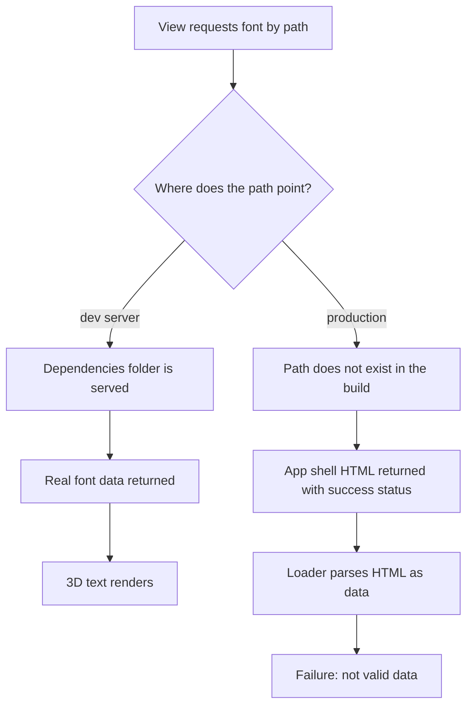

# A Font That Only Existed in Development

## The symptom

In production, the LandingPage experiment threw an uncaught error that surfaced
in monitoring as a JSON syntax error complaining about an unexpected `<` and a
`<!doctype` string. The same view worked perfectly in local development, so the
failure only appeared once the app was deployed.

## Why the same code behaved differently

The view loads a Three.js typeface so it can extrude the site name into 3D text.
That font was being fetched at runtime from a path that pointed straight into the
installed dependencies folder. During development the dev server happily serves
files out of that folder, so the request returned the real font and everything
rendered.

A production build is a different world. The dependencies folder is a build-time
detail; it is never published. When the browser asked for a file that does not
exist, the single-page-app hosting did what it always does for an unknown path:
it returned the application shell — an HTML document — with a success status.
The font loader, expecting structured font data, was instead handed a page of
HTML beginning with a doctype declaration, and parsing it as data failed. The
green success status on the request is what makes this class of bug confusing:
nothing looks broken until something downstream tries to read the response.

## The shift in thinking

The fix is to stop treating the font as a live URL into someone else's folder and
start treating it as an asset the build owns. When the font is imported as a
build asset, the bundler copies it into the published output under a
content-hashed name and hands back the correct address for it. That address is
resolved the same way in development and in production, because in both cases the
file genuinely exists where the import says it does. The runtime path that only
happened to work locally disappears entirely.

## The lesson

Anything the app needs at runtime must come through the build, not through a path
that merely happens to resolve while developing. A request that returns the app
shell with a success status — rather than an honest not-found — is the
fingerprint of this mistake: a resource that lives only in the development
environment. Treat fonts, data files, and other static dependencies as owned
assets so the build is responsible for shipping them and for telling the code
where they are.
