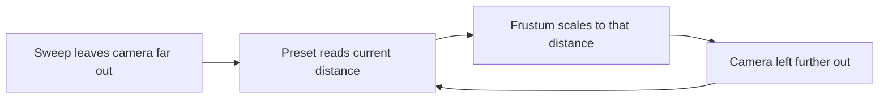

# Lighting a Scene

Four findings from gathering every light in the toolkit into one module, each of them
invisible from reading the code that was there before.

## Two things were called the environment

The word arrived already taken. The bootstrap that builds a renderer, a scene and a physics
world was named after the environment, while the thing a scene actually wants when it asks
for environment light is something else entirely: the indirect, image-based illumination a
scene applies through its environment map, lighting every material from all directions at
once.

Both meanings cannot live in one codebase without someone reaching for the wrong one, so the
bootstrap was renamed for what it returns — a scene — and the term was left to lighting alone.

| Term              | What it means                                             |
| ----------------- | --------------------------------------------------------- |
| Scene bootstrap   | Renderer, scene, camera and physics world, once per view  |
| Environment light | Indirect light from an environment map, on every material |

## A rect area light that lit nothing

A rect area light declared in a view contributed no light at all, and nothing said so. Three.js
keeps the shader data that light needs outside its core build, in a uniforms library that has
to be initialised before the light can do anything. Skip that call and the light still
constructs, still appears in the scene graph, still reports its colour and intensity, and still
emits nothing.

Nothing about the calling code looks wrong. The failure is silent, has no error, and reads as
"that light is too dim" rather than "that light is off", which is why it survived in a view
whose whole purpose was demonstrating light types. A module that owns light creation can make
that call once on everyone's behalf, which is the strongest argument for owning it centrally.

## A preset that answered to its history

The orthographic camera presets framed the scene by scaling their declared position and
frustum against the camera's **current** distance from what it was looking at. The intent was
adaptivity: a preset should suit the scale of the scene it lands in rather than snapping to a
fixed size.

The consequence was that the same preset never framed the same way twice. Whatever had last
moved the camera — a cinematic sweep, a follow rig, the preset picked before it — set the
distance the next preset would inherit, so the framing wandered and never settled.

The fix keeps the adaptivity and removes the drift by scaling against something that does not
move: the distance the scene declared its camera at. A preset is a name for a framing, and a
name that means something different each time it is used is not a preset.

## The first animation frame can arrive from the past

A day-cycle player that advanced its phase by the time between frames broke on the very first
one. The timestamp an animation frame receives is the time that frame began, which can be
**earlier** than the clock reading taken when playback started a moment before. The first delta
was therefore negative, the phase stepped backwards below zero, and the lookup for "which
preset are we blending from" landed on an index no preset occupies.

Two habits come out of it. Clamp a frame delta to zero rather than trusting it to be positive,
and wrap a cyclic index with an expression that handles negatives, because a plain remainder
keeps the sign of its input and hands back a position that does not exist.
