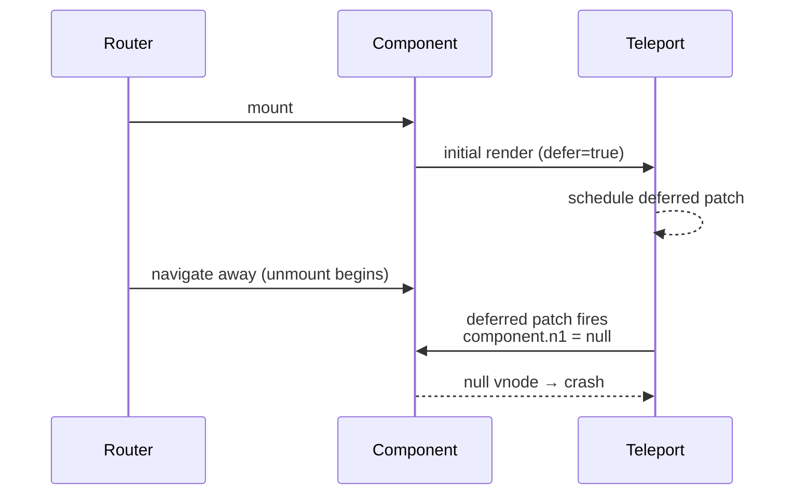
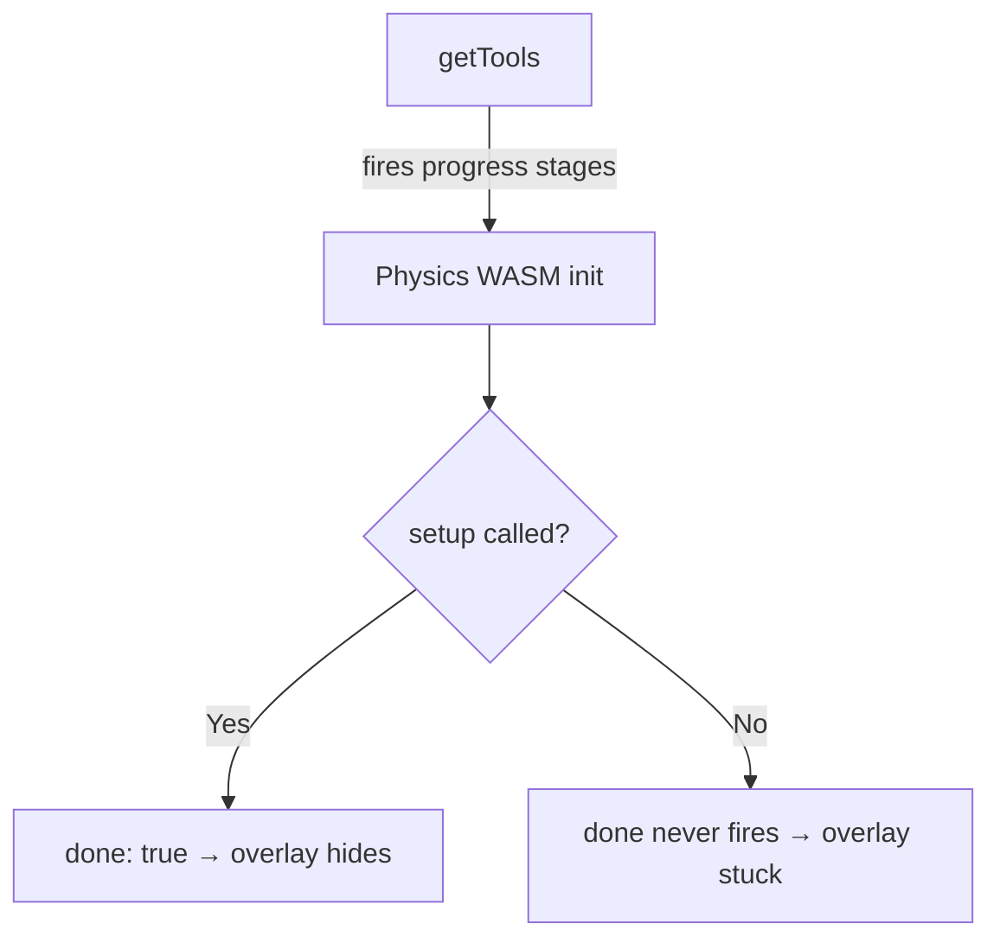
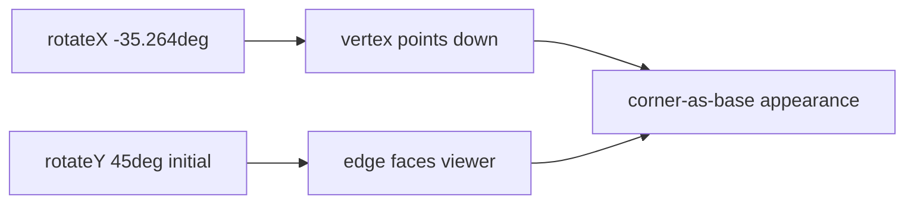

# Loading Overlay: Teleport Crashes, Progress Lifecycle, and CSS 3D Cube

This documents the non-obvious problems encountered while adding a global loading overlay to all Three.js views and building the CSS3 cube animation (PR #12).

## Vue Teleport defer causes null-component crashes on mount and unmount

`<Teleport defer>` was added to Vue 3.5 so the Teleport can wait for its target DOM element to be available. It achieves this by scheduling a second patch cycle after the initial mount. When the component is inside a fragment (multiple root nodes), this deferred cycle runs against a partially-initialised vnode tree.

The symptom was `TypeError: Cannot read properties of null (reading 'emitsOptions')` inside `shouldUpdateComponent` on every navigation to or away from `MultiplayerP2P`.



Two lessons:

1. **Remove `defer` when the target is always in the DOM.** `#config-panel-extra` lives inside `ConfigPanel`, which is unconditionally mounted in `App.vue`. The deferred flag was unnecessary.
2. **`defer` is unsafe in fragment-root components.** If a component has multiple root elements, Vue cannot guarantee the deferred patch runs in a safe window. Avoid `defer` in those components entirely.

## `getTools` progress lifecycle requires `setup()` for done:true

The `onProgress` callback passed to `getTools()` receives stage events during Rapier WASM initialisation. The final `{ done: true }` event is only fired from inside `setup()` — the function that configures lights, ground, sky, and camera.

Views that skip `setup()` and build their scene manually (like `LandingPage`, which uses a custom orthographic camera and its own physics loop) never receive `done: true`. The loading overlay stays visible indefinitely, stuck on the last stage reported by `getTools` (typically "Physics").



The fix for views that bypass `setup()` is to set `loadingVisible.value = false` explicitly after all async initialisation completes — immediately before starting the animation loop.

## CSS3 half-cube: corner-as-base orientation

The initial cube used only three faces (front, right, top) and rotated purely around Y with a shallow X tilt. Two problems appeared:

- **Missing left face:** with the X tilt applied, the gap between the front and back was visible as an open hole. Adding a back face and a left face closed it.
- **Wrong top face direction:** `rotateX(90deg)` points the face downward (toward the viewer from below). The correct transform for a face pointing upward is `rotateX(-90deg)`.
- **Flat orientation:** rotating around Y from angle 0 shows a flat face to the viewer. A corner-as-base look requires starting at `rotateY(45deg)` so the viewer looks at a vertical edge.

The isometric angle that puts one vertex directly below the cube is `rotateX(-35.264deg)` — the arctangent of `1 / √2`. This is the same angle used in true isometric projection.



The animation keyframe therefore reads:

```
from: rotateX(-35.264deg) rotateY(45deg)
to:   rotateX(-35.264deg) rotateY(405deg)
```

Keeping the X tilt constant outside the Y rotation means the tilt never changes during the spin — the cube always looks like it rests on a corner.

## Shared component to avoid cube duplication

The cube markup and keyframe were initially copy-pasted into both `LoadingOverlay` and `LoaderPreview`. Any tweak to the animation required editing two files.

The fix was extracting a `LoaderCube` component. Both consumers import it as a single element — the scoped styles and keyframe live in one place. This is the standard rule: when the same visual structure appears in two components, extract it before the third occurrence forces a harder refactor.
