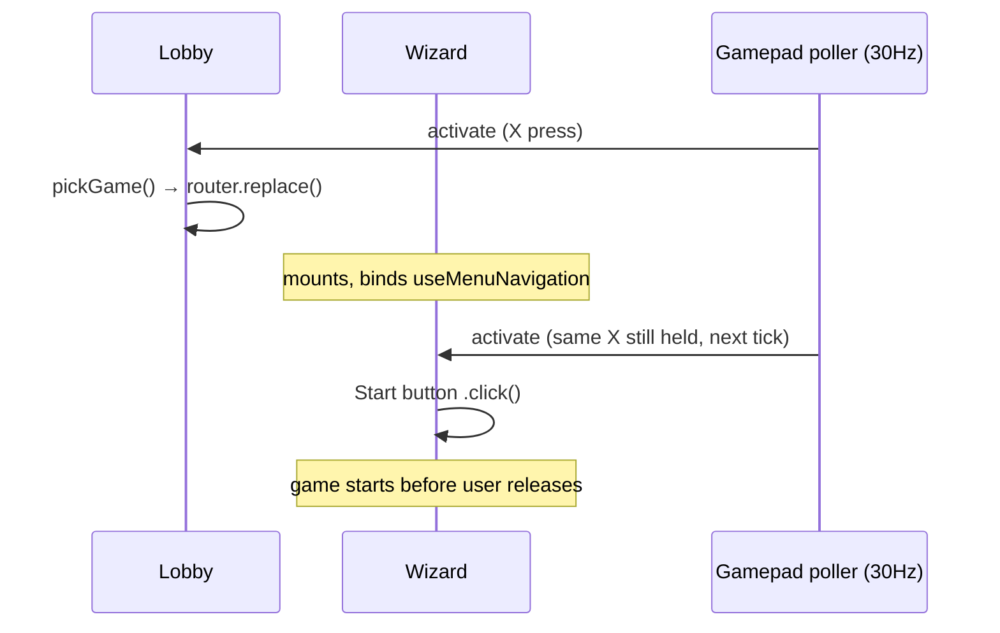
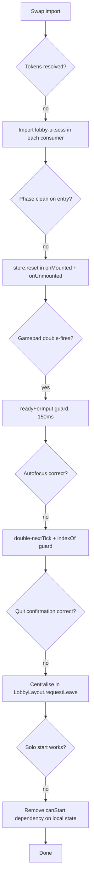

# Migrating the game lobby wizard to LobbyUI

The original `GameLobbyWizard` served every multiplayer game for months. Replacing it with `LobbyUIWizard` — a transparent, game-overlay-styled equivalent — looked simple at first: same props, same emits, swap the import. The reality was a long chain of interdependent problems, each visible only after the previous one was solved.

---

## The starting point looked deceptively clean

`LobbyUIWizard` was designed as a drop-in. It accepted the same props as `GameLobbyWizard`, emitted the same events, and passed through the same slots. Seven lobby wrappers — Pictionary, Squares, Wordle, Minigolf, BubbleShooter, RhythmGame, MarbleMadness — each needed one line changed: the import. For games with custom slot content (MarbleMadness's marble picker, Minigolf's hole grid), those slots carried their own styles that referenced `--game-*` tokens, so those needed token substitution too. But the component swap itself looked mechanical.

The first run showed it was not.

---

## Problem 1: CSS tokens missing at runtime

`LobbyUIWizard` uses `--lui-font`, `--lui-text-shadow`, `--lui-text-color`, and friends. These tokens live in `lobby-ui.scss`, which re-exports `game-ui.scss` via `@use`. The game views that previously used `GameLobbyWizard` only imported `game-ui.scss` — which defines `--font-playful` and the shadow tokens but not the `--lui-*` layer.

During gameplay, the lobby wizard is unmounted. When a game session ends and the store resets to `'lobby'` phase, the wizard remounts. If the parent game component only imports `game-ui.scss`, the wizard's tokens are present — because `lobby-ui.scss` was imported by the lobby wrapper earlier in the session. But after a page reload with a direct route, the import order changes and some tokens silently resolved to `initial`.

The fix was to import `lobby-ui.scss` directly inside each lobby wrapper component and inside `GameHeader.vue`, so the token sheet is guaranteed to be in the document regardless of mount order. Making each component self-sufficient rather than relying on ancestor imports is the general rule.

---

## Problem 2: Stale Pinia phase on re-entry

Pinia stores are singletons. A game store created at startup lives for the entire page session. When a player left a game mid-session, navigated away, and re-entered from the Lobby hub, the store still held `phase = 'playing'` or `phase = 'summary'` from the previous run. The game component mounted, read the phase, and immediately rendered the game canvas or the summary screen — skipping the wizard entirely.

The store had a `reset()` method that set `phase = 'lobby'` and cleared players and messages. It was called from `handleLeaveRoom` but not from the component lifecycle. Adding `store.reset()` to `onMounted` and `onUnmounted` in every game root component ensured a clean slate on both entry and exit. The two calls serve different purposes: `onMounted` guards against stale state from a prior session; `onUnmounted` cleans up so the next entry is not affected by anything that happened in this one.

---

## Problem 3: The gamepad double-fire

Once the wizard showed correctly, the gamepad introduced a new failure. Selecting a game card in the Lobby with the Cross/A button triggered the game component to mount. The wizard's `useMenuNavigation` instance bound immediately via `onMounted`. The same button press that triggered navigation was still registered as held on the next 30 Hz poll tick — roughly 33 ms later. That tick fired `activate` into the wizard's handler, which focused the Start button and called `.click()`. The game started before the player released the button.



The solution was a `readyForInput` ref, initialised to `false`, set to `true` after 150 ms in a `setTimeout`. The wizard's action handler checks this flag and returns immediately if not ready. 150 ms covers four to five poll ticks — enough to guarantee the triggering press has been released — while remaining imperceptibly short for deliberate input. A ref rather than a plain variable ensures the closure in the action handler always reads the current value.

---

## Problem 4: Wizard appears but autofocus points at the wrong element

`jumpToAutofocus()` was added to focus the element carrying `[autofocus]` — the Start button — immediately on mount instead of defaulting to row 0 (the name input). The implementation queried `wizardRoot` for `[autofocus]`, found the Start button's row index, and called `.focus()`.

The problem: `jumpToAutofocus` ran inside `nextTick()`, but the DOM for the wizard's full slot tree (including game-specific rows injected via `#profile-extra`) was not yet rendered in that tick. The query found the Start button in the base wizard but not through slots. Adding a second `nextTick` before the query — or using a `setTimeout(0)` — allowed the full slot tree to render before searching.

A related edge case: `focusCol.value` was set to `items.indexOf(autofocused)`, but `indexOf` returns `-1` if the element is not found (which happened when the Start button had not fully rendered). A `-1` column index caused `Math.min(focusCol.value, items.length - 1)` to pick the last column on the next navigation step. The guard `if (rowIndex === -1) return` prevents the function from setting a stale state.

---

## Problem 5: Quit confirmation needed its own cancel hierarchy

Adding a "Leave the game?" dialog looked straightforward. The wrinkle was that cancel (O/circle) was already handled in three separate places simultaneously:

- `MarbleMadnessGame.vue` — in-game canvas, emits `escape`
- `GameHeader.vue` — header back button and O/circle via `useMenuNavigation`
- `LobbyLayout.vue` — the outer grid, also wired to `useMenuNavigation`

All three had their own `useMenuNavigation` instance. Pressing O fired all three. The in-game handler emitted escape to the game root. The header handler called `handleBack()`. The layout handler called `requestLeave()`. The game root received the escape, called `requestLeave()`, which opened the confirm dialog — but then the header's handler also fired and navigated away without waiting for confirmation.

The resolution was to make `LobbyLayout` the single owner of the confirm gate. It exposes `requestLeave()` via `defineExpose`. Game roots store a `layoutReference` ref pointing at the layout instance, and all leave-triggering paths — header button click, escape from the canvas, O press — call `layoutReference.value?.requestLeave()`. The layout opens the confirm dialog if the phase is not `'lobby'`, and only emits `leaveRoom` after the user confirms. The `GameHeader`'s own cancel handler was kept because it also handles the router-back case (when embedded in the Lobby hub), but it calls `handleBack()` which routes through the same `requestLeave` path when a game is running.

---

## Problem 6: RhythmGame locked out of single player

`RhythmGameLobby` set `:can-start="selectedMidiId !== null"`. `selectedMidiId` is a local ref in the lobby component, always `null` on mount. The game has a built-in default song in the store (`'electric-pulse'`) that is fully playable without any upload. The guard existed to enforce a song selection in the original wizard, but after the store reset was added, a fresh mount always had `selectedMidiId = null` even if the user had uploaded a song in the previous session. The fix was to allow Start at any time, treating the MIDI selector as an optional enhancement rather than a prerequisite.

---

## Navigation within the wizard

The wizard renders a vertical stack of rows. Each row is marked with `data-lui-row` on its root element — `LobbyUIRow` applies this automatically. The navigation logic maintains two counters: `focusRow` (which row) and `focusCol` (which element within that row).

```text
[row 0]  [Name input]
[row 1]  [Red] [Orange] [Green] [Purple] [Gray]   ← focusCol 0-4
[row 2]  [Race] [Rush]                             ← focusCol 0-1
[row 3]  [marble 1] ... [marble 9]                 ← focusCol 0-8
[row 4]  [Track select]
[row 5]  [Laps number]
[row 6]  [Private checkbox]
[row 7]  [Start]
```

`queryRows()` collects all elements with `[data-lui-row]` under `wizardRoot` that contain at least one focusable descendant. `queryFocusables(row)` collects `button`, `input`, `select`, and `textarea` within a row. `applyFocus()` calls `.focus()` on the target and calls `updateFocusedHint()` to reposition the tooltip chip.

Up/Down moves `focusRow` and resets `focusCol` to 0. Left/Right moves `focusCol` within the current row. The row count is re-queried on every action so dynamically added rows (e.g. the Track field that only appears in Race mode) are always included.

### Changing the command set per control type

Not all controls respond to Up/Down the same way. Buttons are activated with X; text inputs swallow left/right for cursor movement; dropdowns and number inputs cycle their value when in edit mode.

`handleControlAction()` dispatches to a type-specific handler before falling through to row navigation:

```text
isTextInput(active) + left/right → swallow, let browser handle
isNumberInput(active) or isSelect(active) → handleCyclableControl()
else → handleRowNav()
```

`handleCyclableControl()` introduces a two-step "edit mode": the first X press sets `editingElement = active`; subsequent Up/Down bumps the value; a second X confirms and advances to the next row. If Up/Down arrives before X (i.e. `editingElement !== active`), the call returns `false` and the row navigation handler takes over — so pressing Down on a dropdown moves to the next row rather than cycling the value.

`bumpControl()` calls `.stepUp()` / `.stepDown()` on number inputs and adjusts `selectedIndex` on selects, then dispatches both `input` and `change` events so Vue's `v-model` picks up the change.

The native `<select>` picker also had to be suppressed because browsers open the OS dropdown on Enter, Space, and F4. `useMenuNavigation` calls `event.preventDefault()` for those keys when a `<select>` is focused.

### Tooltip chip and how it tracks state

The yellow confirmation chip is a `<teleport to="body">` element — it lives outside the wizard's stacking context so it always paints above game canvas layers. Its position is computed from `getBoundingClientRect()` of the focused element each time `applyFocus()` or `updateFocusedHint()` is called. `transform: translateY(-50%)` centres it vertically on the element without any height calculation.

`describeControl()` reads `editingElement` to pick the right hint text:

| Control type    | Idle        | Edit mode   |
| --------------- | ----------- | ----------- |
| Number / select | `↕ Change`  | `✕ Confirm` |
| Checkbox        | `✕ Toggle`  | —           |
| Text input      | `✕ Edit`    | —           |
| Button          | `✕ Confirm` | —           |

The chip is only rendered when `inputSource === 'gamepad'`. `inputSource` is a ref maintained by `useGamepadHint`, a composable that wraps all the hint state. It flips to `'gamepad'` when the `useMenuNavigation` handler fires and passes back the source, and flips to `'mouse'` on any `mousemove` or `mousedown` event. This keeps the chip invisible for keyboard and mouse users who see only the native focus ring.

When focus leaves the wizard's panel entirely — detected via a `focusout` event on the section root with a `relatedTarget` check — both `focusedHint` and `editingElement` are cleared so the chip disappears cleanly.

---

## What the migration taught

The migration revealed a cluster of assumptions that `GameLobbyWizard` had quietly satisfied without making them explicit:

- **Token availability was implicit** in the import order. Making it explicit — each component imports what it needs — removed an invisible dependency.
- **Pinia state was assumed clean on entry**. Games that called `reset()` only on leave missed the case of re-entry after a hard reload or back-navigation. Both mount and unmount need the reset.
- **Gamepad timing is not the same as pointer timing**. A button press that triggers navigation is still held for multiple poll cycles after the new view renders. Any view that reacts to input on mount must guard against carry-over presses.
- **Multiple `useMenuNavigation` instances cooperate, not compete**. Each binds its own controls instance independently. The hierarchy is maintained by which component acts on an event — not by any built-in prioritisation in the composable.
- **`canStart` gates must survive a fresh mount**. Any condition that depends on local component state will reset to its default on every re-entry, even if the underlying data has not changed.


