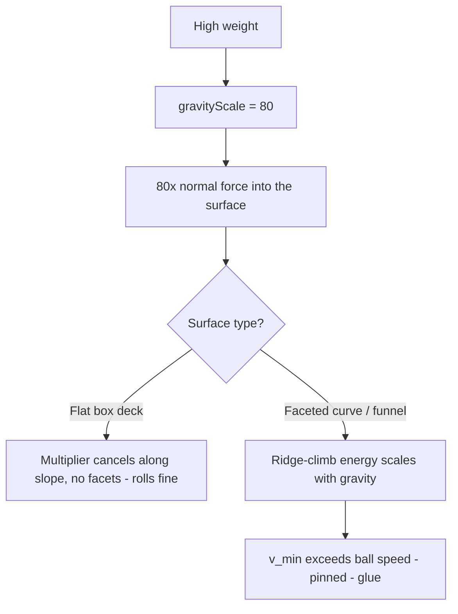

# Why Heavy Marbles Stick to Curves and Funnels

Giving a marble a high **weight** in the Marble Editor makes it drag to a near
stop on the curved tracks and the funnel, as if those surfaces were coated in
glue — while flat straights stay perfectly fast. This write-up explains why a
single mis-modelled parameter causes it, and why the cure is to model weight as
**mass**, not **gravity**.

## The symptom

| Ball weight     | Straights    | Curves / funnel           |
| --------------- | ------------ | ------------------------- |
| Light (default) | rolls freely | rolls freely              |
| Heavy (≈80+)    | rolls freely | drags to a crawl, "glued" |

The tell is that the problem is **surface-specific**: only the curved, swept
surfaces stick. A correct "heavy" ball would feel heavy _everywhere_ (or nowhere)
— stickiness that appears only on curves points at an interaction between the
weight parameter and the way those surfaces are built.

## What "weight" actually does

The physics helper does not give a heavy ball more mass. It gives it more
**gravity**:

> `weight` → `rigidBody.setGravityScale(weight)`

So a ball with `weight: 80` is pulled toward the floor at **80× normal gravity**.
That is a very different thing from an 80× heavier ball: same inertia, but eighty
times the downward force pressing it into whatever it rests on.

## Why straights survive but curves do not

On a **flat** surface, cranking gravity up is almost harmless. Gravity scales
both the force pulling the ball down a slope _and_ the friction resisting it, so
along an incline the multiplier cancels and the ball simply accelerates harder. A
flat box deck is geometrically perfect, so there is nothing for the extra normal
force to catch on.

Curves and the funnel are different: they are **faceted trimeshes**. A smooth arc
is approximated by a fan of flat facets, and between every pair of facets sits a
tiny geometric ridge. To roll across that ridge the ball must lift its centre of
mass over it — and the energy that costs scales with gravity. The climb energy is
`E = m · (g · weight) · h_ridge`, so the minimum speed to carry the ball over a
ridge of height `h_ridge` is `v_min = sqrt(2 · g · weight · h_ridge)`.

The ridge height is fixed by the mesh, but the cost to climb it grows with
`weight`: heavier gravity demands more speed to clear the same ridge.

At normal gravity a rolling marble clears these sub-millimetre ridges without
noticing. At 80× gravity `v_min` climbs past the ball's actual speed, so it can no
longer get over the next facet edge — and the contact solver, now fighting an
enormous normal force, pins it in place. The ball is "glued."

## The fix: weight is mass, not gravity

The intuitive meaning of a "heavy" ball is **inertia**, not extra gravity. A
bowling ball is hard to stop and hard to deflect; it ploughs through a curve
carrying its momentum. It is _not_ mashed into the track at eighty gravities.

Modelling weight as mass restores that behaviour:

| Model                   | Downward force    | Behaviour on curves                  |
| ----------------------- | ----------------- | ------------------------------------ |
| Gravity scale (current) | grows with weight | pinned to facets — sticks            |
| Mass / inertia (fix)    | normal gravity    | momentum carries it through — smooth |

Concretely: keep `gravityScale ≈ 1` and drive the rigid body's mass from the
weight value (`setMass`). Heavy then means "hard to stop," which is both correct
and exactly what makes a heavy ball flow _better_ through curves rather than
worse. It also removes most of the heavy-ball roughness seen on ramps, since the
extreme normal force that amplified every seam is gone.

The trade-off is re-tuning: the marble default and the physic-ball presets pick
their "weight" numbers against a gravity multiplier today, so those values must be
re-chosen against mass. The change should stay local to the marble editor's ball
spawning, so `weight`'s meaning for other games is unaffected.

## Takeaway

When a physics parameter produces a symptom that is **surface-shaped** rather than
uniform, suspect that the parameter is modelling the wrong quantity. Here,
"weight" was gravity, and gravity interacts with mesh faceting in a way mass never
would. The lesson generalises: model the physical quantity you actually mean —
inertia for weight — and the surface-specific artefacts disappear.
