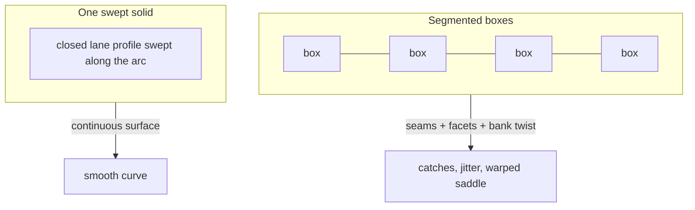
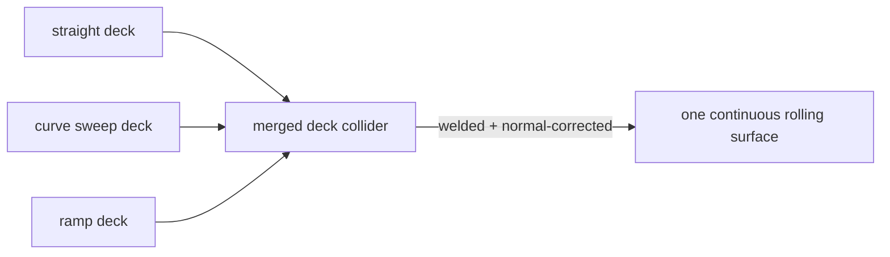

# Marble Editor: Smoothing the Curved Tracks

Curved and banked pieces were the hardest part of the track to get right. They
started as jagged, catch-prone segments and went through three distinct fixes
before they read as smooth ramps a marble could roll around cleanly. This page
records the problem and the reasoning behind each fix.

## The problem: a curve is not a row of boxes

Every straight piece is a box — a flat deck with a wall on each side. The first
attempt at a curve reused that idea: a curve was a **fan of short boxes**, each
rotated a few degrees around the arc. Visually it looked faceted, like a
polygon pretending to be a circle. Worse, each box was a separate collider, so
every joint between segments was a seam. A marble rolling fast across those
seams caught on the internal edges where one box's face met the next, jittering
or stopping outright.

Banked curves made it worse. Banking was applied by _rolling_ each box around
the lane's forward axis, eased in and out across the arc so the ends stayed
level with the flat neighbours. Rolling a flat deck twists it into a warped
saddle: the surface starts flat, twists to tilted, twists back to flat over a
90-degree arc. The result looked lumpy and folded, nothing like a smooth bank.

## Fix 1 — sweep a cross-section instead of stacking boxes

The curve is now **one solid**, not a row of boxes. A single closed outline of
the lane profile — the deck floor plus both walls, as a loop of points — is
**swept along the arc**: at many stations around the quarter-circle the profile
is placed, oriented tangent to the arc, and consecutive stations are joined into
one continuous mesh. Where a box fan had a dozen facets, the sweep uses dozens
of stations, so the silhouette reads as a smooth curve. Because it is one mesh,
there are no box-to-box seams _inside_ the piece at all.

The funnel uses the same idea with a lathe instead of a linear sweep — a profile
revolved around a vertical axis. Straights and the loop ring stay as boxes,
where robustness matters more than silhouette.

## Fix 2 — make the winding physical

A swept mesh collides as a **trimesh** (a soup of triangles) rather than a solid
box. To stop the marble bumping over the mesh's internal triangle boundaries,
the trimesh is built with a flag that **corrects contact normals across every
internal edge**, blending each triangle's normal with its neighbours' so the
rolling surface feels continuous.

That flag has a sharp consequence: it derives those normals from the triangles'
**winding order**. The swept profile was wound inside-out — the deck faces
pointed _down_, the walls pointed _away_ from the lane. Nothing had revealed
this earlier, because a plain trimesh collides on both faces and the render
material was double-sided, so both systems silently forgave the inversion. The
moment the normal-correcting flag was switched on, the curves broke — a marble
would sink or catch. The fix was to reverse the winding so every face points
outward (deck up), and to **lock it with tests**: the closed sweep must have
positive signed volume, every deck-top triangle must face up, and the entry cap
must face its neighbour. Orientation is now a checked invariant, not something
that can silently flip again.

## Fix 3 — merge the pieces so junctions disappear

Even with smooth individual curves, the _joints between pieces_ still caught the
marble, because each piece was its own collider and two adjacent colliders
always meet at a seam. The final fix stopped building physics per piece.

Collision is now a handful of **merged colliders, one per surface class** — all
deck triangles across every piece welded into a single deck, all walls into a
single wall, the curve sweeps welded into the same deck surface as the straights
they connect to. Welding coincident vertices at the flush junctions turns the
whole run into one continuous surface, and the internal-edge normal correction
then smooths across those welds too. The marble rolls from a straight into a
curve and out the other side over what is, physically, one unbroken floor.

## What the tests can and cannot prove

A fixed-step headless simulation guards the parts that are deterministic: a
gauntlet of every piece type, and a curve-heavy track, must both carry a marble
to the finish without falling through, at the game's real top speed. What the
sim cannot reproduce is real-time contact jitter under a variable frame rate —
that still needs a human driving the track. The geometry and winding invariants,
though, are fully locked by unit tests, so the curves cannot silently regress to
faceted, inside-out, or seam-ridden again.
