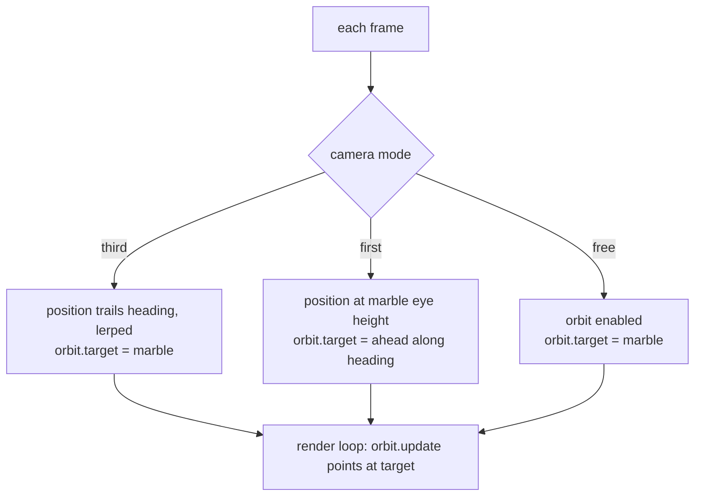

# Marble Editor: Three Race Cameras

Play mode offers three cameras and cycles between them with a single button:
**third person**, **first person**, and **free orbit**. This page explains how
the three modes share one dispatcher, and the one rendering subtlety that shapes
the whole design.

## One heading drives everything

All three cameras and the marble's own controls are built on a single value: a
**smoothed heading** — the direction the marble is travelling, lerped from its
velocity so it doesn't twitch, and guarded so a brief backward nudge doesn't
flip it around. Steering, the forward push, and the cameras all read from this
one vector, which is why the controls stay intuitive as the track curves: "back"
is always behind where the marble is actually going, not a fixed world axis.

## The subtlety: the orbit target owns the look direction

The scene runs on a shared render loop that calls the orbit controls' `update()`
**every frame**. That call re-points the camera at the orbit target. So any
camera that computes its own look direction with `lookAt` will have it
**overwritten one frame later** unless the same direction is also written into
the orbit target. Every mode therefore routes its intended look-at _through the
orbit target_, not just through `lookAt`. This one fact is why the code copies a
target position around in each mode rather than only calling `lookAt`.

## The dispatcher

A single function runs each frame and branches on the current mode. Orbit is
only enabled in free mode; the two follow cameras disable it so they own the
camera themselves.

| Mode  | Camera position                                       | Look target                           | Orbit |
| ----- | ----------------------------------------------------- | ------------------------------------- | ----- |
| Third | Trails behind the marble along the heading, lerped in | The marble                            | off   |
| First | At the marble, raised to eye height                   | Ahead of the marble along the heading | off   |
| Free  | User-controlled                                       | The marble (kept centred)             | on    |

## How each mode feels, and why

- **Third person** trails the marble at a fixed height and distance behind the
  heading, and its position is **lerped** toward that goal rather than snapped —
  so the camera lags slightly and swings smoothly as the marble turns, instead
  of rigidly glued to it. This is the default because it reads the track best.
- **First person** sits at the marble's position raised to eye height and looks
  a short distance _ahead_ along the heading. It is immediate and immersive; on
  a fast curve the look direction swings as hard as the marble turns.
- **Free orbit** hands the camera back to the user. It is the only mode that
  enables the orbit controls, and it keeps the orbit target pinned to the marble
  so the marble stays centred while the user spins around it — useful for
  inspecting a jump or a loop mid-race.

Cycling the modes is a single control that steps third → first → free, so a
player can flip to the view that suits the moment without leaving a menu.
