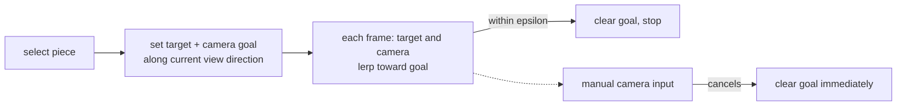

# Marble Editor: Framing the Selected Piece

When you select a track piece in the editor — by clicking it, cycling with the
d-pad, or loading a track — the camera glides over and frames it. This page
explains how that transition works and the decisions behind how it feels.

## The goal

Two things make a selection feel good, and they pull in opposite directions:

- **Recentre on the piece** so you can see what you just selected.
- **Don't yank the view.** The editor camera is an orbit camera the user is
  constantly rotating and panning; snapping it to a fixed pose would throw away
  the angle they carefully set up.

The solution keeps the user's viewing _angle_ and settles at a comfortable
_distance_, and it eases there rather than cutting.

## Preserve the angle, replace the distance

Selecting a piece sets an **animated goal**, it does not move the camera
directly. The goal is computed once:

| Quantity        | How it is chosen                                                                        |
| --------------- | --------------------------------------------------------------------------------------- |
| Orbit target    | The selected piece's world position                                                     |
| Camera position | That target, pushed back along the **current view direction** to a fixed focus distance |

Reusing the current view direction is the key move: the vector from the old
orbit target to the camera _is_ the user's chosen angle, so placing the new
camera along it means the pitch and yaw are unchanged — only what the camera
looks at, and how far away it sits, change. The fixed distance is deliberately
pulled back so the piece and its neighbours stay in frame; a selection should
show context, not zoom in tight.

## Ease every frame, settle, and stop

A per-frame camera action lerps both the orbit target and the camera position a
fraction of the way toward their goals each tick. Because a lerp shrinks the
remaining distance geometrically, the move starts quickly and slows as it
arrives — a natural ease-out with no keyframes or duration bookkeeping. Once
both are within a small epsilon of the goal, the goal is cleared and the action
does nothing until the next selection.

## Manual input always wins

The one hazard of an animated camera is that it fights the user. If a transition
is still easing when the user grabs the stick to rotate or pan, the two would
tug against each other. So the manual camera controls **cancel the focus goal**
the instant they receive any input: the transition abandons itself and hands
control straight back. The result is that the automatic framing is a convenience
that never gets in the way — it moves you toward the piece, but the moment you
want to look somewhere else, it's gone.
