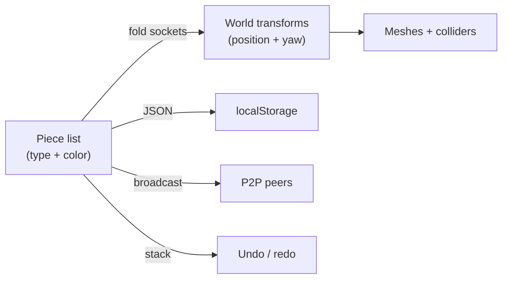

# Marble Editor: Chain Transforms and Physics Lessons

The marble track editor lets players snap together typical marble-run pieces
(straights, curves, ramps, funnels, loops, jumps), edit collaboratively over
P2P, and race the result. Building it surfaced a handful of non-obvious
problems in coordinate math, rigid-body physics, and control design that this
page records.

## The track is a fold, not a scene graph

A track is stored as nothing more than an ordered list of `{ type, color }`
pieces. Every piece type declares two socket properties in its local frame
(entry at the origin, lane heading along negative Z):

| Socket property | Meaning                                                            |
| --------------- | ------------------------------------------------------------------ |
| exit offset     | Where the next piece's entry lands, relative to this piece's entry |
| exit yaw delta  | How much the lane heading turns across the piece                   |

World transforms are derived by a single left-to-right fold over the list: the
cursor position accumulates each rotated exit offset, and the yaw accumulates
each delta. Rotating a local offset by the accumulated yaw is one 2D rotation
in the XZ plane. Four left curves compose to a closed circle, which doubles as
the unit test for the whole system.

Because the world layout is a pure function of the list, everything else
becomes trivial: localStorage persistence serializes the list, undo/redo is a
stack of past lists, and multiplayer sync broadcasts the full list on every
edit (tens of pieces at most — last-write-wins by timestamp beats operational
transforms at this scale). The 3D scene is disposed and rebuilt on every
change rather than patched.

## Junctions: from overlap to flush seams

The single most persistent physics bug: a marble at full speed would stop dead
against lane walls, its center sitting exactly on the plane where two colliders
meet. Two cuboids placed flush edge-to-edge (deck beside wall, or piece beside
piece) leave a hairline seam; contact normals flip across the seam's internal
edge and the solver can wedge a fast ball into the crack.

Three measures together eliminated it:

| Measure                                            | Why it works                                                                               |
| -------------------------------------------------- | ------------------------------------------------------------------------------------------ |
| Walls overlap the deck edge by a quarter unit      | Shared volume removes the internal seam plane entirely                                     |
| Lane boxes extend slightly past their nominal span | Consecutive pieces and arc segments interpenetrate instead of touching                     |
| Continuous collision detection on the marble       | A 20 u/s ball moves a third of a unit per step; CCD stops it tunnelling into corner cracks |

Relatedly, walls are near-frictionless while decks keep high friction: a
marble grinding along a wall must keep its speed, and slick rails also weaken
edge-catch events at wall-to-wall junctions.

The bumper field later reproduced both halves of this lesson in miniature.
Its bumpers originally sat exactly flush on the deck (the same hairline seam
at their base) and were placed so the passage between bumper edge and wall
measured exactly one marble diameter — a zero-clearance corridor where the
solver pinches the ball from both sides. Bumpers now sink into the deck like
walls do, and a unit test asserts every bumper-to-wall passage clears the
marble diameter by a margin, turning the clearance rule from tribal knowledge
into a checked invariant.

### Overlap was the wrong cure — the disease was doubled colliders

The longitudinal piece-to-piece overlap eventually caused a worse problem than
it solved. Extending every lane box past its nominal span meant two fixed
colliders shared the same volume at each junction, and the swept-curve pieces
added straight stubs that poked into their neighbours. A marble crossing that
doubled zone is resolved against two overlapping surfaces at once, and their
competing contact normals make the ride jitter and catch — visible as pieces
poking through each other, felt as the colliders "breaking" at every edge.

The fix inverts the earlier rule: pieces now butt up **exactly**, no
longitudinal overlap at all (`JOINT_OVERLAP = 0`, and the arc sweep drops its
end stubs). The hairline-seam wedge that overlap originally guarded against is
handled instead by a small **contact skin** on every track collider — a
virtual margin (Rapier's `setContactSkin`) that keeps the marble a hair above
the surface, so a flush seam presents a continuous virtual floor with no
geometric overlap. The deck-versus-wall lateral overlap _within_ a piece
stays; only the junction overlap _between pieces_ is gone.

A fixed-step headless simulation cannot reproduce the real-time contact jitter
(it needs variable framerate and uncapped speed), so the tests guard what they
can: a downhill gauntlet of every descending piece must reach the finish, and
a gently-driven marble must cross a chain of flush straights without stalling.
The contact skin itself remains defence-in-depth, validated in play rather
than in a unit test.

## Loops are a budget, not a shape

A vertical loop only works if the marble arrives with enough energy, and the
marble's gravity is scaled several times above normal for a weighty feel —
which multiplies the requirement. The classical bound (speed at the bottom
must exceed the square root of five times gravity times radius) said our loop
was impossible at the capped top speed, yet it completes reliably. The gap is
closed by an input redirect: while the marble is climbing, the forward input
is re-aimed along its velocity, continuously feeding energy into the climb the
way a skater pumps a half-pipe. The redirect is capped at the global speed
limit, because an uncapped along-velocity impulse is a positive feedback loop
(it once accelerated the marble to more than double the speed cap).

Other loop findings:

- The ring is tangent to the entry lane, sunk slightly below deck level, so
  entering it is a smooth crest rather than a step; the original flush ring
  entry ate a third of the marble's speed on impact.
- The lateral shift that separates loop entry from exit must not start on the
  ascending quarter: drifting wall segments form a staircase of edges that a
  heavy marble grinds into. The shift begins after the top, and the loop lands
  on a full-width exit lane displaced exactly one lane width to the left.

## Heading-relative control

World-fixed controls (W always pushes toward negative Z) are the
MarbleMadness convention, and they silently break the moment a track contains
a 90-degree curve: past the curve, "forward" pushes into the side wall and
the marble coasts to a stop. The fix is a smoothed heading vector derived from
velocity — briefly reversing does not flip it, and respawns reset it to the
checkpoint's lane direction. That same vector drives all three cameras (first
person looks along it, third person trails behind it) and the input basis, so
steering stays intuitive through curves, funnels and loops in every view.

One rendering subtlety: the shared render loop calls the orbit controls'
update every frame, which re-points the camera at the orbit target even while
the controls are disabled. Any camera mode that wants its own look direction
must route it through the orbit target rather than calling lookAt directly,
or its orientation is overwritten one frame later.

## Smooth pieces are swept cross-sections

Curved and banked pieces began as chains of small rotated boxes and read as
segmented. They are now a single trimesh: the closed lane profile (deck plus
both walls) swept along the arc, with the banking roll eased in and out across
the sweep so the piece still meets its flat neighbours perfectly level. The
funnel is the same idea as a lathe instead of a sweep. Box colliders remain
for straight pieces and the loop ring, where robustness matters more than
silhouette.

## Trimesh winding becomes physics the moment normals matter

A plain Rapier trimesh collides on both sides of every triangle, so the
winding order of the swept geometry never mattered — until the
`FIX_INTERNAL_EDGES` flag was added to stop marbles bumping over the sweep's
internal triangle boundaries. That flag corrects contact normals by blending
them with the adjacent triangles' _face_ normals, and face normals come
entirely from winding. The swept profile turned out to be wound inside-out
(deck faces pointing down, walls pointing away from the lane), and the lathe
funnel was inverted too. Nothing had ever revealed this: physics was two-sided
and the render material was `DoubleSide`, so both systems silently forgave the
inversion. Curves and banked pieces — exactly the swept trimeshes — broke the
instant the flag made orientation meaningful.

The lesson: an orientation bug can lie dormant in a mesh for as long as every
consumer is double-sided, and any single-sided consumer added later will be
blamed for it. Orientation is now pinned by unit tests instead of eyes: the
closed sweep must have positive signed volume (divergence theorem over its
triangles), every deck-top triangle must face up, and the entry cap must face
the neighbouring piece. The funnel lathe is flipped explicitly, since Three's
lathe winds toward the outside of the solid of revolution while the marble
rolls on its inside.

## Adding a new track piece is a physics contract

Every difficulty we hit while adding pieces traces back to the same
misunderstanding: a piece is not just a shape. It is a three-part contract,
and breaking any part breaks pieces that are nowhere near the new one.

| Contract part       | What it promises                                                                    | What happens when broken                                     |
| ------------------- | ----------------------------------------------------------------------------------- | ------------------------------------------------------------ |
| Catalog exit socket | The piece's declared exit offset and yaw match where its geometry actually ends     | Every downstream piece shifts; junction gaps appear far away |
| Junction overlap    | Geometry extends past its nominal span and shares volume with its neighbours        | Hairline seams wedge or launch a fast marble                 |
| Physics conventions | Deck friction high, walls slick, restitution near zero, trimesh faces wound outward | Marbles grind to a stop, bounce wildly, or fall through      |

The subtler lessons, in the order they cost us time: box colliders are the
default and trimeshes the exception (only for genuinely curved surfaces),
because boxes are unbreakable while trimeshes carry winding and internal-edge
obligations. Passage widths are part of collision design — any corridor a
marble can enter must clear its diameter with margin, or the solver pinches
it (the bumper field shipped with an exactly-diameter gap). And free
parameters like gravity scale are not free: friction scales with gravity, so
a "heavier" marble becomes an immovable one before it becomes a faster one.

The acceptance gate that makes new pieces safe to add is the headless
simulation test: a scripted marble is steered down a gauntlet containing
every descending piece and must reach the finish zone within a simulated
timeout. A new piece joins that gauntlet, and any contract violation shows up
as a `fell-through` or `timeout` verdict before a human ever plays the track.

## A bedroom around the track

The editor and race scenes floated in fog-tinted sky, which made track scale
unreadable — nothing anchored the eye. The scenes now sit inside a giant
children's bedroom, recasting the track as a toy marble run on the floor.

The room cannot be a fixed backdrop because tracks grow arbitrarily in every
axis while editing. Instead the room is derived data: piece transforms fold
into an axis-aligned bounding box (padded for geometry that hangs off piece
origins), the box maps to a room layout — floor just below the lowest piece,
walls padded outward, ceiling above the highest — and the layout deterministically
places toys along a wall-inset perimeter walk. Each stage is a pure function,
so sizing and placement are unit-tested without a scene, and the editor only
rebuilds the room when an edit actually changes the layout.

Two rendering choices carry the effect. Walls and ceiling are single-sided
planes facing inward: from outside the room they are backface-culled, so a
freely orbiting editor camera always sees into the room instead of staring at
a wall — the classic dollhouse trick, with no camera logic at all. And the
floor is purely visual, sitting below the track with no collider, so the
existing fall-detection and penalty-respawn behaviour is untouched by the
scenery.
