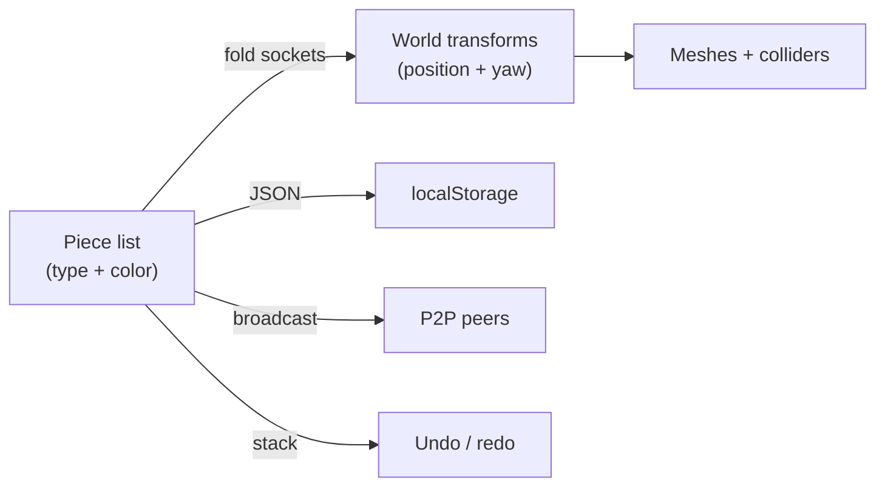

# Marble Editor: Chain Transforms and Physics Lessons

The marble track editor lets players snap together typical marble-run pieces
(straights, curves, ramps, funnels, loops, jumps), edit collaboratively over
P2P, and race the result. Building it surfaced a handful of non-obvious
problems in coordinate math, rigid-body physics, and control design that this
page records.

## The track is a fold, not a scene graph

A track is stored as nothing more than an ordered list of `{ type, color }`
pieces. Every piece type declares two socket properties in its local frame
(entry at the origin, lane heading along negative Z):

| Socket property | Meaning                                                            |
| --------------- | ------------------------------------------------------------------ |
| exit offset     | Where the next piece's entry lands, relative to this piece's entry |
| exit yaw delta  | How much the lane heading turns across the piece                   |

World transforms are derived by a single left-to-right fold over the list: the
cursor position accumulates each rotated exit offset, and the yaw accumulates
each delta. Rotating a local offset by the accumulated yaw is one 2D rotation
in the XZ plane. Four left curves compose to a closed circle, which doubles as
the unit test for the whole system.

Because the world layout is a pure function of the list, everything else
becomes trivial: localStorage persistence serializes the list, undo/redo is a
stack of past lists, and multiplayer sync broadcasts the full list on every
edit (tens of pieces at most — last-write-wins by timestamp beats operational
transforms at this scale). The 3D scene is disposed and rebuilt on every
change rather than patched.

## Junctions must overlap, never touch

The single most persistent physics bug: a marble at full speed would stop dead
against lane walls, its center sitting exactly on the plane where two colliders
meet. Two cuboids placed flush edge-to-edge (deck beside wall, or piece beside
piece) leave a hairline seam; contact normals flip across the seam's internal
edge and the solver can wedge a fast ball into the crack.

Three measures together eliminated it:

| Measure                                            | Why it works                                                                               |
| -------------------------------------------------- | ------------------------------------------------------------------------------------------ |
| Walls overlap the deck edge by a quarter unit      | Shared volume removes the internal seam plane entirely                                     |
| Lane boxes extend slightly past their nominal span | Consecutive pieces and arc segments interpenetrate instead of touching                     |
| Continuous collision detection on the marble       | A 20 u/s ball moves a third of a unit per step; CCD stops it tunnelling into corner cracks |

Relatedly, walls are near-frictionless while decks keep high friction: a
marble grinding along a wall must keep its speed, and slick rails also weaken
edge-catch events at wall-to-wall junctions.

## Loops are a budget, not a shape

A vertical loop only works if the marble arrives with enough energy, and the
marble's gravity is scaled several times above normal for a weighty feel —
which multiplies the requirement. The classical bound (speed at the bottom
must exceed the square root of five times gravity times radius) said our loop
was impossible at the capped top speed, yet it completes reliably. The gap is
closed by an input redirect: while the marble is climbing, the forward input
is re-aimed along its velocity, continuously feeding energy into the climb the
way a skater pumps a half-pipe. The redirect is capped at the global speed
limit, because an uncapped along-velocity impulse is a positive feedback loop
(it once accelerated the marble to more than double the speed cap).

Other loop findings:

- The ring is tangent to the entry lane, sunk slightly below deck level, so
  entering it is a smooth crest rather than a step; the original flush ring
  entry ate a third of the marble's speed on impact.
- The lateral shift that separates loop entry from exit must not start on the
  ascending quarter: drifting wall segments form a staircase of edges that a
  heavy marble grinds into. The shift begins after the top, and the loop lands
  on a full-width exit lane displaced exactly one lane width to the left.

## Heading-relative control

World-fixed controls (W always pushes toward negative Z) are the
MarbleMadness convention, and they silently break the moment a track contains
a 90-degree curve: past the curve, "forward" pushes into the side wall and
the marble coasts to a stop. The fix is a smoothed heading vector derived from
velocity — briefly reversing does not flip it, and respawns reset it to the
checkpoint's lane direction. That same vector drives all three cameras (first
person looks along it, third person trails behind it) and the input basis, so
steering stays intuitive through curves, funnels and loops in every view.

One rendering subtlety: the shared render loop calls the orbit controls'
update every frame, which re-points the camera at the orbit target even while
the controls are disabled. Any camera mode that wants its own look direction
must route it through the orbit target rather than calling lookAt directly,
or its orientation is overwritten one frame later.

## Smooth pieces are swept cross-sections

Curved and banked pieces began as chains of small rotated boxes and read as
segmented. They are now a single trimesh: the closed lane profile (deck plus
both walls) swept along the arc, with the banking roll eased in and out across
the sweep so the piece still meets its flat neighbours perfectly level. The
funnel is the same idea as a lathe instead of a sweep. Box colliders remain
for straight pieces and the loop ring, where robustness matters more than
silhouette.
