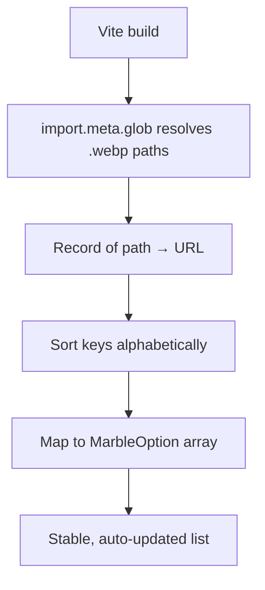
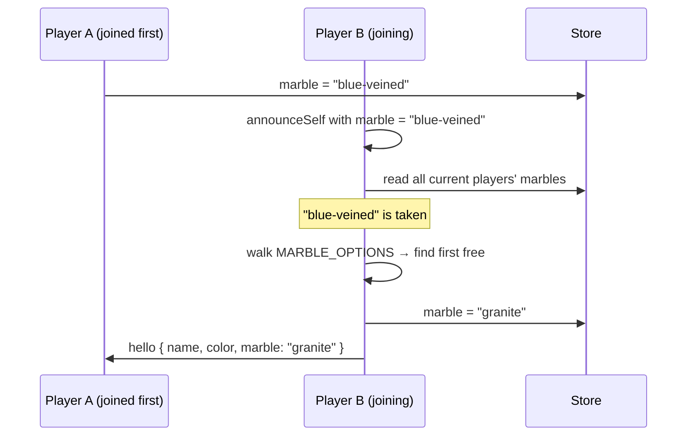
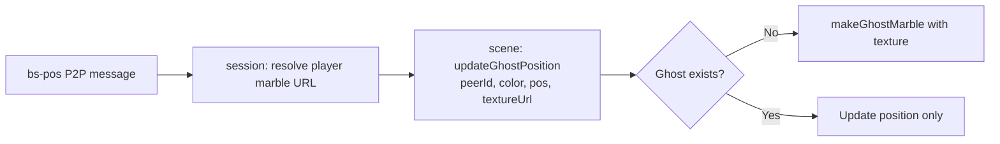
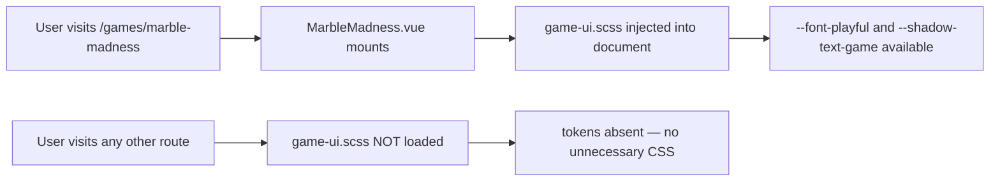
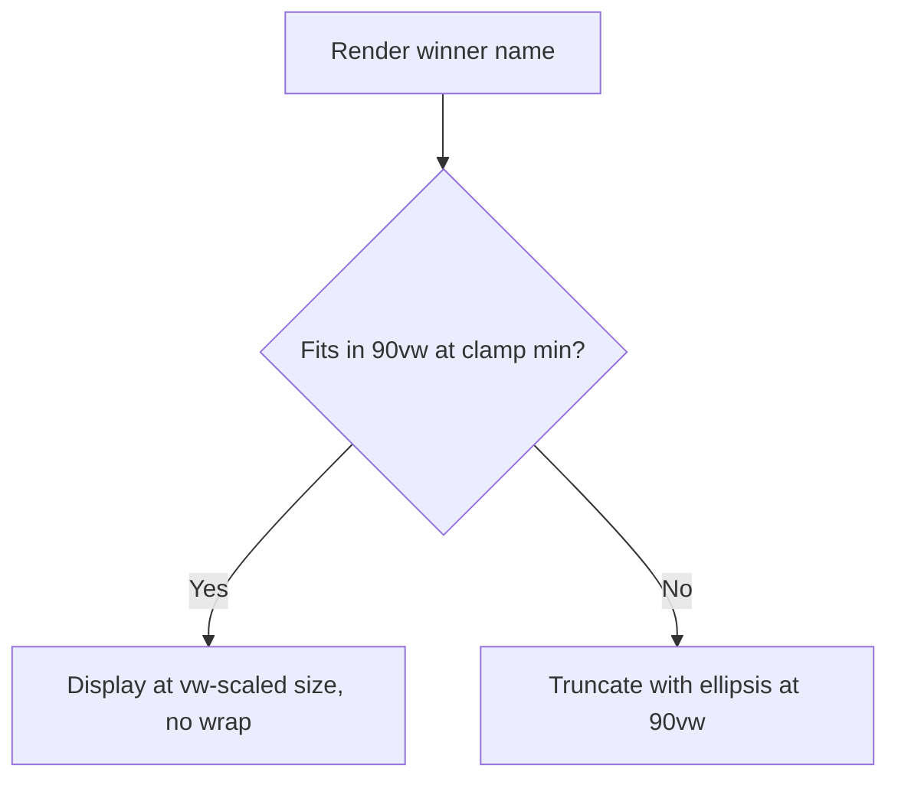

# Marble Madness: Multiplayer Physics Racing

Non-obvious problems encountered while building the marble racing game (PR #162): texture discovery, P2P deduplication, ghost rendering, and game-UI style extraction.

## Build-time marble asset discovery

The game offers nine selectable marble textures. The initial approach was to import each image individually and assemble an array by hand. This breaks as soon as an image is added or renamed, and has no natural ordering.

The correct approach uses Vite's `import.meta.glob` at module scope with `eager: true`. Vite resolves all matching paths at build time, producing a record keyed by absolute path whose values are the URL strings. Sorting the keys alphabetically before mapping gives a stable, deterministic order without any manual listing.

The file name encodes the display name — stripping the extension and any leading numeric prefix gives the human-readable label without a separate manifest.

## P2P marble deduplication without a server

No two players should use the same marble texture. A centralised server could enforce this, but the game uses peer-to-peer networking with no authority.

The resolution is opportunistic: because each peer announces itself sequentially, the local Pinia store already contains every previously joined player's marble selection by the time a new peer's hello is processed. On receiving a hello — or when announcing self — the session composable reads all current players' marble IDs from the store, builds the set of taken IDs, and walks the marble options list in order until it finds a free one. If the requested marble is taken, the first free option is assigned instead.

This works because P2P joins are sequential in practice. A true simultaneous join could assign the same marble to two peers; the session re-checks on every avatar update, so a second announce shortly after resolves any collision.

## Rendering opponent ghost marbles with per-player textures

Opponent marbles appear in the scene as low-opacity "ghost" spheres that track position updates broadcast over the network. The ghost-creation function needed to apply each opponent's chosen marble texture, not a shared fallback.

The difficulty is that the Three.js scene composable does not know about players or session state — it only knows about a canvas and physics. Routing the texture URL through a callback was the cleanest solution: the session composable owns the player-to-marble mapping, and on each position update it resolves the URL and passes it as an extra argument to the ghost update function. The scene composable applies it to the sphere's material without any knowledge of the session.

The texture URL is a Vite asset URL (a plain string), so it passes through the channel without serialisation issues.

## Lazy game-UI style injection

The marble game — like GoombaRunner before it — uses a distinctive playful font and multi-shadow text treatment. Early iterations placed these CSS custom properties (`--font-playful`, `--shadow-text-game`, `--shadow-text-game-large`) inside the global `_variables.scss`, which loaded them for every route even when no game was open.

Extracting them to a dedicated `src/assets/styles/game-ui.scss` and importing that file only in the root game component's script block means the tokens are injected into the document only when the route is visited. The underlying CSS custom properties in `:root` are still global once injected, but they are absent from the initial page load.

The shadow token value matches the GoombaRunner pattern: eight 1 px text-shadows form a full white outline, followed by a stack of progressively offset black drops that create the layered 3-D effect. Two sizes are defined — standard and large — for body text and titles respectively.

## Winner name overflow: viewport-relative sizing

The multiplayer summary screen shows the winning player's name above a "Wins!" heading. Long player names broke the layout in two ways: the text wrapped to a second line, or it overflowed the container on narrow viewports.

Separating the name into its own element decouples its sizing from the heading. The name uses a `clamp` expression where the middle value is viewport-width relative — as the viewport narrows, the font shrinks proportionally. `white-space: nowrap` prevents line wrapping entirely; `max-width: 90vw` combined with `text-overflow: ellipsis` acts as a last resort for names that are pathologically long even at the smallest allowed font size.

The "You win!" case renders only the heading — no name element — so the single-player congratulation path is unaffected.
