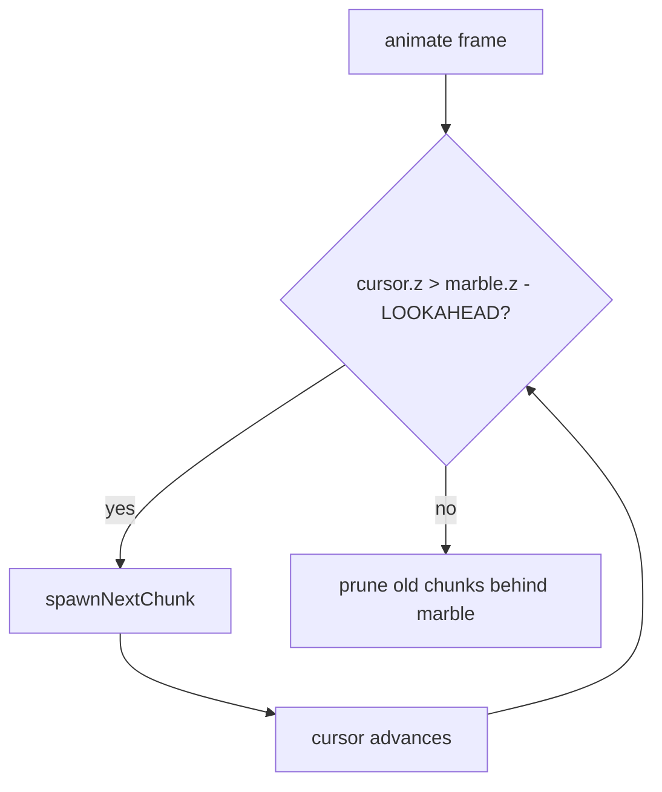
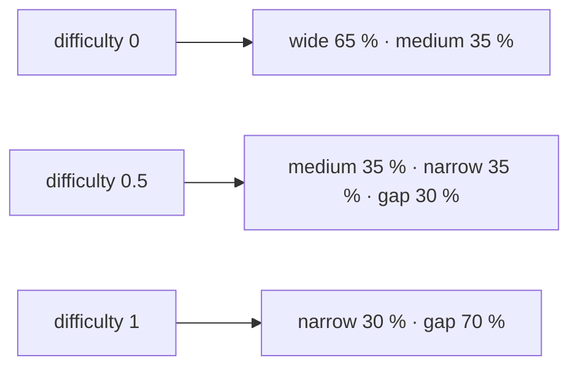
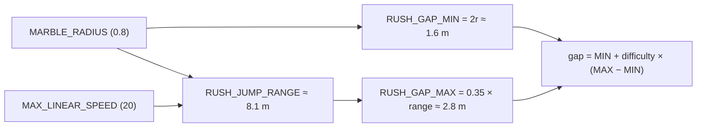
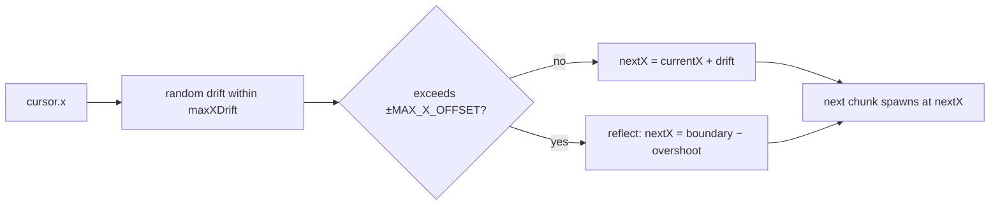

# Marble Rush: Track Generation and Gap Physics

Non-obvious decisions made while building the Rush endless mode (PR #172–173): procedural chunk streaming, physics-derived gap sizing, and lateral drift.

## Chunk streaming instead of a fixed track

The Race mode loads a static `TrackConfig` — a hand-authored list of platform positions baked into `config.ts`. Rush must run forever, so a fixed list is impossible.

The solution is a cursor-based chunk streamer. A `ChunkCursor` records the current spawn head `{ z, x }`. Each frame the game checks whether the lookahead window ahead of the marble is full; if not, it calls `spawnNextChunk` until the window is satisfied.



The lookahead distance (`RUSH_LOOKAHEAD_Z = 120`) keeps several chunks pre-rendered so the player never sees platforms pop into view. Chunks that have fallen more than `RUSH_DISPOSE_BEHIND = 80` units behind the marble are removed from the scene and their Rapier colliders destroyed.

Recursion replaces the `while` loop that would otherwise violate the functional/no-loop-statements ESLint rule. Each recursive call spawns one chunk and re-enters only if the lookahead window is still under-full.

## Chunk types and difficulty scaling

Four chunk shapes are available. A weighted random selector picks among them based on a `difficulty` value in `[0, 1]` that grows linearly with distance up to `RUSH_MAX_DIFFICULTY_DISTANCE = 400`.

| Type   | Platform width                 | Drift allowed   |
| ------ | ------------------------------ | --------------- |
| Wide   | 14 u                           | ±4 u            |
| Medium | 10 u                           | ±2.5 u          |
| Narrow | 3–7 u (scales with difficulty) | ±1.5 u          |
| Gap    | 6–12 u landing                 | ±4 u (airborne) |

At low difficulty the selector heavily favours wide and medium chunks. At full difficulty gaps and narrow bridges dominate.



## Physics-derived gap sizes

The gap width is not an arbitrary number. It is derived from the ball's physical constants so that it scales automatically if the ball radius or speed cap changes.

When the ball rolls off a platform edge its centre sits exactly `MARBLE_RADIUS` above the platform top face. Under gravity `g` the ball can travel horizontally at most:

```
RUSH_JUMP_RANGE = MAX_LINEAR_SPEED × √(2 × MARBLE_RADIUS / g)
```

With the current values (`MAX_LINEAR_SPEED = 20`, `MARBLE_RADIUS = 0.8`, `g = 9.81`) this evaluates to roughly **8.1 m**.

Two derived constants bound the gap at each difficulty extreme:

- `RUSH_GAP_MIN = 2 × MARBLE_RADIUS` — the smallest gap the ball cannot straddle; it must genuinely jump.
- `RUSH_GAP_MAX = RUSH_JUMP_RANGE × 0.35` — 35 % of the theoretical maximum, keeping full-difficulty gaps demanding but clearable.



The landing platform width narrows with difficulty through the same linear interpolation, from 12 u down to 6 u.

## Lateral drift

The first implementation kept `cursor.x = 0` throughout, producing a corridor that ran perfectly straight. That is boring and removes any steering challenge.

Each chunk builder returns a `maxXDrift` value appropriate for its width. Wide platforms tolerate larger shifts because the ball has room to realign; narrow bridges allow very little lateral change to stay reachable from the previous platform.

After every chunk spawn a helper computes the next cursor X:

```
nextX = clamp(currentX + random(−maxDrift, +maxDrift), −MAX_X_OFFSET, +MAX_X_OFFSET)
```

When the drift would push past the boundary it reflects back rather than clamping flat, which prevents the path from hugging a wall for long stretches.

Gap chunks allow the same drift as wide platforms because the ball is airborne during the void and has time to move laterally.



## Pickup bonuses and penalty feedback

Time pickups (glowing yellow orbs) grant `RUSH_TIME_BONUS = 3` extra seconds and increment a `pickupCount` counter. The counter triggers a floating green `+3s` text in the HUD, mirroring the existing red penalty animation. Both animations share the same float-and-fade keyframe; the pickup label is pinned to the right edge so it does not collide with the red penalty text at the centre.

A `lastSafePosition` tracks the most recent spot where the ball was above the fall threshold and not descending quickly. On a fall the ball teleports there instead of back to spawn, keeping the player near their progress distance.
