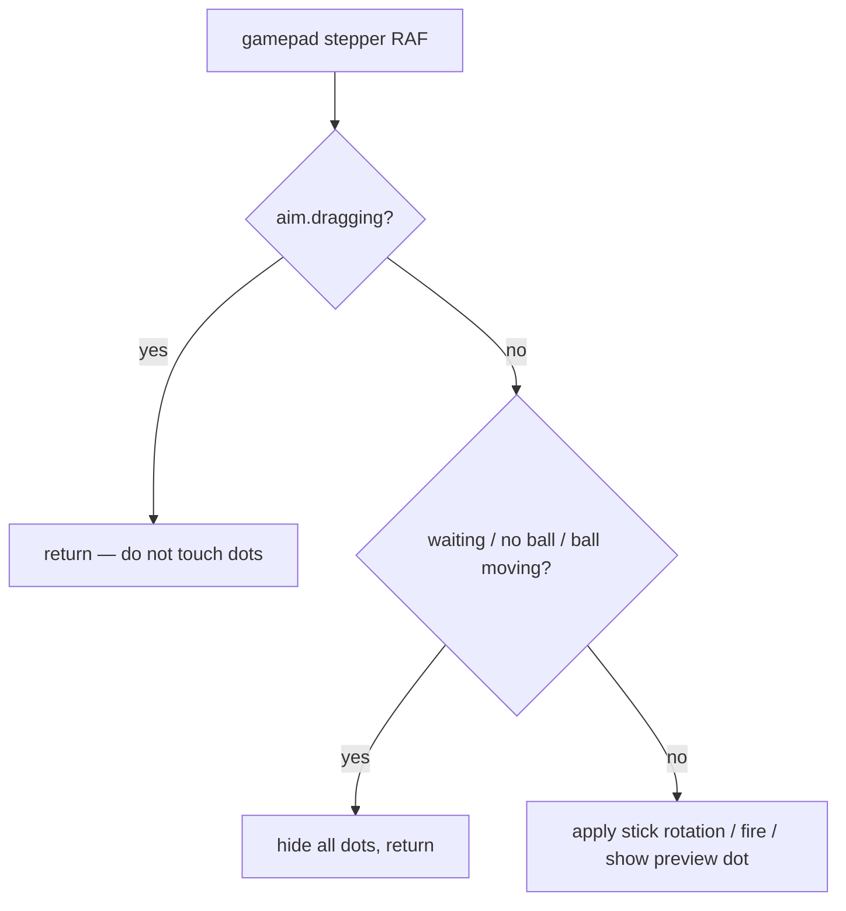

# Minigolf: Gamepad Aiming and the LobbyUI Score Overlay

## Gamepad aiming dot guard conflict

The minigolf aim indicator shows a row of small dots along the aim direction. Two input paths both update those dots each frame: the mouse/pointer path (which runs during drag) and the gamepad path (which runs when the stick is moved).

The `createGamepadAimStepper` function originally had a single early-return guard:

```
if (waiting || !ball || !isBallStopped(ball) || aim.dragging) return
```

The `aim.dragging` check was intended to skip gamepad processing while the player was using the mouse — correct in principle. But the guard was placed before the code that shows the dots, and the same RAF callback runs for both paths. The result: every frame during a mouse drag, the gamepad path returned early and hid the dots, overriding the dots that the pointer path had just shown. The aim indicator went invisible the moment the player started dragging.

The fix is to split the guard into two passes. The drag check returns early before touching the dots — nothing about the aim indicator changes while the mouse is active. The rest of the guard (ball missing, ball still moving, waiting for other players) also hides the dots and returns, since those states genuinely apply to both input methods.



## First-rotation gate on the gamepad preview dot

A single preview dot marks where the ball will land based on aim direction and default power. Showing it immediately on game start looked cluttered — the dot appeared at an arbitrary angle before the player had touched the stick.

The fix uses a `hasRotated` flag inside the stepper closure. The flag is false on construction and flips to true the first time the stick produces a non-zero rotation. The preview dot is only drawn when `hasRotated` is true. Once the player has adjusted the aim even slightly, the dot stays visible for the rest of that turn.

## LobbyUIWizard slot name

`LobbyUIWizard` exposes a `#profile-extra` slot for game-specific content inside the profile step (e.g. a hole picker). The slot name is not `#config` or `#settings`. Using the wrong name produces no error and no output — the content is silently discarded. The correct names are `#profile-extra` (extra profile-step content) and `#summary` (bottom of the summary step).

## Score overlay height on the Three.js canvas

The final-score screen (`MinigolfSummary`) is an `position: absolute; inset: 0` overlay that sits on top of the live Three.js canvas. To make both visible at the same time, `MinigolfGame` (the canvas component) and `MinigolfSummary` live inside a shared wrapper `div` with `position: relative`.

That wrapper is a flex child of `LobbyLayout`'s main slot. Without `flex: 1; min-height: 0` on `MinigolfGame`'s root element, the wrapper's flex context made the canvas component collapse to its intrinsic (essentially zero) height — the green disappeared. The absolute overlay rendered correctly at `inset: 0` relative to the wrapper, but nothing was behind it. Adding `flex: 1; min-height: 0` to the canvas component's root restored full height propagation without needing a grid workaround.
