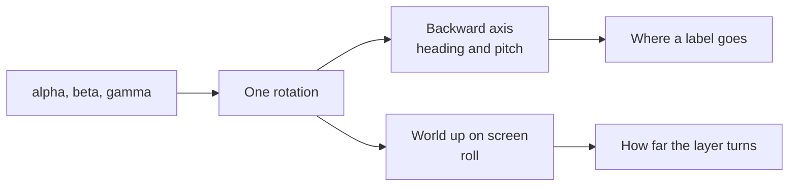

# Mixed Reality Map: Aiming a Phone at the Street

Labelling the world through a phone camera turned out to be three problems that all look
like one: knowing where the camera points, knowing what is out there, and drawing the answer
so it can be read. Each had a wrong first answer that seemed obviously right.

The camera here is the browser's synthetic test pattern rather than a street, which is what
makes the layout legible in a screenshot: the labels, their stacking and their distances are
the real output, standing in front of a stand-in world.

## The orientation angles lock in exactly the pose this needs

Device orientation arrives as three Euler angles, and the compass bearing looks like it is
simply the first of them. It is, but only while the device lies flat. Euler angles are
applied in sequence, and where two of the axes line up the pair stops describing two
independent rotations and starts describing one, so a change in either produces the same
motion and the difference between them is lost. For this ordering that happens at a quarter
turn of pitch.

A phone lying on a table is far from it. A phone held up to look through sits right on top of
it. So the naive heading is not merely imprecise for an aimed view, it is undefined for the
only pose the view is ever used in: the bearing stops responding to turning, and the roll
starts swinging the whole overlay instead.

The tilt controls had already met this once, from the other side, and answered it by working
from the direction of gravity rather than from the angles. The same answer generalises. The
three angles combine into one rotation, and every question worth asking is a direction read
off that rotation rather than an angle read off the inputs.

| Question                          | The direction that answers it                    |
| --------------------------------- | ------------------------------------------------ |
| Which way is the camera pointing? | The device's backward axis, in world coordinates |
| How far above the horizon?        | The vertical part of that same direction         |
| How far is the horizon turned?    | World up, projected onto the screen plane        |

None of the three has a discontinuity anywhere, so the same arithmetic holds face down, held
up, and rolled into landscape.

One platform difference survives this. WebKit reports a relative first angle and publishes
the absolute compass separately, where every other engine puts the absolute value in the
angle itself. Rather than branching downstream, the compass reading substitutes for the angle
before the rotation is built, which leaves a single path through the maths.

## Rotating the overlay is what makes it look fixed

The instinct is to hold the labels upright, the way a map's text stays upright. That is
exactly backwards. Upright text is painted on the glass and travels with the phone, and a
viewer reads it as an interface. Text that turns against the phone stays square to the
horizon, and a viewer reads it as part of the street.

Because every label turns by the same amount, the layer turns once rather than each label
being placed into an already-turned frame. That also keeps the placement arithmetic in a
frame where up is up.

The page must then not turn as well, or the same rotation happens twice. Locking the page to
portrait is the honest fix; where a platform ignores the lock, the rotation the browser
already applied is subtracted back out — but only when the page has visibly taken it. Some
browsers report the angle the device is held at rather than the one the document was turned
by, and believing that turns the overlay a quarter turn while the page is plainly still
portrait. The viewport's own shape is the check: a portrait viewport has not been rotated,
whatever the angle claims.

Two more ways to be spun a quarter turn by nothing, both of which took a phone to find. A
device lying flat has no horizon — the plumb line points straight through the screen — so its
roll is whichever way the last of the sensor noise fell, and it has to be held rather than
followed. And roll is an angle: blending it as a plain number sends the overlay the long way
round half a turn every time it crosses the wrap. Neither shows up on a desk, and both look
identical to the projection being wrong.

The page is still portrait in that shot. The phone has been rolled a quarter turn, and the
labels have turned the other way to stay square to the world.

## Everything on the horizon is everything in one place

Placing each name at its bearing and leaving the vertical alone puts every label on a single
line, where the near ones bury the far ones and a street of shops becomes an unreadable
smear. The correction is not a layout trick. Something standing on the ground is genuinely
below eye level, by an angle that grows as it gets closer, and using that angle separates a
doorway two paces away from a tower four streets back the way the eye already expects.

That is not enough on its own, because two shops next door to each other are at the same
distance and the same bearing. The rest is a declutter pass: a label sharing a column with
one already placed rises a row above it. Nearest first, so the closest label keeps its true
position and the ones lifted clear are the ones already reading as further away.

## The obvious map API is the one that does not answer

Overpass is the standard way to ask OpenStreetMap what is nearby, and it is the right query
language for it. Its public mirrors are also a shared free service under permanent load, and
during this work every mirror tried returned a gateway timeout or a busy page — sometimes as
an HTML error body under a success status, which is its own trap for a parser.

A reverse geocoder answers a narrower question, which is the only question this view has:
what is around this point. Komoot's is free, needs no key, sends an open cross-origin header,
and replies in under a second. The narrower service being both faster and more reliable is
the usual shape of this trade, and worth reaching for before the general one.

Its answers still need filtering. A city, a county and a postcode all come back with a
position, but that position is wherever the centre happened to be drawn, so labelling them
puts a city's name on one arbitrary building. Names repeat too, because a square, the footway
across it and the cycleway along it are three features sharing one name.

The one thing it cannot answer is geometry. A reverse geocoder returns a street as a single
point, and a street drawn on the ground needs the whole chain of nodes it runs through, so the
centre lines do come from Overpass after all — a much smaller question than the original one,
named roads only, and treated as a bonus that simply produces no lines when the mirror is
having a bad day.

Those lines then want a far shorter radius than the labels. From standing height the ground
falls away fast: a street two hundred metres off sits half a degree below the horizon, and
every street past that piles into the same few pixels of it. Drawing more of them adds a smear
rather than information.

A line is also the wrong shape to draw them with. A stroke has a width in pixels, so it stays
the same thickness however far away it runs, and reads as a wire strung across the picture
rather than as ground. A road has a width in metres, and projecting both kerbs from it gives a
surface that narrows into the distance exactly as the street in the picture does. The same
reasoning sizes the marker on a shop: a fixed dot says nothing, and a box drawn at a shopfront's
real width shrinks with distance and so says where the thing is.

## Calibration is not optional

No browser reports the camera's field of view, and it differs by device. It is also the one
number that decides whether a label sits on the building it names, so it is a control rather
than a constant. The compass gets the same treatment: magnetometers read off, some Android
builds never report an absolute bearing at all, and a desktop has no sensor whatsoever. A
heading offset covers all three, and doubles as the only way to look around on a machine that
cannot be turned.

Which kinds of thing are named is a row of icon toggles along the bottom rather than a setting
behind a button, because it is the control that gets used while walking: a street of shops is a
wall of names, and turning four of the five kinds off is how you find the one you wanted.
