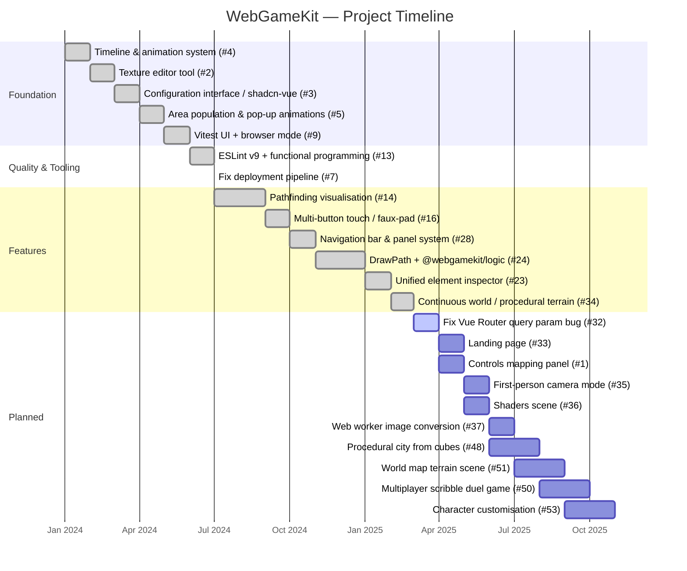
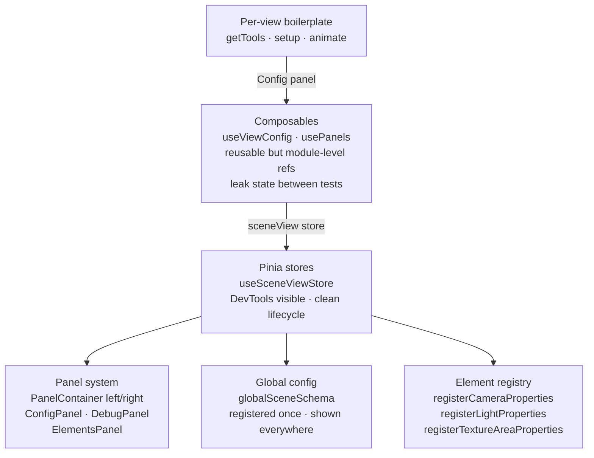
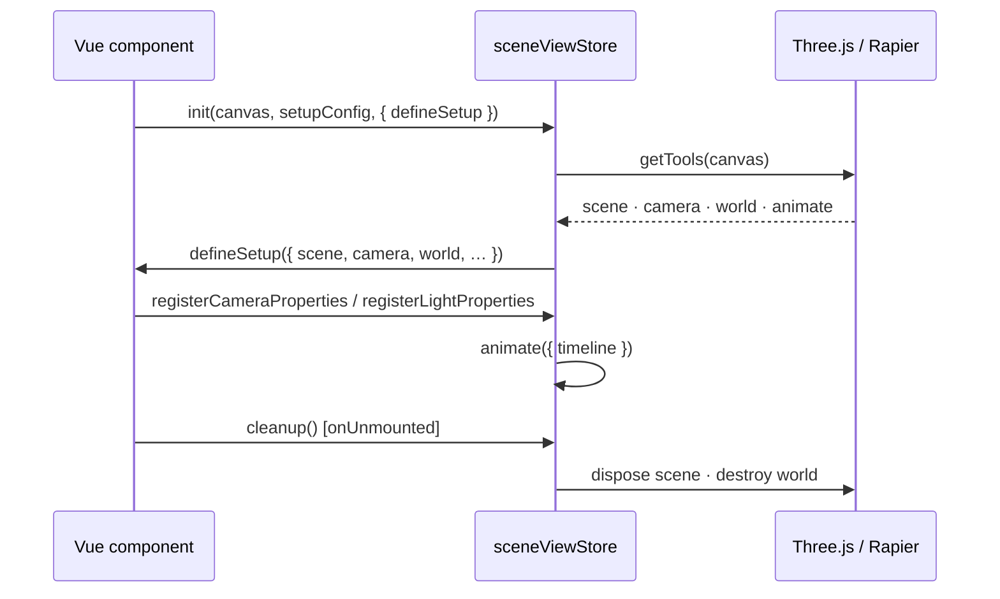
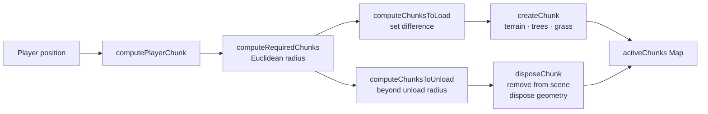

# Development Journey

A living record of what has been built, the architectural decisions made along the way, and the technical lessons that came from them.

:::tip Keeping this doc up to date
When merging a PR, add any new architectural pattern, key lesson, or planned item introduced by the PR to the relevant section below. One bullet per lesson is enough — link to the PR for full context.
:::

---

## Timeline



---

## Architecture Evolution

The codebase grew through three distinct stages: ad-hoc per-view setup, extraction into composables, and finally centralisation into Pinia stores.



---

## Key Patterns

### Scene Lifecycle

Every Three.js view uses `useSceneViewStore` which wraps `getTools → setup → animate` in a consistent lifecycle.



### Chunk Streaming (ContinuousWorld)



Chunks are generated deterministically: the same `(chunkX, chunkZ)` always produces the same layout because all randomness is seeded from the chunk coordinates.

### Panel Registration

Panels are configuration-driven: views register a schema once and all panels update automatically. No per-component wiring needed.

```ts
// Any view — one call registers camera, lights, orbit in the Elements panel
registerCameraProperties(camera, orbitControls);
registerLightProperties(ambientLight, directionalLight);
```

The global `globalSceneSchema` (frame rate, text selection, bloom, vignette) is always present in every view's Config panel without any per-view registration.

### Functional Programming Conventions

| Rule | Reason |
|------|--------|
| No classes — use functions + types | Simpler composition, no `this` binding issues |
| No `for` loops — use `map`/`filter`/`reduce`/`flatMap` | Enforced by ESLint `functional/no-loop` |
| No module-level `ref()` in composables | Invisible to DevTools, never cleans up, stale state in tests |
| Deterministic seeds for procedural generation | Revisiting a chunk always produces the same result |

---

## Technical Complexities & Lessons

Grouped lessons extracted from all PRs. Each maps to a domain where the project repeatedly encountered the same class of problem.

### Three.js Rendering

- **Camera gimbal lock** on isometric transitions: always reset `camera.up` when repositioning a camera programmatically
- **`mixer.update()` double-call**: Three.js `finished` events fire synchronously inside `mixer.update()`; a handler that triggers another update advances the mixer twice in one frame
- **`renderOrder` in generic helpers**: setting it automatically in `getCube` caused draw-order conflicts; callers now set it explicitly
- **OrbitControls ↔ store sync**: `OrbitControls` mutates camera state directly — always add a `change` listener to sync it back to reactive config
- **Instanced grass / `alphaTest`**: using `alphaTest` on billboard sprites instead of `transparent: true` avoids per-frame depth sorting

### State & Reactivity

- **TypeScript `never` narrowing**: an unassigned `let x: T | null = null` where only `null` is assigned narrows to `never` after a null guard — use the most concrete type and assign early
- **`functional/immutable-data` scope**: this ESLint rule is `error` in `src/stores/` but `off` in `.vue` files — DOM side effects (`document.body.style`) must live in `App.vue`, not in stores
- **Composables → Pinia migration**: module-level `ref()` in composables is invisible to DevTools and never cleans up; migrate shared state to Pinia
- **Query param sync**: URL ↔ store sync must be tested end-to-end; it consistently broke after store refactors

### Animation & Physics

- **Timeline manager init order**: initialise managers at declaration time (`const tl = createTimeline()`), not inside conditional blocks — this bug regressed three times
- **Per-instance animation closures**: animation state must be encapsulated per-instance; shared external counters desync when animations overlap
- **Free camera vs. player independence**: camera mode and player movement are separate concerns — share input events but process them independently
- **Stratified sampling for placement**: pure `Math.random()` produces visually clumped distributions; use jittered grid sampling for natural-looking element placement

### Testing & CI

- **Browser tests in CI**: Vitest browser-mode tests are significantly slower than jsdom — benchmark against the CI time budget before adding them to the required pipeline
- **`pnpm` version pinning**: pin the pnpm version in CI to match the lockfile version; runner defaults change
- **TDD for complex state machines**: animation timelines with blocking/resuming transitions are strong TDD candidates — easy to unit-test in isolation, hard to reason about under real-time rendering
- **Parameterised tests with `it.each()`**: always use `it.each()` for multiple similar cases; separate `it()` calls for the same logic duplicate maintenance surface

### Linting & Code Quality

- **ESLint v9 flat config**: requires explicitly wiring parsers per file type; v8 implicit parser inheritance does not carry over
- **Mass auto-fix PRs accumulate conflicts**: lint-enforcement PRs that touch every file should be merged as quickly as possible
- **Schema detection discriminants**: schema parsers need a clear discriminant (e.g. presence of `min`/`max`) to distinguish nested groups from leaf controls; shape inference is fragile

### DevOps & Infrastructure

- **Orphaned Docker containers**: always pass `--remove-orphans` in deploy commands to avoid stale containers holding ports
- **Overwrite compose file on every deploy**: treat the server's `docker-compose.yml` as ephemeral — sync it from source before `docker compose up`
- **`workflow_dispatch` for safe fix verification**: add a manual trigger to deploy workflows so fixes can be tested without polluting the branch trigger config

---

## Planned Investigations

Open issues grouped by theme:

| Theme | Issues |
|-------|--------|
| **Rendering** | Shaders (#36), WebGPU stress test (#39), Textures showcase (#40), Post-processing with WASM/Rust/WebWorker (#41), Materials page (#42) |
| **Game mechanics** | First-person camera (#35), Enemy-chasing game (#26), Sphere-ground game (#18), Multiplayer scribble duel (#50) |
| **Procedural generation** | City from cubes (#48), World map terrain (#51), Character customisation (#53) |
| **Performance** | Web worker for image conversion (#37), IndexedDB for Three.js (#38), General perf optimisation (#19) |
| **Tooling** | Prettier (#46), Package example pages (#47), Live config VS Code sync (#22), Timeline editor (#20) |
| **Infrastructure** | Fix Vue Router query param (#32), Fix npm publishing (#8), Add loader (#12), Landing page (#33) |
| **DX** | Controls mapping panel (#1), Remove Three.js duplications (#44) |
