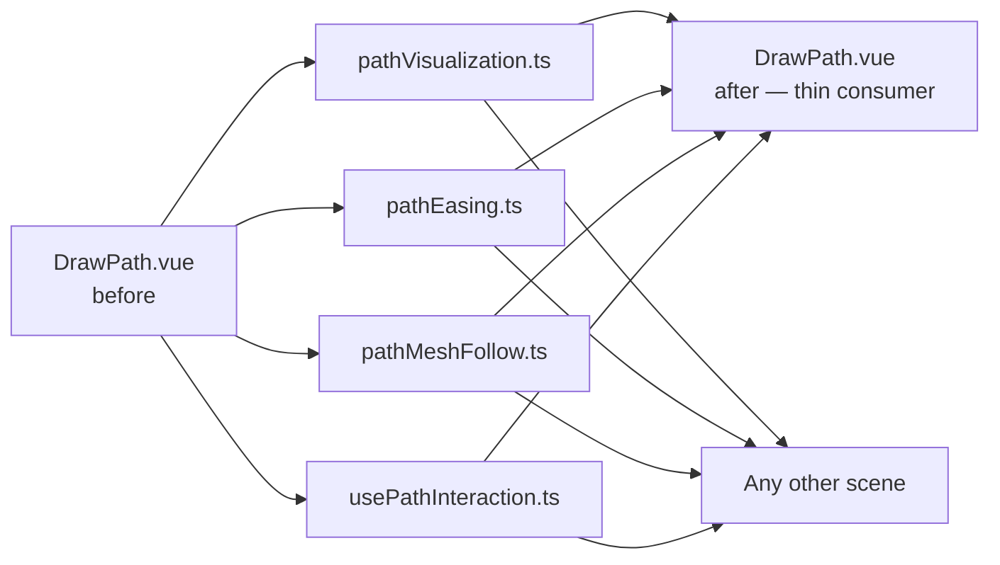

# Abstracting Path-Following into a Reusable Feature

## Starting point

The DrawPath experiment shipped a complete path-following implementation: users hold-draw a curve on the ground, a follower mesh travels along it with easing, and waypoint nodes can be dragged to reshape the path in real time. The logic was entirely self-contained inside `DrawPath.vue` and its adjacent helpers, which meant every future scene that wanted path-following would have to duplicate it.

## What needed to be separated

Three distinct concerns were tangled inside DrawPath:

1. **Visualisation** — building the tube mesh and waypoint sphere nodes in the Three.js scene
2. **Pointer/touch interaction** — converting raw browser events into waypoints via ground-plane raycasting, enforcing a minimum drag distance, and switching between draw mode and node-drag mode
3. **Follower physics** — the per-frame tick that advances the mesh along the path, handles easing, and branches on loop/ping-pong completion

Extracting each concern into its own module decoupled them from DrawPath's scene-specific state and made them consumable by any view.

## Extraction strategy

The visualisation helpers (`drawCreatePathVisualization`, `drawInterpolateWaypoints`, `drawCreateWaypointNode`, etc.) moved into `src/utils/pathVisualization.ts` with their DrawPath-specific config values (`PATH_LINE_COLOR`, `PATH_TUBE_RADIUS`) converted to optional parameters with sensible defaults. The original helper file now re-exports from the shared location so DrawPath's imports required no change.

The easing multiplier moved to `src/utils/pathEasing.ts` under the name `pathGetEasingMultiplier`. Again, the original `easing.ts` helper re-exports it.

The per-frame mesh advance tick became `pathAdvanceMesh` in `src/utils/pathMeshFollow.ts`. It takes a `THREE.Object3D` and a `PathFollowState` and returns a `PathFollowResult`, delegating the pure path arithmetic to the existing `logicAdvanceAlongPath` in `@webgamekit/logic`.

## Pointer interaction as a composable

The ground-plane raycasting, hold-to-draw, node hit-testing, and drag logic were extracted into `src/composables/usePathInteraction.ts`. Rather than accepting specific scene state, it works entirely through callbacks: `onDrawStart`, `onAddWaypoint`, `onUpdateWaypoint`, and `onDrawEnd`. The caller decides what to do with each event; the composable only handles the browser layer.

The module-level helpers (`getNdcFromEvent`, `intersectGround`, `hitTestNodes`) perform pure geometric operations and are kept separate from the main function to satisfy the line-count constraint.

## Store integration

The `debugScene` store gained a `paths` collection mirroring the existing `instancedGroups` and `spawnGroups` patterns. Each `PathEntry` holds the serialisable data (waypoints, reactive config) and a `PathHandlers` object whose callbacks the scene provides when registering a path.

A `pathRegistrationContext` ref lets any view register an `onEnablePath(elementName)` callback that the Elements panel can invoke without holding Three.js scene references. The panel only knows about element names; the view decides how to wire the scene-side path logic in response.

## Elements panel surface

A path belongs to the mesh it is attached to, so its controls live _inside_ that mesh element's own expandable properties rather than as a separate top-level entry. `ElementItem.vue` gained an optional "Enable path" button (a `Route` icon) that appears on mesh elements when a `pathRegistrationContext` is registered. Clicking it calls `debugSceneStore.enablePathForElement(elementName)`.

Once a path exists for an element, expanding that element in the Elements panel reveals a collapsible `ElementPathSection.vue` beneath its normal properties. The section expands to show the waypoint position list (the same inline X/Y/Z editor used by `ElementInstancedGroup.vue`) plus `SchemaControls` for every path option: speed, push force, easing, easing intensity, playing, loop, ping pong, show path, show nodes, and reset. The panel maps each path to its element by name, so the section appears in the right place automatically.

## Scaling the visualisation to the scene

The path tube and waypoint nodes use small package defaults (tube radius 0.06, node 0.4) sized for the ~1-unit DrawPath reference scene. Dropped into a scene built on a much larger unit scale — for example the Timeline test scene with 30-unit grid cells viewed from a distant orthographic camera — those defaults are sub-pixel and effectively invisible. The consuming view passes scene-appropriate values (a tube radius and node size measured in the scene's own units) so the path reads clearly at whatever scale it is used.

## Showing a path only for the selected element

With several elements each carrying a looping path, drawing every tube at once clutters the scene. A path's tube and nodes are therefore shown only while that path's element is the currently selected one in the Elements panel — selection is the single source of truth, read from the element-properties store. A watcher re-evaluates every path's visibility whenever the selection changes, and a shared `updateTickVisibility` helper combines three conditions: the element is selected, the path is not hidden, and its own show-path / show-nodes toggles are on. Movement is unaffected — paths keep advancing their followers whether or not their tube is drawn — so deselecting an element simply hides its line without stopping it. Enabling a path also selects its element, so a freshly drawn path is visible immediately.

## Syncing `playing` with the Timeline panel

The `playing` config key is the one path option that has global consequences: it should pause all animation, not just the path. Inside `ElementPathSection.vue`, writing `playing = false` also calls `useTimelinePanelStore().setPaused(true)`, and a watcher syncs in the reverse direction so the global Timeline play/pause button also controls the path.

## DrawPath after the refactor

After extraction, `DrawPath.vue` became a thin consumer. The long pointer-handling block was replaced with a three-line `usePathInteraction` call. The `SceneState` type lost its `selectedNodeIndex` field (the composable tracks that internally). The easing call site became `pathGetEasingMultiplier` instead of the local `getEasingSpeedMultiplier`. The behaviour is identical; the duplication is gone.
