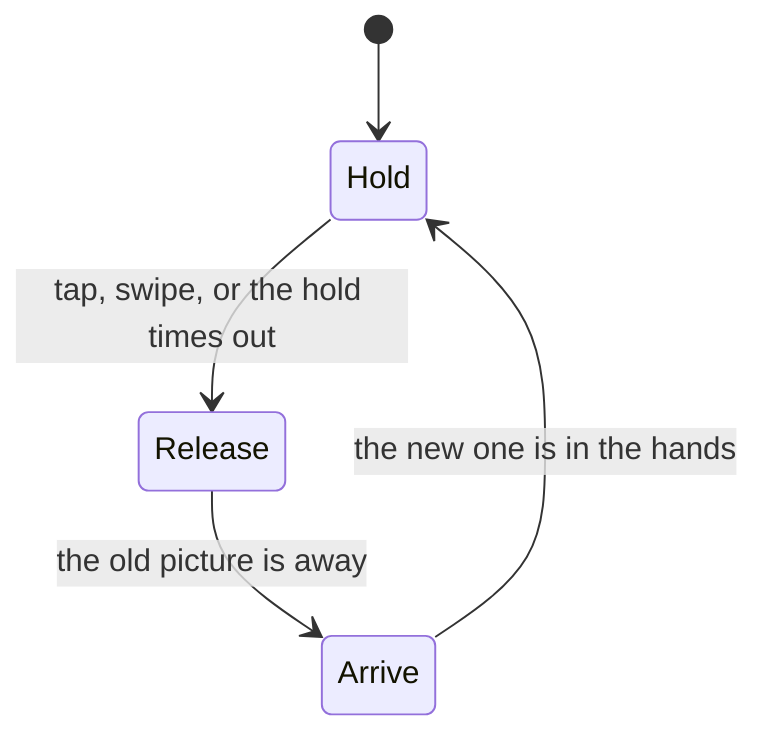

# A slideshow with no slide

:::note Source files

<video controls loop muted playsinline width="720" src="/video/picture-slideshow/hand-off.webm">
  A stickman, cut off at the knees by the bottom of the frame, holds a photograph. Tapping the
  right of the screen sends it spinning away to the right while he turns after it and a new one
  arrives from the left into his hands. It happens twice more, the last one in the other
  direction.
</video>

`src/views/Experiments/PictureSlideshow/slideshow.ts`, `config.ts`,
`PictureSlideshow.vue`, `types.ts`, `packages/controls/src/pointer.ts`.

:::

A slideshow normally changes picture by moving the picture: a crossfade, a wipe, a
slide. This one has no such effect anywhere in it. The change is a character throwing
one picture away and receiving another, and the only thing being animated is him.

That inversion is the whole design, and it turns a rendering problem into a staging
problem. Nothing here is hard to draw. What is hard is that a physical object cannot
appear or vanish in front of the viewer, and a slideshow has to do both, forever — and
that a puppet's reach is a fixed fact you have to design around rather than a number
you get to choose.

## The cycle is three phases and one number

Each change is a hold, a release and an arrival, in that order. The hold ends either
when the viewer asks for a change or when it simply times out, and the change itself
runs to its own end and cannot be interrupted.

Everything the hands do is derived from a single eased scalar: one holding a picture at
display height, zero with the hands empty and lowered, falling across the release and
rising across the arrival. It sets the arm pitch, it sets how far the arms are spread,
and it interpolates the arriving picture from off frame into the display pose.

Driving all three from the same number is not a tidiness preference. Animating a hand
and the thing in it separately means the two agree only if their curves and durations
match exactly, and they drift apart the moment either is retuned — a picture sliding out
of a grip that is still closed. Sharing the scalar makes the grip true by construction,
and leaves the timings safe to expose as panel controls.

## Two things cannot be allowed to pop

An object appearing from nothing, or vanishing into it, breaks the illusion harder than
any amount of stiffness in the animation. There are two such moments per change, at
opposite ends, and travelling sideways solves both at once.

**The picture that leaves** is thrown clear of the frame rather than set down. Letting it
land is the obvious reading, and it does not work: a discarded picture lying at the
character's feet has to be gone again before its turn comes round, and there is nowhere
off-camera for it to go, so it blinks out in plain view a few seconds later. Anything
that comes to rest inside the frame must later be removed inside the frame. The scene has
no floor at all, which is what makes the throw possible: there is nothing to land on.

That is also why the character stands on nothing and runs off the bottom of the shot. A
base under him would be a floor by another name — something a thrown picture could hit,
and something the composition has to make room for below the subject.

**The picture that arrives** comes in from the side opposite the one just vacated,
starting far enough out to be off camera before it moves. It is hidden entirely during
the release, so the first frame it is drawn on is already outside the shot.

## Reach is the rig's decision, not the designer's

The picture wants to be as large as possible, and the hands have to be visible at its
edges rather than buried behind it. Those two pull against each other, and what settles
the argument is the rig.

Its arms are short. Rotating them forward alone can only ever hold the hands as far apart
as the shoulders are, which is narrower than a picture worth looking at. Rolling them
outwards as well swings each hand wide of its own shoulder and buys the difference — but
only a fixed amount of it, because the arm is the length it is. The largest picture the
character can be seen holding is therefore a property of the model, arrived at by
measuring rather than chosen.

Measuring it is where this went wrong twice. An arm's world-space bounding box is not its
reach: for a limb rotated on two axes the box is an axis-aligned hull whose corners are
nowhere near the geometry, and reading a hand position off it overstated the reach by
more than double. The number that means something is the far end of the arm's own mesh,
transformed into the world — and taking it from the box instead produced a picture sized
for a reach the character did not have, with both hands hidden behind it.

## Perspective decides the margin, not the layout

Even once the hands were genuinely wider than the picture, they stayed hidden. The
picture was held further forward than the hands, and a perspective camera magnifies
whatever is nearer to it: held forward, the picture outgrew its own grip on screen and
swallowed it, however wide the arms were spread.

The fix is to hang the picture at the hands' own depth, only just in front of them. At
equal depth both are magnified equally, and the clearance built into the layout is the
clearance the viewer sees. A margin measured in world units is only trustworthy between
things the same distance from the camera.

## The beats

| Hold                                                                                                  | Release                                                                                     |
| ----------------------------------------------------------------------------------------------------- | ------------------------------------------------------------------------------------------- |
|  |  |

| Crossing                                                                                                              | Arrival                                                                                                |
| --------------------------------------------------------------------------------------------------------------------- | ------------------------------------------------------------------------------------------------------ |
|  |  |

## A swipe and an orbit drag are the same gesture

Driving the change from the screen meant teaching the controls package where a press
happened and which way it moved, which it had no notion of: its touch device could only
report that the screen had been pressed. Pointer events cover mouse, touch and pen in one
stream, so the addition is one controller rather than two that can disagree.

It cannot coexist with orbit on the same element. A drag across the canvas is either a
camera rotation or a swipe, and a scene that listens for both does both at once. This one
gives up orbit, which costs nothing since the composition is fixed and the picture is the
subject. The same canvas also needs `touch-action: none`, or a phone claims the swipe as
a page scroll and the gesture never completes.

## The scene did not keep the lights it asked for

An early version showed its photographs at night, then at dawn, then at night again, and
nothing in the view explained why. Scenes here open on a moving sky by default: the scene
store starts a day cycle immediately after setup, and it overwrites every light and the
background colour a frame later. A declared palette is correct for exactly one frame.

That is the right default for a landscape and the wrong one for a gallery, where the
subject has to stay readable. Turning the cycle off before its first frame runs leaves the
declared rig in place.

The camera has a quieter version of the same problem. Orbit aims the camera at its target
on its first update whether or not it is enabled, so a scene that sets `camera.lookAt` and
disables orbit without also setting `orbit.target` is framed on the origin instead — which
here cropped the character's head, and looked for all the world like a bad camera height.
Both constraints are recorded in the Three.js views rule.
