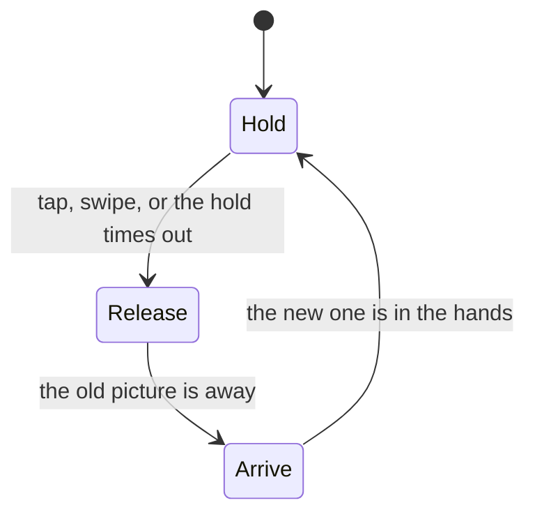

# A slideshow with no slide

:::note Source files

<video controls loop muted playsinline width="720" src="/video/picture-slideshow/hand-off.webm">
  A Mixamo character, cut off at the knees by the bottom of the frame, holds a photograph in a
  bent-elbow grip. Tapping the right of the screen throws it clear to the right, both hands still
  on it as it tips away, and the next picture arrives from the left back into the same grip.
</video>

`src/views/Experiments/PictureSlideshow/slideshow.ts`, `config.ts`,
`PictureSlideshow.vue`, `character.ts`, `types.ts`, `packages/controls/src/pointer.ts`.

:::

A slideshow normally changes picture by moving the picture: a crossfade, a wipe, a
slide. This one has no such effect anywhere in it. The change is a character throwing
one picture away and receiving another, and the only thing being animated is him.

That inversion is the whole design, and it turns a rendering problem into a staging
problem. Nothing here is hard to draw. What is hard is that a physical object cannot
appear or vanish in front of the viewer, and a slideshow has to do both, forever — and
that a puppet's reach is a fixed fact you have to design around rather than a number
you get to choose.

## The cycle is three phases and one number

Each change is a hold, a release and an arrival, in that order. The hold ends either
when the viewer asks for a change or when it simply times out. A change past the first
30% of its own run is likewise left to finish, but a second swipe arriving earlier than
that turns it around instead of being ignored — restarting from whichever picture is
still actually on screen (the one the abandoned change had barely begun leaving) rather
than from the one that was only ever about to arrive. Early on there is nothing to
strand; any later and there would be.

The picture hangs off the hands, which is what keeps the two from disagreeing — and also
means every degree the body moves, the picture moves with it. The authored gesture is
deliberately small for that reason: a slideshow's picture is meant to be read, so the
character stays alive without its subject drifting.

Everything the hands do is derived from a single eased scalar: one holding a picture at
display height, zero with the hands empty and lowered, falling across the release and
rising across the arrival. It sets the arm pitch, it sets how far the arms are spread,
and it interpolates the arriving picture from off frame into the display pose.

Driving all three from the same number is not a tidiness preference. Animating a hand
and the thing in it separately means the two agree only if their curves and durations
match exactly, and they drift apart the moment either is retuned — a picture sliding out
of a grip that is still closed. Sharing the scalar makes the grip true by construction,
and leaves the timings safe to expose as panel controls.

## Two things cannot be allowed to pop

An object appearing from nothing, or vanishing into it, breaks the illusion harder than
any amount of stiffness in the animation. There are two such moments per change, at
opposite ends, and travelling sideways solves both at once.

**The picture that leaves** is thrown clear of the frame rather than set down. Letting it
land is the obvious reading, and it does not work: a discarded picture lying at the
character's feet has to be gone again before its turn comes round, and there is nowhere
off-camera for it to go, so it blinks out in plain view a few seconds later. Anything
that comes to rest inside the frame must later be removed inside the frame. The scene has
no floor at all, which is what makes the throw possible: there is nothing to land on.

That is also why the character stands on nothing and runs off the bottom of the shot. A
base under him would be a floor by another name — something a thrown picture could hit,
and something the composition has to make room for below the subject.

**The picture that arrives** comes in from the side opposite the one just vacated,
starting far enough out to be off camera before it moves. It is hidden entirely during
the release, so the first frame it is drawn on is already outside the shot.

## Reach is the rig's decision, not the designer's

The picture wants to be as large as possible, and the hands have to be visible at its
edges rather than buried behind it. Those two pull against each other, and what settles
the argument is the rig.

Its arms are short. Rotating them forward alone can only ever hold the hands as far apart
as the shoulders are, which is narrower than a picture worth looking at. Rolling them
outwards as well swings each hand wide of its own shoulder and buys the difference — but
only a fixed amount of it, because the arm is the length it is. The largest picture the
character can be seen holding is therefore a property of the model, arrived at by
measuring rather than chosen.

Measuring it is where this went wrong twice. An arm's world-space bounding box is not its
reach: for a limb rotated on two axes the box is an axis-aligned hull whose corners are
nowhere near the geometry, and reading a hand position off it overstated the reach by
more than double. The number that means something is the far end of the arm's own mesh,
transformed into the world — and taking it from the box instead produced a picture sized
for a reach the character did not have, with both hands hidden behind it.

## Verifying the part, not the whole

The character spent a long time presenting the picture over its own shoulders, and every
check made of it passed.

The picture has to be on the camera's side, so the hands have to reach that way, and a
measurement confirmed they did. What was never checked was which way the _body_ faced. It
had been turned half a circle early on, on an assumption about the rig's own zero that was
never tested, and from the front a flat cut-out gives nothing away: the arms come round the
sides of the picture and look exactly as they should. Only a side view shows the picture in
front of the body and the arms reaching behind it.

The correction is not the turn on its own. Arm pitch is expressed in the body's frame, so
facing the body forward sends the arms backwards instead — the two are one fix, not two. And
the pitch that then reads best is a small one, because a flat arm swung far forward turns
its edge to the camera and reads as a spike rather than a limb.

The lesson is about what a measurement covers. Confirming the hands were in the right place
proved the hands were in the right place; it said nothing about the body they were attached
to, and a front view could not tell the difference. A pose needs a second angle before it is
believed, and the cheapest one is the axis the composition does not use.

## Perspective decides the margin, not the layout

Even once the hands were genuinely wider than the picture, they stayed hidden. The
picture was held further forward than the hands, and a perspective camera magnifies
whatever is nearer to it: held forward, the picture outgrew its own grip on screen and
swallowed it, however wide the arms were spread.

The fix is to hang the picture at the hands' own depth, only just in front of them. At
equal depth both are magnified equally, and the clearance built into the layout is the
clearance the viewer sees. A margin measured in world units is only trustworthy between
things the same distance from the camera.

## Real pictures need the same prep the placeholder never did

The placeholder used everywhere above was a single photo, repeated on every board, always
opaque and never a strange aspect ratio — none of the things a real picture turns out to
be. Two of the three paintings that replaced it carried real alpha transparency, which the
board's material blends per pixel, so the scene showed through wherever a painting's own
background wasn't opaque. Every picture is now flattened onto white and cover-fit to the
board's own aspect ratio before it lands in `PICTURES`, cropping whichever side overflows
rather than stretching or padding it — the same recipe any future addition needs.

| Before (the placeholder)                                                                                        | After (a real painting, prepped)                                                                                                                      |
| --------------------------------------------------------------------------------------------------------------- | ----------------------------------------------------------------------------------------------------------------------------------------------------- |
|  |  |

## The beats

| Hold                                                                                                | Release                                                                                     |
| --------------------------------------------------------------------------------------------------- | ------------------------------------------------------------------------------------------- |
|  |  |

| Crossing                                                                                                              | The other character                                                                                                           |
| --------------------------------------------------------------------------------------------------------------------- | ----------------------------------------------------------------------------------------------------------------------------- |
|  |  |

## A swipe and an orbit drag are the same gesture

Driving the change from the screen meant teaching the controls package where a press
happened and which way it moved, which it had no notion of: its touch device could only
report that the screen had been pressed. Pointer events cover mouse, touch and pen in one
stream, so the addition is one controller rather than two that can disagree.

It cannot coexist with orbit on the same element. A drag across the canvas is either a
camera rotation or a swipe, and a scene that listens for both does both at once. This one
gives up orbit, which costs nothing since the composition is fixed and the picture is the
subject. The same canvas also needs `touch-action: none`, or a phone claims the swipe as
a page scroll and the gesture never completes.

## The scene did not keep the lights it asked for

An early version showed its photographs at night, then at dawn, then at night again, and
nothing in the view explained why. Scenes here open on a moving sky by default: the scene
store starts a day cycle immediately after setup, and it overwrites every light and the
background colour a frame later. A declared palette is correct for exactly one frame.

That is the right default for a landscape and the wrong one for a gallery, where the
subject has to stay readable. Turning the cycle off before its first frame runs leaves the
declared rig in place.

## Two characters, one stage

The scene now offers a choice from the panel: the cut-out rig wearing any of the shared
skins, or a Mixamo skeleton playing a gesture authored for it. They are different shapes
with different reaches, and the naive way to support both is two cameras and two picture
sizes, re-tuned against each other every time either changes.

They share one of each instead, on two decisions. The rigs are scaled so their _hands_ end
up the same distance apart rather than so their heights match — the picture is sized to a
hand span, so matching spans is what lets one board serve both. Their proportions then leave
the hands at different heights, which is answered by standing each rig by its hands rather
than by its feet. Since the legs are cut off by the bottom of the frame anyway, nothing is
lost by letting the feet fall where they may.

Reach is also why the clip is authored against the rig that plays it. Rotations retarget
between Mixamo skeletons, which is the whole point of the format, but reach does not: the
same angles on a shorter-armed rig hold the hands closer together. A gesture solved against
one skeleton and played on another came out at half the intended span, with both hands well
inside the picture — correct as rotation, wrong as pose.

Behind that, each character answers one question every frame — where does the picture hang —
and the slideshow asks nothing else. A rig the scene poses itself computes it from its own
pose; a rig driven by a clip reads it from the hand bones. Neither needs to know the other
exists.

The camera has a quieter version of the same problem. Orbit aims the camera at its target
on its first update whether or not it is enabled, so a scene that sets `camera.lookAt` and
disables orbit without also setting `orbit.target` is framed on the origin instead — which
here cropped the character's head, and looked for all the world like a bad camera height.
Both constraints are recorded in the Three.js views rule.

## A clip on its own clock drifts against the cycle it serves

The Mixamo gesture originally answered "where does the picture hang" with its clip left
to run continuously on the mixer's own clock the instant a change started, independent of
the hold, release and arrival it was meant to accompany. It looked alive on its own and
wrong in context: since nothing tied the clip's length to the cycle's, the two drifted
against each other whenever either was retuned, and a change that finished early or late
against the clip either froze part way through a gesture or sat idle after it had already
finished.

The fix follows from the same principle as the eased scalar above: derive the pose from
the phase, not from the wall clock. The clip is the whole hold-to-hold round trip —
dropping the leaving picture and picking up the next baked into its own middle frames as
one authored gesture — and it is never left to play itself. It stays paused and is
scrubbed by hand to the change's own elapsed seconds every frame, which is what lets a
live drag move the hands exactly as far as the finger has moved, rather than the gesture
only ever running once, at its own fixed pace, from whenever a change happens to start.

Scrubbing the same clip backward through itself for a change heading to the previous
picture — instead of forward through the same frames again with a different picture
behind it — is what makes going back read as undoing the hand-off rather than repeating
it forward with the destination swapped.

## Matching endpoints is not matching a curve

Fixing the drift above made the hand and the picture agree at the two ends of every
flight: both start at the grip, both finish at the grip. For most of the distance
between those ends, they still disagreed. A picture flying home would be most of the
way back while the hand still carrying it was only half-reached, so a screenshot taken
mid-flight showed a hand reaching at nothing, some distance from where the picture
actually was.

The two were driven by unrelated systems sharing nothing but a raw progress number: the
picture's own offset eased on a plain squared curve, chosen for how a thrown object
should decelerate, while the hand's reach came from a clip baked with a smoothstep,
chosen for how an arm should move. Both are reasonable curves in isolation. Agreeing at
the boundary only guarantees the two lines cross at 0 and 1 — nothing stops one from
running ahead of the other everywhere in between, and the steeper the two curves'
difference, the wider that gap gets before it closes back to zero at the far end.

Two values driven by the same raw input still have to share a shape, not just a
domain, if anything is meant to track something else across the whole span rather than
only greet it at the finish. The fix was to put the picture's flight on the exact same
`ease` the gesture already used, so a given progress produces the same fraction of
"still travelling" on both sides, all the way through — not a new curve, just the one
already there, reused.
