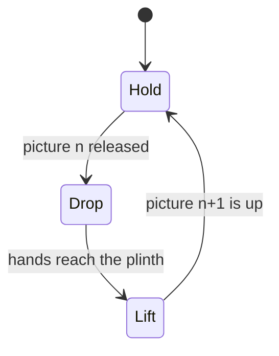

# A slideshow with no slide

:::note Source files

<video controls loop muted playsinline width="720" src="/video/picture-slideshow/drop-and-lift.webm">
  A stickman stands on a plinth holding a photograph up in front of him. He lets go; the
  photograph tips forward, tumbles past the edge of the plinth and falls out of shot. His arms
  swing down to a second photograph standing at his feet, and lift it into the space the first
  one left, uncovering a third at the spot it was lifted from.
</video>

`src/views/Experiments/PictureSlideshow/slideshow.ts`, `config.ts`,
`PictureSlideshow.vue`, `types.ts`.

:::

A slideshow normally changes picture by moving the picture: a crossfade, a wipe, a
slide. This one has no such effect anywhere in it. The change is a character putting
one picture down and picking up another, and the only thing being animated is him.

That inversion is the whole design, and it turns a rendering problem into a staging
problem. Nothing here is hard to draw. What is hard is that a physical object cannot
appear or vanish in front of the viewer, and a slideshow has to do both, forever.

## The cycle is three phases and one number

Each change is a hold, a drop and a lift, in that order, repeating. Cycle _n_ holds
picture _n_, releases it, and lifts picture _n + 1_ into its place, so the picture
the lift ends on is already the one the next hold carries.

Everything visible is derived from a single eased scalar: one at display height,
zero with the hands down at the plinth, falling across the drop and rising across
the lift. It sets the arm pitch, and it interpolates the held picture between the
waiting pose and the display pose.

Driving both from the same number is not a tidiness preference. Animating a hand and
the thing in it separately means the two agree only if their curves and durations
match exactly, and they drift apart the moment either is retuned — a picture sliding
out of a grip that is still closed. Sharing the scalar makes the grip true by
construction, and leaves the timings safe to expose as panel controls.

## The pose numbers came from the rig, not from taste

The poses are not aesthetic choices that were nudged until they looked right. The
raised arm pitch, the display height, and where the waiting picture stands are all
solved from three measurements taken off the loaded rig: the shoulder height, the
arm length below it, and the rig's full height.

Guessing these is slower than measuring them, and the reason is that the errors are
not independent. An arm pitch that is wrong by a little puts the hands somewhere the
picture is not, and correcting the picture to meet them then puts it somewhere the
composition does not want. Measuring first collapses a search over several coupled
values into arithmetic.

## Two things cannot be allowed to pop

An object appearing from nothing, or vanishing into it, breaks the illusion harder
than any amount of stiffness in the animation. There are two such moments per cycle,
at opposite ends.

**The picture that leaves.** Letting it land is the obvious reading of "drop", and it
does not work. A discarded picture lying at the character's feet has to be gone again
before its turn comes round, and there is nowhere off-camera for it to go — so it
blinks out in plain view a few seconds later. Every variation on this has the same
shape: anything that comes to rest inside the frame must later be removed inside the
frame.

The fix is to give it nowhere to rest. The character stands on a plinth rather than a
floor, and the released picture is tossed just far enough forward to clear the
plinth's edge before it has fallen as far as its top, then keeps going. It leaves the
shot on its own and can be quietly reset while out of view.

That clearance is a real constraint, not a comfort margin, and it binds three
numbers together: the plinth's radius, how fast the picture falls, and how far
forward it is tossed. Too little forward travel and it sinks through the plinth it
was standing over; too much and it is thrown at the camera rather than dropped.

**The picture that arrives.** The waiting picture is deliberately indexed as the one
_after_ whatever is currently held, which means it changes identity at the instant
the lift begins. That instant is the one moment the lifted picture is still sitting
exactly on the waiting spot, covering it completely. The successor takes the spot
behind it and is uncovered by the lift itself, reading as the next picture in a
stack rather than as one appearing out of nowhere.

## The beats

| Hold                                                                                                                          | Release                                                                                       |
| ----------------------------------------------------------------------------------------------------------------------------- | --------------------------------------------------------------------------------------------- |
|  |  |

| Reach                                                                                                                         | Lift                                                                                                       |
| ----------------------------------------------------------------------------------------------------------------------------- | ---------------------------------------------------------------------------------------------------------- |
|  |  |

## The scene did not keep the lights it asked for

The first working version showed its photographs at night, then at dawn, then at
night again, and nothing in the view explained why. Scenes here open on a moving sky
by default: the scene store starts a day cycle immediately after setup, and it
overwrites every light and the background colour a frame later. A declared palette
is correct for exactly one frame.

That is the right default for a landscape and the wrong one for a gallery, where the
subject has to stay readable. Turning the cycle off before its first frame runs
leaves the declared rig in place, and the constraint is recorded where a view author
will meet it, in the Three.js views rule.
