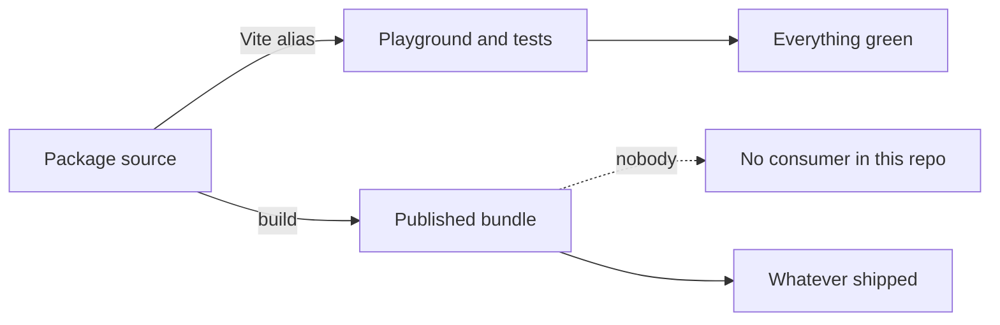

# Publishing Blind: When the Playground Never Loads What Ships

## The symptom

There was no symptom. That is the whole point of this entry.

Thirteen packages had been published to npm. Every test passed, the app ran, the build was
green, and the documentation described an API that worked. The first time anything in this
repository loaded a built package the way an outside consumer would, it threw immediately.

## Why nothing noticed

Vite resolves every `@webgamekit/*` import straight to the package's source entry, through
aliases declared in the app's build config. This is deliberate and worth keeping: it means a
change to a package is live in the playground without a rebuild, and it means a stack trace
points at real source rather than a bundled chunk.

It also means the built output is never loaded by anything. Not the app, not the unit tests,
not the production build. The published artifact and the thing under test are two different
files, and only one of them has ever been executed.

The gap is invisible from reading the code, because from inside the repository the import
specifier and the import result look identical. Only the resolution differs, and resolution is
configuration rather than code.

## What was hiding in it

One module built its shader uniforms as a literal object at module scope, reading the window
dimensions as it did so. Inside the playground this was harmless — a browser was always there
by the time anything imported it.

Loaded in a bare Node process, the module throws while it is still being evaluated, before any
function is called. That makes the entire package unimportable in any server-rendering
context, and unimportable in any tooling that inspects it outside a browser. A consumer could
not have worked around it, because the failure happens on import rather than on use.

The fix was to give the uniform a neutral default and let the code that creates the render
pass supply the real dimensions — which is what every sibling shader already did, and which is
also more correct in the browser, since the value is now read when the pass is built rather
than whenever the module first happened to load.

## The general shape

A bug can only be found by something that exercises the code path the bug lives on. Aliasing
packages to source removes the only path on which "the published artifact is broken" is
observable, so no amount of additional unit testing would ever have surfaced this.

The check that closes the gap does the one thing nothing else did: it builds the packages,
packs them, installs them into a throwaway project outside the workspace, and imports them
from there — in both module systems, and once more through the type declarations. It is slow
compared to a unit test and it belongs in continuous integration rather than in a watch loop,
but it is the only observer of an entire class of failure.

Two properties made it worth building rather than trusting review. It runs in Node with no
DOM, so anything that reaches for a browser global at module scope fails loudly. And it
installs from a tarball rather than a directory, so anything the package forgot to include in
its published files is simply absent.

The operational side of this — when to write a changeset, what the release does, how to run
the check — is in the [releasing the packages guide](../guides/releasing-packages.md).
