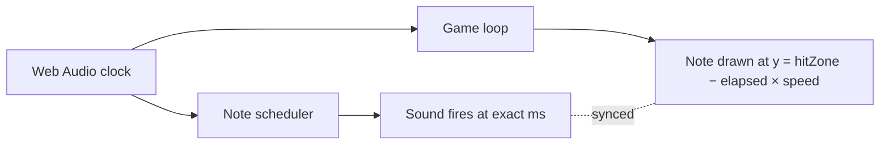
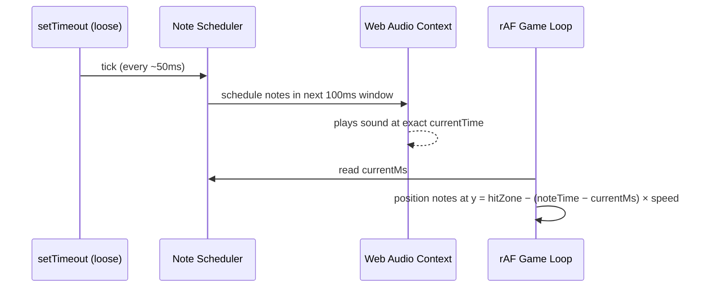
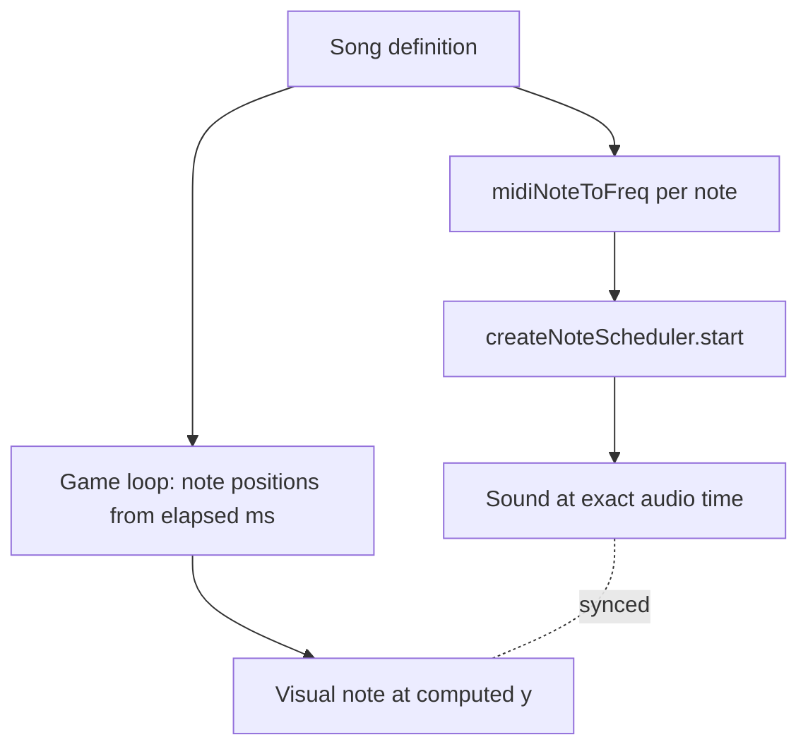
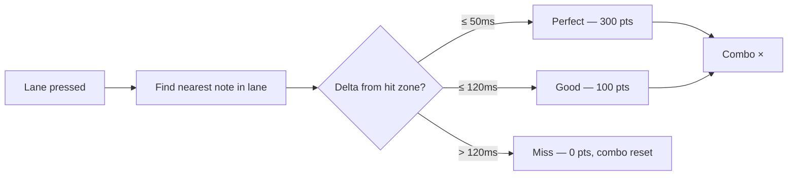
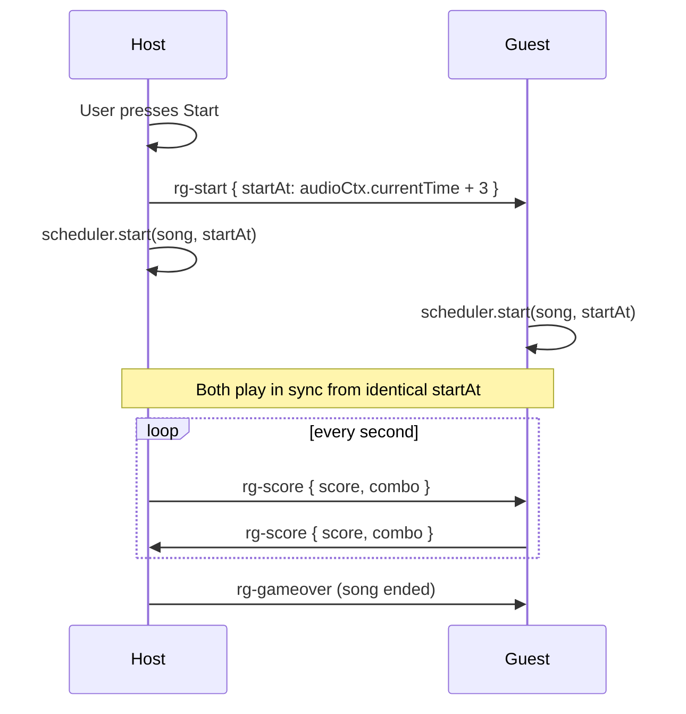
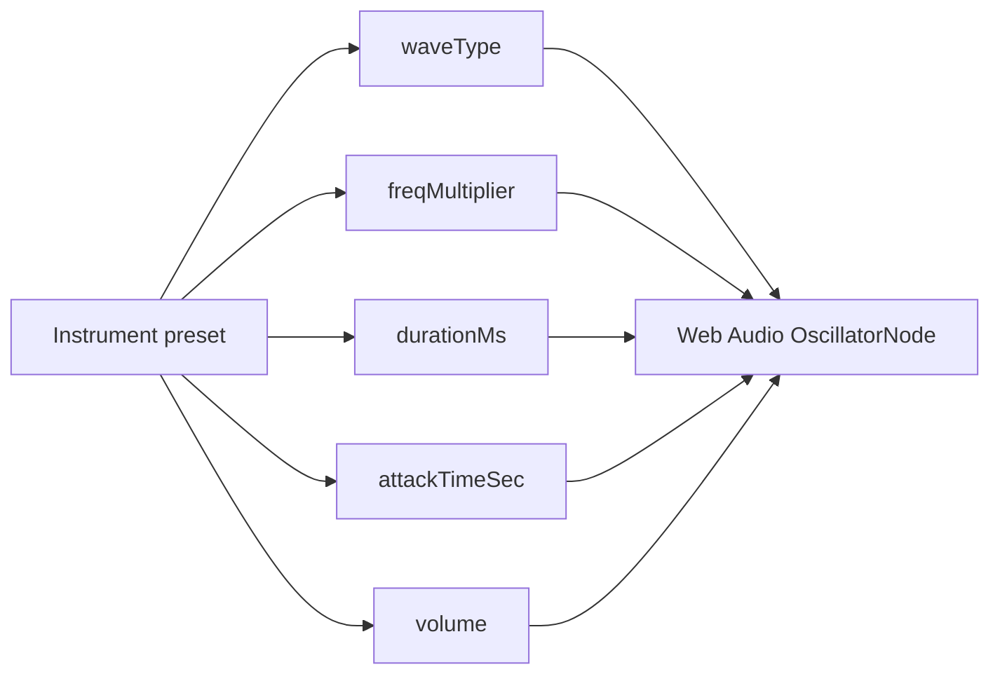
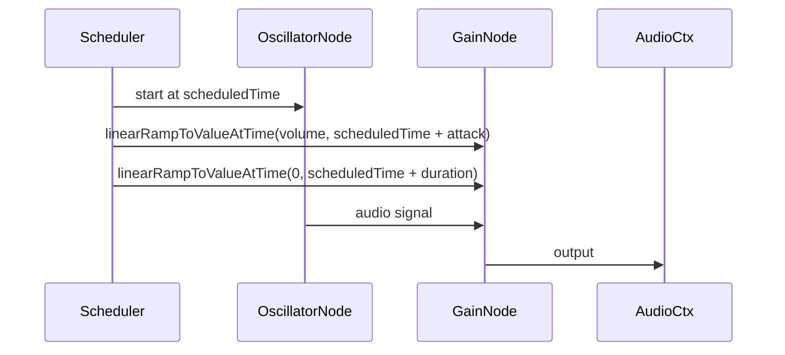

# Rhythm Game: Audio Clock, Note Scheduling, and Lane Input

This documents the design decisions behind the rhythm game (issue #138).

## The core timing problem: setTimeout drifts

The existing audio package schedules notes using `setTimeout`. This is fine for background music where occasional drift is imperceptible, but a rhythm game lives or dies by timing accuracy. If a note appears at time T on screen and the corresponding sound fires 30 ms late, players feel something is wrong even if they cannot name it.

The fix: make the **Web Audio API clock** (`audioContext.currentTime`) the single source of truth for both visual note positions and sound scheduling. The Web Audio clock is driven by the hardware audio pipeline — it runs ahead of the main thread and is immune to JavaScript event loop congestion.

The scheduler emits elapsed milliseconds on each animation frame via a callback so the game loop never reads `Date.now()` — it always reads the audio clock.

## Two new audio package functions

**`midiNoteToFreq`** converts MIDI note numbers (0–127) to Hz using the equal temperament formula. Middle C is note 60. This lets songs be authored in readable note names and makes the format portable between games. Without it, every song must store raw frequencies, which are opaque and hard to edit.

**`createNoteScheduler`** wraps the Web Audio lookahead scheduling pattern:

- Uses an internal lookahead window (typically 100–200 ms ahead of the playhead) to pre-schedule oscillators before they are needed
- The lookahead runs on a short `setTimeout` interval, but the actual audio events are pinned to precise `audioContext.currentTime` offsets — so drift in the scheduling callback does not affect when sound is heard
- Exposes a live `currentMs` property so the game loop can read elapsed time without converting between clocks

## Lane structure and controls

Four lanes map to the faux-pad directions (left / down / up / right), keyboard home-row keys, gamepad DPad, and touch zones. The faux-pad is the primary mobile control surface — its four directions align naturally with the four lanes and require no visual explanation.

Each lane has a fixed neon colour so players build spatial muscle memory: the colour, position, and direction are all redundant signals for the same action.

## Note representation

Songs are sequences of `{ lane, midiNote, time }` objects where `time` is milliseconds from song start. This is distinct from raw audio note sequences — it carries lane assignment and is authored for human readability using MIDI note numbers rather than frequencies.

## Hit detection

On each lane input, the game searches backwards from the current audio-clock time for the nearest unresolved note in that lane. The result falls into one of three windows:

Notes that scroll past the hit zone without input are automatically marked as misses on the next frame.

## Multiplayer synchronisation

Each player runs their own note track independently. The host broadcasts a `rg-start { startAt }` message containing an audio-clock timestamp; every client starts the scheduler at that exact time. Because all clients use the same Web Audio clock origin, note positions are deterministic across machines without any further sync.

## Visual design principles

- **Dark canvas with neon per-lane colours** — cyan, magenta, yellow, green. High contrast, readable at a glance.
- **Hit zone as a pulsing bar** at 80 % of canvas height, not at the very bottom, so there is a small "reaction buffer" below it.
- **Lane buttons always visible** at the bottom — they animate on press to give tactile feedback on both desktop and mobile.
- **Feedback is immediate and local** — a ring-expand burst on perfect, a flash on good, a red cross on miss. Players should know the quality of each hit within one frame.

## Instrument simulation with Web Audio API

Real instruments cannot be bundled as audio files without a CDN or large asset pipeline. Instead each "instrument" is approximated by a different oscillator configuration — a combination of wave shape, duration, frequency offset, and envelope.

The three presets and their rationale:

| Instrument | Wave       | Freq mult | Duration | Character                                                                    |
| ---------- | ---------- | --------- | -------- | ---------------------------------------------------------------------------- |
| Piano      | `triangle` | ×1        | 90 ms    | Bright, short decay — triangle is softer than square but not as pure as sine |
| Bass       | `triangle` | ×0.5      | 220 ms   | Same warmth, one octave lower, held longer                                   |
| Guitar     | `sawtooth` | ×1        | 110 ms   | Sawtooth carries strong odd+even harmonics that read as "stringy"            |

The frequency multiplier is applied uniformly to every lane's MIDI-derived frequency so the entire key layout shifts as a chord without reauthoring the song.

The attack envelope (`attackTimeSec`) is an `AudioParam` ramp — short for piano (5 ms, key-click feel), medium for bass (3 ms), and very short for guitar (2 ms, percussive string pluck). Without the envelope, oscillators start at full amplitude and produce a digital click on every note.

Adding a new instrument only requires a new entry in `INSTRUMENT_PRESETS` in `config.ts` — the scheduler and game loop pick it up automatically. For a more realistic feel, the next step would be `PeriodicWave` with custom harmonic tables, or a convolution reverb impulse; the current architecture supports both without changing the game logic.
