# Rhythm Game: Audio Clock, Note Scheduling, and Lane Input

This documents the design decisions behind the rhythm game (issue #138).

## The core timing problem: setTimeout drifts

The existing audio package schedules notes using `setTimeout`. This is fine for background music where occasional drift is imperceptible, but a rhythm game lives or dies by timing accuracy. If a note appears at time T on screen and the corresponding sound fires 30 ms late, players feel something is wrong even if they cannot name it.

The fix: make the **Web Audio API clock** (`audioContext.currentTime`) the single source of truth for both visual note positions and sound scheduling. The Web Audio clock is driven by the hardware audio pipeline — it runs ahead of the main thread and is immune to JavaScript event loop congestion.

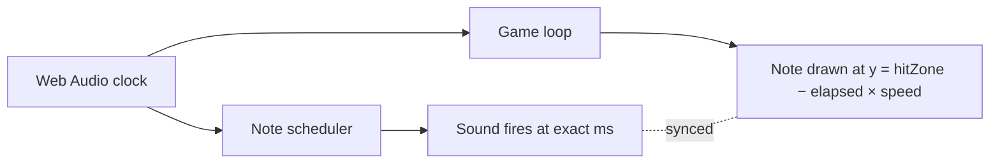

The scheduler emits elapsed milliseconds on each animation frame via a callback so the game loop never reads `Date.now()` — it always reads the audio clock.

## Two new audio package functions

**`midiNoteToFreq`** converts MIDI note numbers (0–127) to Hz using the equal temperament formula. Middle C is note 60. This lets songs be authored in readable note names and makes the format portable between games. Without it, every song must store raw frequencies, which are opaque and hard to edit.

**`createNoteScheduler`** wraps the Web Audio lookahead scheduling pattern:

- Uses an internal lookahead window (typically 100–200 ms ahead of the playhead) to pre-schedule oscillators before they are needed
- The lookahead runs on a short `setTimeout` interval, but the actual audio events are pinned to precise `audioContext.currentTime` offsets — so drift in the scheduling callback does not affect when sound is heard
- Exposes a live `currentMs` property so the game loop can read elapsed time without converting between clocks

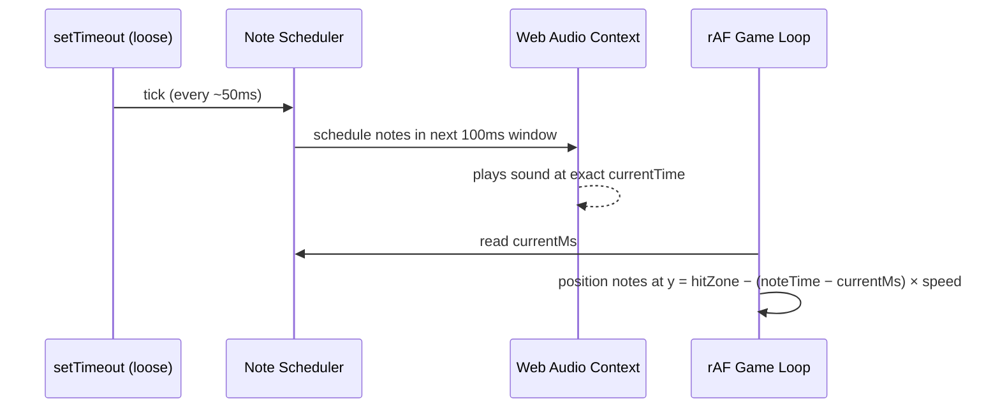

## Lane structure and controls

Four lanes map to the faux-pad directions (left / down / up / right), keyboard home-row keys, gamepad DPad, and touch zones. The faux-pad is the primary mobile control surface — its four directions align naturally with the four lanes and require no visual explanation.

Each lane has a fixed neon colour so players build spatial muscle memory: the colour, position, and direction are all redundant signals for the same action.

## Note representation

Songs are sequences of `{ lane, midiNote, time }` objects where `time` is milliseconds from song start. This is distinct from raw audio note sequences — it carries lane assignment and is authored for human readability using MIDI note numbers rather than frequencies.

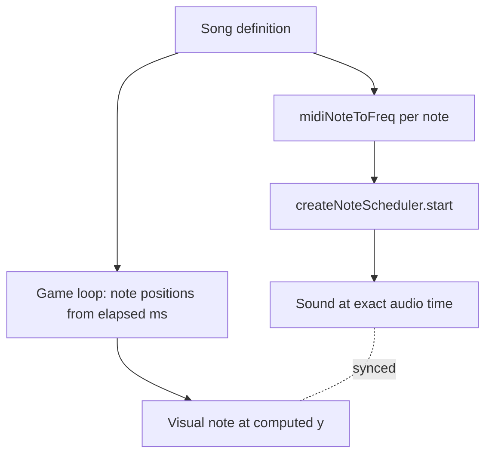

## Hit detection

On each lane input, the game searches backwards from the current audio-clock time for the nearest unresolved note in that lane. The result falls into one of three windows:

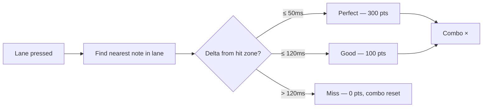

Notes that scroll past the hit zone without input are automatically marked as misses on the next frame.

## Multiplayer synchronisation

Each player runs their own note track independently. The host broadcasts a `rg-start { startAt }` message containing an audio-clock timestamp; every client starts the scheduler at that exact time. Because all clients use the same Web Audio clock origin, note positions are deterministic across machines without any further sync.

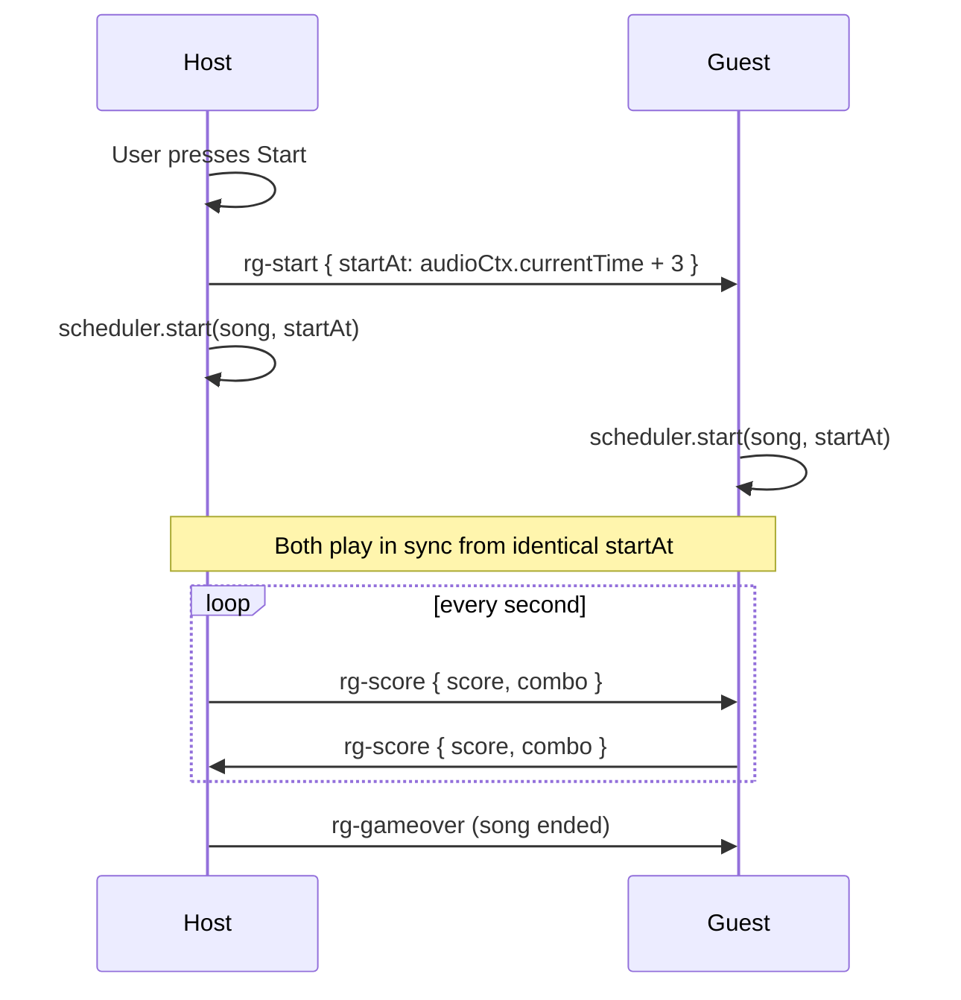

## Visual design principles

- **Dark canvas with neon per-lane colours** — cyan, magenta, yellow, green. High contrast, readable at a glance.
- **Hit zone as a pulsing bar** at 80 % of canvas height, not at the very bottom, so there is a small "reaction buffer" below it.
- **Lane buttons always visible** at the bottom — they animate on press to give tactile feedback on both desktop and mobile.
- **Feedback is immediate and local** — a ring-expand burst on perfect, a flash on good, a red cross on miss. Players should know the quality of each hit within one frame.

## Instrument simulation with Web Audio API

Real instruments cannot be bundled as audio files without a CDN or large asset pipeline. Instead each "instrument" is approximated by a different oscillator configuration — a combination of wave shape, duration, frequency offset, and envelope.

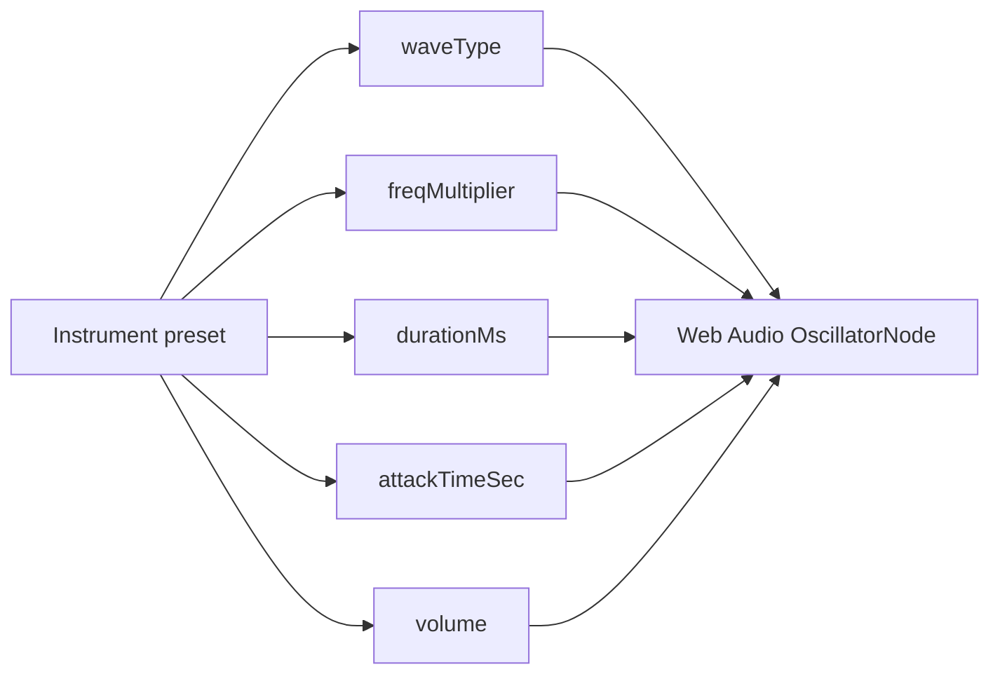

The three presets and their rationale:

| Instrument | Wave       | Freq mult | Duration | Character                                                                    |
| ---------- | ---------- | --------- | -------- | ---------------------------------------------------------------------------- |
| Piano      | `triangle` | ×1        | 90 ms    | Bright, short decay — triangle is softer than square but not as pure as sine |
| Bass       | `triangle` | ×0.5      | 220 ms   | Same warmth, one octave lower, held longer                                   |
| Guitar     | `sawtooth` | ×1        | 110 ms   | Sawtooth carries strong odd+even harmonics that read as "stringy"            |

The frequency multiplier is applied uniformly to every lane's MIDI-derived frequency so the entire key layout shifts as a chord without reauthoring the song.

The attack envelope (`attackTimeSec`) is an `AudioParam` ramp — short for piano (5 ms, key-click feel), medium for bass (3 ms), and very short for guitar (2 ms, percussive string pluck). Without the envelope, oscillators start at full amplitude and produce a digital click on every note.

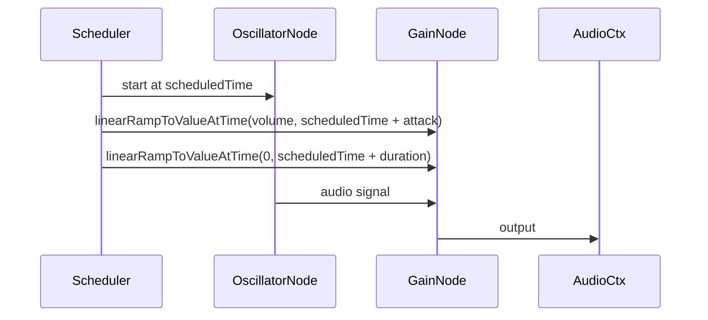

Adding a new instrument only requires a new entry in `INSTRUMENT_PRESETS` in `config.ts` — the scheduler and game loop pick it up automatically. For a more realistic feel, the next step would be `PeriodicWave` with custom harmonic tables, or a convolution reverb impulse; the current architecture supports both without changing the game logic.

## Canvas rendering: Canvas 2D API and glow effects

The game loop renders entirely on a `<canvas>` element using the browser's **Canvas 2D API** — no WebGL, no Three.js. The choice was deliberate: the game is a 2D rhythm game with flat geometry (rectangles, circles, arcs), and Canvas 2D handles that with minimal setup overhead.

Each animation frame is driven by `requestAnimationFrame`. The loop reads `scheduler.currentMs` for the current playhead position, derives every note's y-position from the elapsed time, and redraws the entire canvas from scratch. No retained-mode scene graph is involved — every pixel is painted from scratch each frame.

**Glow is `ctx.shadowBlur` + `ctx.shadowColor`.** The Canvas 2D API's shadow system is the simplest way to produce a neon glow: set `shadowColor` to the lane colour and `shadowBlur` to a radius (12–24 px for notes, 24 px for active lane indicators). The shadow is rendered behind every path or fill operation that follows. It must be reset to `shadowBlur = 0` after each glowing element, or every subsequent draw inherits the shadow.

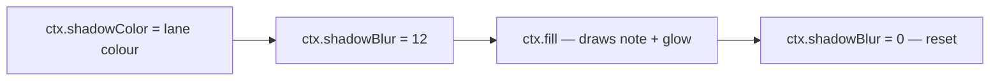

**Hit flash.** When a note is hit, a semi-transparent rectangle floods the lane for one frame and fades over ~250 ms. The alpha is encoded directly into the hex fill colour: `flashColor + hex(alpha * 100)`. `alpha` starts at 1 and decreases each frame by `dt × 0.004`.

**Perfect shockwave.** A perfect hit additionally draws an expanding ring: `ctx.arc` with a radius that grows as `(1 − alpha) × 90` while the alpha fades. The ring uses `ctx.shadowBlur` for the glow, giving it a neon pulse feel that distinguishes it visually from a good hit.

**Particles.** Each hit spawns 3–8 circles at the hit-zone y-position. On every frame, each particle's `x` and `y` are jittered by a random offset (`±10 px`) and its radius shrinks by 3 %. Alpha decreases by `dt × 0.003`. Dead particles (alpha ≤ 0) are filtered out. The particle list is a plain array — no object pool — because the count is low enough that GC pressure is negligible.

**Lane indicators (key labels at the bottom).** Each lane's indicator circle uses `ctx.arc` with a fill and stroke. When the lane is active, `ctx.shadowBlur = 24` creates a bright glow ring. The key letter (`D`, `F`, `J`, `K`) is drawn with `ctx.fillText` centered inside the arc.

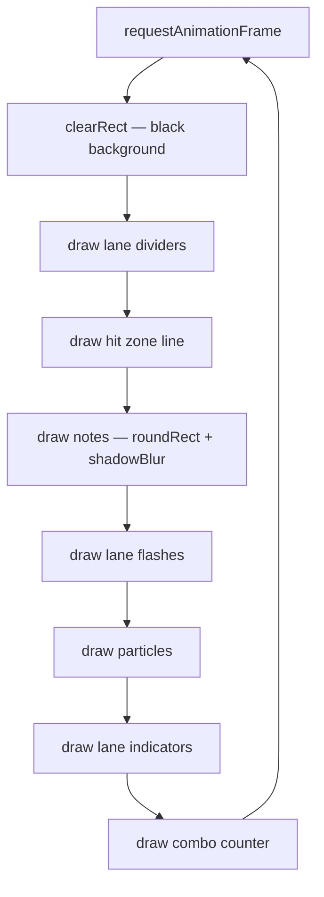

The combo multiplier text (`12× COMBO (×4)`) is rendered with `ctx.fillText` at `textAlign: center` above the hit zone. It only appears when `combo > 1` to avoid noise during quiet passages.

## Controls: three separate failures before input worked

Getting keyboard input working took three separate fixes, each invisible until the previous one was solved.

**Failure 1 — key case mismatch.** `LANE_KEYS = ['D', 'F', 'J', 'K']` was used to build the keyboard mapping, producing entries keyed by `'D'`, `'F'`, etc. `KeyboardEvent.key` returns lowercase letters for unmodified presses, so the events arrived as `'d'`, `'f'` and found no match. Fix: register both `k.toLowerCase()` and `k.toUpperCase()` for each lane key.

**Failure 2 — focus requirement.** The controls composable was initialised with `keyboardTarget: gameContainer` (the canvas wrapper div). Keyboard events on a non-input element only fire when that element has focus, which never happened automatically. Fix: pass `keyboardTarget: null`, which binds the listener to `window` and fires regardless of focus.

**Failure 3 — tap/click not reaching notes.** Canvas click events fired but did not register as lane hits. The game loop uses the audio clock (`scheduler.currentMs`) as the source of truth for note timing; a canvas click must convert the pointer x-position to a lane index and then call `pressLane(lane)` exactly as keyboard input does. Without this, the canvas received pointer events that bypassed the hit-detection path entirely.

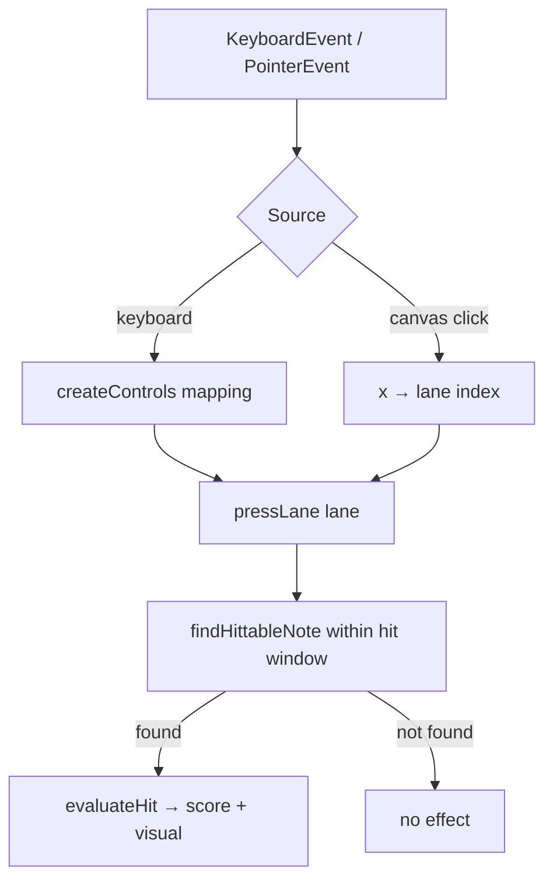

## Score tracking: two separate sources of invisible data loss

Accuracy always showed 100 % and every stat counter read 0. The root cause was two independent bugs that compounded.

**Bug 1 — p2pOnData callback order.** The Trystero-based P2P library calls data handlers as `(payload, peerId)`. The session composable had them reversed as `(peerId, data)`. As a result:

- The avatar handler called `store.upsertPlayer({ id: payload_object, name: peerId_string, … })` — the player was stored with a stringified object as its ID and the peer's UUID as its name.
- The score handler passed the peerId string where score data was expected — `store.updateScore(peerId, peerId)` effectively discarded every score update.
- The start handler called `onStart(peerId_string)` instead of `onStart({ song, difficulty, startAt })` — `gameStartAt` stayed at 0, the game never launched for the guest.

The TypeScript types were too loose to catch the swap (both arguments are `unknown` in some overloads), so no compile error surfaced.

**Bug 2 — LobbyPlayer conversion erased stats.** `RhythmGameLobby` received `playerList: LobbyPlayer[]`, a base type with only `{ id, name, color }`. To pass it to `RhythmGameSummary` (which needs `RgPlayer` with score fields), the lobby mapped the array and hardcoded every stat to 0:

```typescript
// before — all stats silently zeroed
const summaryPlayerList = computed(() =>
  props.playerList.map((p) => ({
    ...p,
    score: p.score ?? 0,
    combo: 0,
    perfect: 0,
    good: 0,
    miss: 0
  }))
)
```

Fix: add a separate `rgPlayerList: RgPlayer[]` prop that receives the Pinia store's player list directly, bypassing the lossy conversion.

```mermaid
flowchart LR
    A[store.playerList: RgPlayer[]] -->|rgPlayerList prop| B[RhythmGameLobby]
    B -->|:player-list| C[GameLobbyWizard]
    B -->|:rg-player-list| D[RhythmGameSummary]
    D --> E[accuracy = perfect + good×0.5 / total]
```

## Multiplayer host detection: three broken attempts

Getting the host/guest split right in the wizard (host sees Game Settings + Start; guest waits) required three revisions.

**Attempt 1 — `Object.keys(players)[0]` (original).** Each tab's Pinia store is independent. Each player calls `announceSelf` first, inserting themselves into their local store before the peer's avatar arrives. So `Object.keys(players)[0]` is always the local player on every tab — both tabs think they are host.

**Attempt 2 — `isCreator` flag from `useRoomId`.** The room composable knows whether the room ID was freshly generated (`isCreator = true`) or came from the URL (`isCreator = false`). This worked on first load but broke on any page refresh: the host's URL already contains `?room=xxx` after the first visit, so on refresh `isCreator = false` and the host loses the host role permanently.

**Attempt 3 — `hostPeerId` set via CONFIG_CHANNEL sender (broken).** CONFIG is broadcast by the host when a peer joins. The guest receiving CONFIG can infer the sender is the host. But there is a race: both tabs fire `p2pOnPeerJoin` before any messages have been exchanged, so both briefly think they are host and both send CONFIG. Each tab's CONFIG handler then sets `hostPeerId` to whoever sent CONFIG last, which could be the guest — leaving both without a Start button.

**Resolution — match all other games.** Every other game in the suite (Minigolf, Squares, Pictionary…) uses insertion-order: `hostId = Object.keys(players)[0]`. The trick is that the CONFIG channel is only sent by the player who was already in the room (the real host), whose `p2pOnPeerJoin` fires with `isHost = true` because they inserted themselves first and no other player has arrived yet. The guest's `p2pOnPeerJoin` fires moments later, but by then the CONFIG has either already arrived or is in flight, and the guest's `isHost` resolves correctly after the avatar exchange completes. The approach is eventually consistent and matches what already works across all other games.

## MIDI playback: from file to falling notes and background audio

The rhythm game can play any MIDI file uploaded by the player. The pipeline has three distinct stages: persistence, extraction, and dual scheduling.

### Stage 1 — upload and persistence (IndexedDB)

When a MIDI file is selected, the browser reads it as an `ArrayBuffer`. Before any game-specific processing, the raw bytes and their extracted track metadata are written into an IndexedDB object store (`rg-midi-library`). Only track metadata (name, note count, index) is stored alongside the binary — the game never fetches all buffers at once. The song-picker dropdown is populated from metadata alone; the binary is loaded on demand when a track is actually selected.

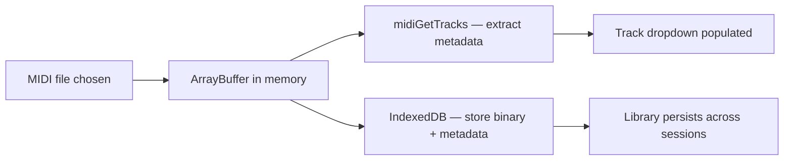

Storing metadata separately from the binary avoids loading every file into memory just to render the dropdown. A library with dozens of files remains fast.

### Stage 2 — track extraction and pitch-to-lane mapping

`midiGetTracks` uses `@tonejs/midi` to parse the binary and returns one entry per track that contains at least one note, sorted by note count descending. The track label combines the MIDI track name and the instrument name (when present) so the dropdown is self-describing even for multi-track orchestral files.

When the player selects a track, `parseMidiTrack` converts that track's notes into the game's `RhythmNote` format. Two transforms are applied.

**Pitch-to-lane mapping.** The game has four lanes. A MIDI track can span any portion of the 128-note MIDI range. Rather than fixing a global mapping, the converter measures the pitch range of the selected track and divides it into four equal-width quartiles. Each note falls into whichever quartile contains its pitch.

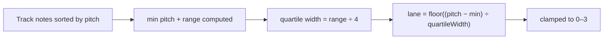

This keeps the lane spread natural regardless of whether the track covers a full piano range or a narrow bass line. A track that spans only five semitones still uses all four lanes proportionally.

**Difficulty gap filtering.** At easy and medium difficulty, notes closer than a minimum time gap are dropped so the stream is sparse enough for less experienced players. Hard difficulty disables filtering entirely. When a MIDI file is used for gameplay, the track is always parsed at hard (no filtering) because the player chose the song and is expected to want all of it.

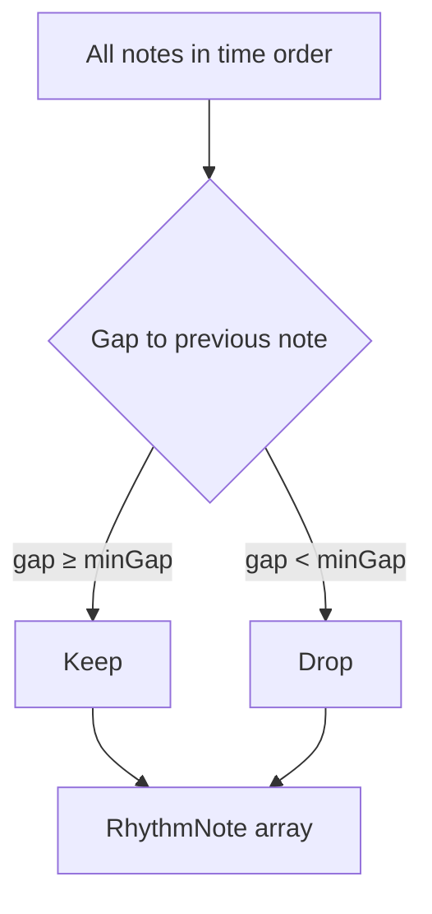

### Stage 3 — dual scheduling: gameplay notes and background audio

Once the gameplay notes are derived, a second pass over the entire MIDI file produces background audio. `midiParseBackground` reads every note from every track — not just the gameplay track — and converts each to a `ScheduledNote` with the actual MIDI pitch frequency and the actual note duration from the file. This is the key difference from the gameplay notes: gameplay notes are pitch-bucketed to four lanes; background notes preserve every pitch and every duration.

Both sets of notes are merged into a single array and handed to the same `createNoteScheduler` instance before the game starts. One Web Audio `AudioContext` handles everything, which avoids the browser's limit on concurrent audio contexts and guarantees that gameplay and background audio are synchronised to the same hardware clock.

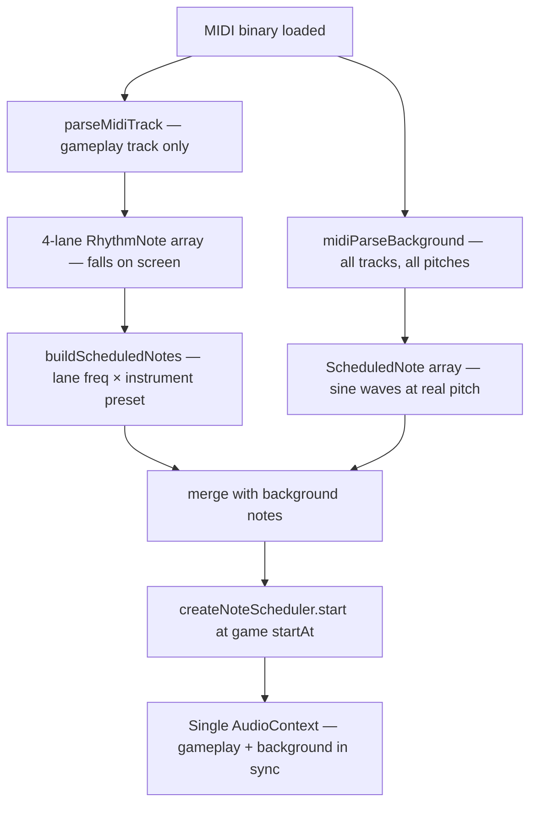

Background notes play at a lower volume than gameplay notes so they serve as ambient accompaniment rather than competing with the hit feedback sounds. The result is that the player hears a synthesised rendition of the original song while tapping the falling notes derived from a single chosen track.

### Why the same `AudioContext`

An earlier implementation used two separate schedulers — one for gameplay notes, one for background. Both created their own `AudioContext`. Browsers cap the number of simultaneous audio contexts (Chrome allows six), and two contexts cannot be synchronised to the same hardware clock without additional latency compensation. The merged approach eliminates both problems: one context, one clock, one scheduler, one `start` call.

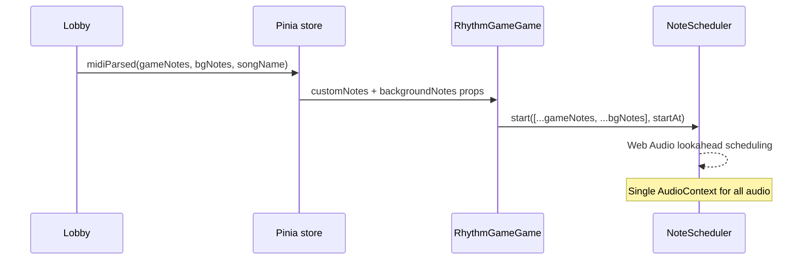
