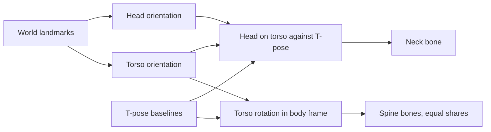

# Rig Animator: calibrating the camera with a held T-pose

Why the Rig Animator's camera calibration measures one held T-pose, how that turns a flat webcam
feed into sideways movement and distance for the rig's root, and why the torso and neck turn
themselves instead of the whole rig turning.

## World landmarks carry no room position

MediaPipe's Pose Landmarker reports two coordinate spaces per frame: normalized image landmarks
(0 to 1 across the frame, the space the skeleton overlay draws in) and "world" landmarks, scaled
to metres and used for every bone mapping in this tool. The name invites reading world landmarks
as room tracking, and they are not: they are normalized to the detected person's own body,
centered near the hip. A person who steps a metre to the left produces the same world landmarks
as one standing still; only the image landmarks shift.

Everything about where the body is, rather than how it is posed, therefore has to come from the
image landmarks, and an image landmark on its own is ambiguous: a body that looks smaller might be
further away or just a smaller person. The T-pose resolves that. It records how large this
particular person appears at a known moment, so every later frame is read against their own
reference size rather than an assumed average body.

## Distance from apparent size

Under a pinhole camera, apparent size is inversely proportional to distance. Comparing the
calibrated apparent size with the current one gives the ratio of distances directly, without
knowing either distance. Turning that ratio into metres needs one absolute distance, and the
calibration derives it from the real shoulder width MediaPipe reports alongside the shoulders'
apparent span.

That derivation needs the camera's focal length, which a browser cannot read: a media stream
reports its resolution, never its lens. The tool assumes a 60° horizontal field of view, typical
of a laptop webcam, and exposes it as a setting. A wrong value does not break the motion; it
scales every distance and every sideways step by the same proportion, so movement still reads in
the right direction and in the right relative amounts.

The size measured is the vertical span from the shoulders to the hips, not the shoulder width:
turning in place narrows the shoulders but leaves that height unchanged, so a twist never reads as
a step back. With the hips out of frame, the usual framing for a webcam, the span from the nose to
the shoulders stands in, noisier but still unaffected by a turn.

| Measured at calibration      | Read live against it                                       |
| ---------------------------- | ---------------------------------------------------------- |
| Torso height, or head height | distance ratio, then metres from the assumed field of view |
| Body center                  | sideways movement, converted at the current distance       |
| Torso and head orientation   | the zero for torso and neck rotation                       |
| Each hand's on-screen angle  | the zero for wrist rotation                                |
| Arm span in metres           | the reach multiplier, against the rig's own arm span       |

## Turning the whole rig turned too much

The first calibrated version read the body's turn from how far the shoulders' apparent span had
shrunk, and turned the rig's root by it. That is right for a person turning on the spot and wrong
for nearly everything else done in front of a webcam: twisting at the waist or glancing aside
turned the entire rig, feet included. The head had the same problem in miniature. It was aimed
through a two-bone chain rooted in the upper spine, so a nod bent the spine and swung both arms
with it.

The model that matches editing the rig by hand is local rotation. Each part turns by its own
rotation, and whatever hangs off it follows, exactly as dragging a bone in the editor drags its
children. A part the detector misses, or a bone the rig lacks, simply gets no rotation of its own.

| Part  | Read from                                                    | Turns                                |
| ----- | ------------------------------------------------------------ | ------------------------------------ |
| Torso | the shoulder line, and hip midpoint up to shoulder midpoint  | the spine bones, an equal share each |
| Neck  | the ear line, and ear midpoint toward eye midpoint, on torso | the neck bone alone                  |
| Wrist | wrist to middle knuckle on the viewing plane                 | the hand bone alone                  |
| Root  | nothing                                                      | never turns; it only moves           |

Sharing the torso rotation between the spine bones matters as much as reading it: put entirely on
one joint, a lean folds the rig at that joint, where a real back bends along its whole length.

## Rotations in the body's own frame

Direction is a question this tool has answered wrong on paper before: hand sides and body
mirroring were both reasoned out from MediaPipe's documented conventions, and both turned out
backwards on a live camera. The rotations sidestep that by construction. They are read from the
landmarks after the same axis flips the limb mapping applies, so the spine turns the same way the
mapped hands already land, whatever the camera or mirroring convention.

The zero they are read against needs the same care. A rotation measured against the camera is the
wrong zero for a person who calibrated standing at an angle to it: a lean toward their own front
would come out as part lean, part side bend. Each rotation is instead measured against the T-pose
in the body's own frame, so a lean reads as a lean whichever way the person stood. The neck is
measured against the torso the same way, so twisting the whole upper body does not also count as
turning the head.

Two choices keep an uncalibrated capture sensible, read against standing upright and square-on.
With the hips out of frame there is no up direction to lean or bend against, so only the twist is
read, about world up. And the head's forward direction points toward the eyes rather than the
nose: the eyes sit level with the ears on a head held straight, where the nose sits below them and
would read as a permanent nod.

## Depth stays shallow

World landmark depth is estimated from a single view and consistently comes out shallower than the
matching horizontal extent. An earlier version asked for a second, side-on T-pose, whose arms span
the depth axis, to measure that shortfall against the true arm span and correct for it. It was
dropped to keep calibration to a single pose, and the cost is known: any rotation that moves
landmarks toward or away from the camera (twisting, leaning toward the camera, nodding, turning the
head) reads smaller than it really is. A side bend moves them across the image and is unaffected.

## The root had nowhere to record its position

Keyframes held bone rotations only, a sensible choice when every edit rotated a joint and bone
positions described the rig's proportions. Root motion broke that assumption: a take that walks
toward the camera recorded a rig walking in place, since the movement lived only in the root's
position. Keyframes now carry positions as well, restricted to the skeleton root, found by
structure rather than by name. Every other bone still records rotation only, so editing a limb's
position in the panel keeps adjusting the rig rather than animating it.

## A hip mapping that moved nothing on real rigs

Before calibration, "Move Hips to Photo" mapped the detected hip midpoint onto the root. The limb
mapping places each target relative to a reference center, and on any rig with upper-leg bones
that center for the legs is the detected hip midpoint itself, so the hip target was always the
hips measured against themselves: zero offset, every frame. Its unit test passed because the test
rig had no upper-leg bones, which sends the leg mapping down its shoulder-anchored fallback, where
the offset is real. Nothing about the formula looked wrong, and on a real Mixamo rig the checkbox
simply held the root at rest, indistinguishable from not being driven yet. The calibrated root
offset replaced it rather than repairing it, since a correct hip offset needs exactly the reference
size and distance only a calibration can supply.
