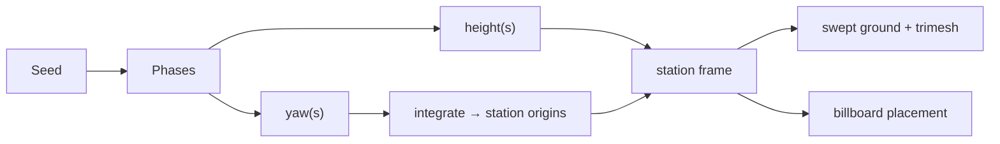

# Streaming an endless track from a seed

Rock Runner generates its world as the player moves through it: ground, physics
and thousands of illustration billboards appear ahead of the rock and are thrown
away behind it. Nothing is authored, nothing is stored, and every player in a
room walks an identical world without exchanging a single vertex. This is the
theory behind that, and the two geometric traps that cost the most time.

## The path is a function, not a data structure

The centreline is defined analytically rather than generated and stored. Heading
and height are each a sum of low-frequency sine terms evaluated at the distance
travelled:

```
yaw(s)    = Σ Aₖ · sin(2π·s / λₖ + φₖ)
height(s) = Σ Bₖ · sin(2π·s / μₖ + ψₖ)
```

The phases come from the seed. Two consequences follow, and both are why this
shape was chosen over a stored spline.

**It is endless without being infinite.** Because wavelengths are irrational
multiples of each other, the sum never repeats within any distance a player will
run, yet it costs a handful of multiplications to evaluate anywhere.

**Multiplayer is one integer.** The host broadcasts the seed. Every peer
reconstructs the same track exactly, so position sync carries only where each
rock _is_, never what it is rolling on.

Positions still have to be integrated: the heading gives a direction, not a
place. Stations are stepped outward from the origin and cached, growing in both
directions and never rebuilt, so the world stays stable for the whole run.



## Where the rock is, in path terms

Everything downstream — which chunks exist, which way to push, where the ground
is — needs the distance travelled. The rock's world position alone cannot give
it, because steering drifts it sideways off the centreline.

Projecting the offset from the last known station onto the local tangent
recovers exactly the forward component and discards the lateral one. Because the
path is smooth and the rock moves only a little each frame, this converges in
one or two iterations from the previous frame's answer. It is a Newton step on a
curve, not a search, so it costs the same every frame no matter how far the
player has run.

## Trap one: a swept ribbon folds through itself

The ground is a cross-section swept along the station frames. The obvious way to
make the world feel open is to sweep a very wide ribbon. That fails, and the
failure is geometric rather than a bug.

Sweeping a profile of half-width **w** along a curve of radius **r** maps the
inner edge onto a circle of radius **r − w**. When **w > r** that radius goes
negative: the inside of the ribbon turns inside out and passes through itself.

| Half-width vs radius | Result                           |
| -------------------- | -------------------------------- |
| w ≪ r                | Clean surface                    |
| w → r                | Inner edge compresses to a point |
| w > r                | Surface folds through itself     |

The first attempt used a half-width of 750 against a path whose tightest radius
was about 22 units — a factor of thirty over the limit. It rendered as dark
diagonal bands across the ground, which reads as z-fighting and sends you
looking for depth-buffer problems rather than for the real cause.

The turn radius is not a free parameter either; it falls straight out of the
curve terms, since the heading's derivative peaks when every term peaks at once:

```
max |dyaw/ds| = Σ Aₖ · 2π / λₖ        r_min = 1 / max |dyaw/ds|
```

So terrain width and path curviness are a single coupled decision. The
resolution was to relax the curve amplitudes until the radius comfortably
exceeded the terrain half-width, and to encode the relationship as a test, so a
later retune of the curves cannot silently reintroduce the fold.

A second, smaller lesson sits alongside it: the drivable deck and the
surrounding countryside are built as _separate_ strips that meet edge to edge
rather than one spanning under the other. Two surfaces that share a depth range
will z-fight at distance no matter how carefully their heights are chosen; two
surfaces that never overlap cannot.

## Trap two: the world needs to exist behind you

The rock spawns at distance zero. If generation also starts at zero, the ball
sits on the track's leading edge with half its contact patch over nothing. It
rolls backwards off the start, and because the distance cursor is clamped to be
non-negative, the telemetry reports the player standing still at 0 m while
actually falling.

The symptom is badly misleading. The rock lands correctly, settles, and only
then departs, which looks like a physics-material or contact-normal problem. It
took logging the rock's height against the path's height, frame by frame, to see
that the ball was simply rolling off an edge that should not have been there.

The general rule this leaves behind: a streamed world must be generated around
the player, not ahead of them. The keep-alive window behind is not only an
aesthetic choice about glancing over your shoulder — it is a correctness
requirement wherever the player can start or move backwards.

## Chunking as the unit of everything

Ground, physics colliders and every illustration area share one lifecycle:
`ensureAhead` extends the world to a lookahead, `prune` discards what has fallen
behind a keep-alive distance, and both are keyed on distance along the path
rather than on a world axis. Because the path curves, a world-axis window would
cut the track diagonally and pop geometry in and out during bends.

Each area picks its own window. Distant background props reach much further
ahead and are kept much longer than roadside bushes, because large far objects
appearing at the horizon are far more visible than small near ones.

## Making thousands of flat drawings look placed

The scenery is 2D illustrations on flat planes. Two decisions keep that cheap.

**Facing is baked, not updated.** A billboard normally rotates to face the camera
every frame. Here the camera is always behind the rock, looking along the path,
so a plane rotated once to face back along its own local heading is already
facing the camera. Thousands of planes therefore cost nothing per frame.

**One draw call per texture per chunk.** Instances are bucketed by the texture
they drew and each bucket becomes a single instanced mesh, with per-instance
size and rotation carried in the transform rather than in separate objects.

Placement is stratified along the chunk and then jittered, which reads as
scattered without the clumping pure randomness produces. The jitter is clamped
back inside the chunk — otherwise neighbouring chunks would both place geometry
in the overlap and the same tree would appear twice, then vanish twice.

One last detail worth recording: displacement mapping needs vertices to
displace. A ground slab described by a four-point outline has none across its
width, so a displacement map on it is a silent no-op that looks like a flat
decal. The surfaces are subdivided across their width specifically so the map
has something to move; bump mapping, which works per pixel, needs no such help.
