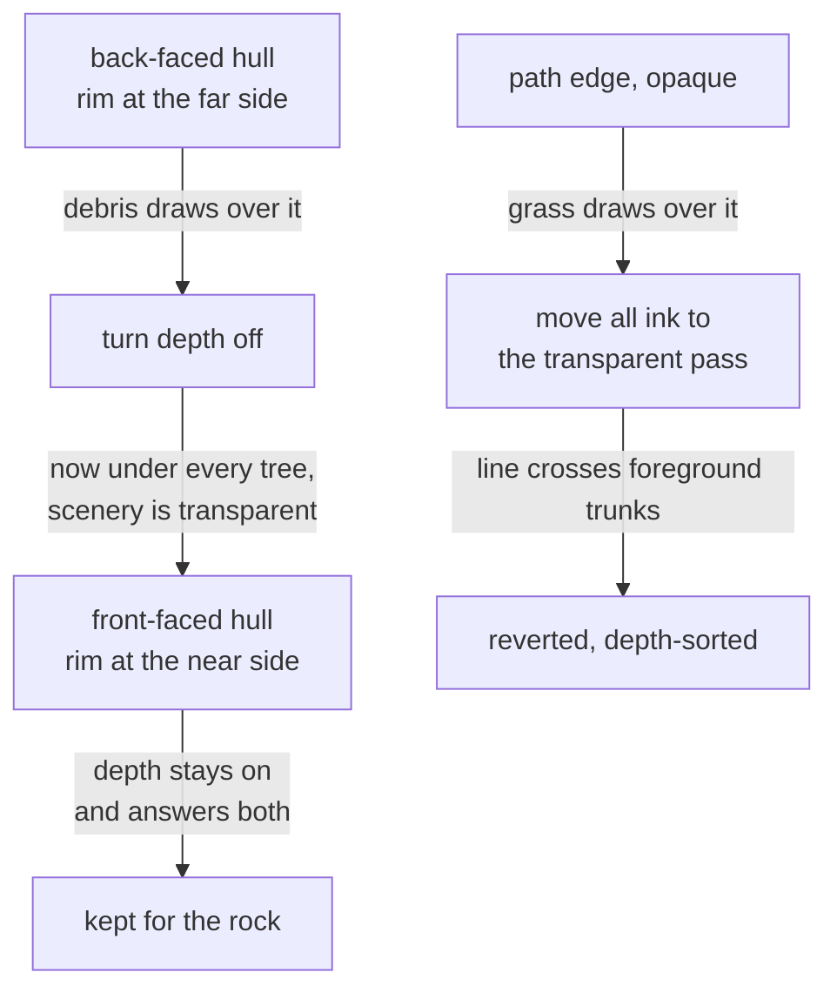

# Getting an ink line to sit on top of a 3D scene

Rock Runner draws two ink lines over its world: an edge down each side of the
path, and an outline around the rock. Both took several attempts to place
correctly, and each attempt fixed one complaint by causing its opposite. This is
what a renderer's ordering rules actually guarantee, and why a line drawn _on_ a
picture is a different problem from an object drawn _in_ one.

## Why an outline is not just geometry

The outline around the rock is an inverted hull: a slightly grown copy of the
ball, with the ball itself drawn over the middle so only a rim survives. It is
the standard technique, it costs one extra draw call, and it produces a hard edge
where a post-process outline pass produces a soft halo.

The usual construction renders the hull's **back** faces. That works, and it puts
the visible rim at the _far_ side of the ball — because the front faces are
culled, what survives is the surface furthest from the camera. Everything between
the camera and that surface therefore draws over the line, and correctly so.

The rock trails debris. A chip behind the ball is nearer the camera than the far
side of a hull enclosing it, so it drew across the rim and cut the line into
pieces. Depth was right; the result was wrong.

**Front faces fix it at the source.** They put the outline just in front of the
ball, which is where a line drawn on a picture belongs, and the rim then wins
against anything behind the ball while still losing to anything genuinely in
front of it. The ball is drawn after the hull and is the only one of the two to
write depth, which is what leaves a rim rather than a silhouette.

## Turning depth off fixes one case and breaks its opposite

Before finding that, the obvious fix for the debris was to take the outline out
of depth entirely. It worked. It also put the line underneath every tree in the
world — including trees standing far behind the rock.

That is worth understanding, because it is not what render order suggests should
happen.

> Transparent geometry is drawn after **every** opaque object, whatever its
> render order. Order sorts within each of the two lists; it does not carry
> across the boundary between them.

The scenery is transparent. The outline was opaque. So the scenery drew after it
no matter what order either was given, and with depth off the outline could not
even defend itself. The two fixes were pulling in opposite directions: depth off
beat the debris, depth on beat the trees.

Only moving the line to the _near_ side satisfies both, because then depth can
stay on and still give the answer wanted in each case.

## The same problem, one level up

The path's edge then showed the same symptom for the same reason: grass standing
on the track drew over it. Here the line is opaque and lying on the ground, and
the grass is transparent and standing up — so it is both later in the render and
genuinely nearer.

The fix that worked was to move all the ink into the transparent pass and give it
an explicit order: scenery, then the outline, then the rock. That required the
rock to join the pass too, or the path's line would have crossed the ball.

It was reverted anyway. The path's edge spans the screen, and a line that ignores
depth is painted over whatever is in front of it — for a small silhouette that is
invisible, but a black stroke drawn across a foreground tree trunk is not. The
edge went back to depth-sorted and grass crosses it, which is the lesser of the
two.

The rock kept the treatment. **The same trade is worth taking at one scale and
not at another**, which is the most useful thing here: the correct answer was
different for two lines drawn in the same ink for the same reason.

## The bug that hid inside the first version

The outline shipped invisible once, and the reason is worth recording because the
tests agreed with it.

The hull was built at unit radius, on the belief that the ball carried its size in
its `scale`. It does not: the shared ball helper bakes the size into the geometry
and leaves scale at one. A hull of radius 1 parented to a ball of radius 2.2 sits
entirely inside it and draws nothing at all — no error, no warning, just no
outline.

The tests passed because they checked the hull against the number they had handed
it rather than against a rock. They asserted a radius of 1.04 and were satisfied,
while describing something no one could ever see. They now build a rock, wrap it,
and assert the hull clears its surface at three different radii.

The hull also measures the radius off the mesh it is given rather than taking it
as an argument, because a hull told the wrong radius vanishes silently, and that
is not a mistake a caller should be able to make.

## What generalises

- Render order sorts within the opaque and transparent lists, not between them.
  An opaque object cannot be ordered above a transparent one at all.
- An inverted hull's rim sits wherever its rendered faces sit. Back faces put it
  behind the object, which invites everything in between to draw over it; front
  faces put it in front, which is usually what a drawn line wants.
- Turning depth off is not a fix, it is a trade — the line stops losing to what is
  behind it and starts winning against what is in front. Whether that is
  acceptable depends on how much screen the line covers.
- A test that checks a value against the argument it supplied verifies nothing
  about the world. Wrap the real object and assert against that.
