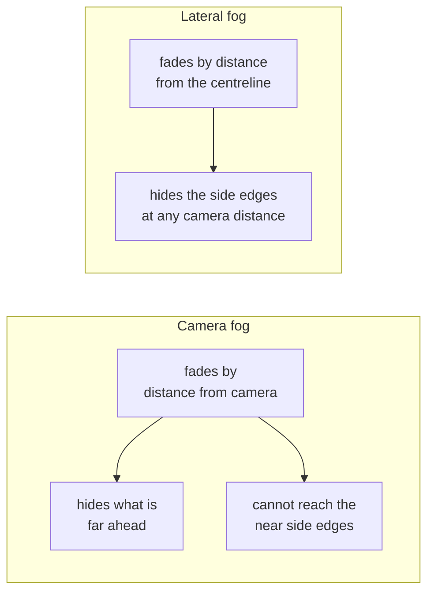

# Fog that fades sideways

:::note Source files

`src/views/Games/RockRunner/lateralFog.ts`, `trackChunks.ts`,
`scatter/scatterAreas.ts`, `trackPanel.ts`, `config.ts`.

:::

Rock Runner's world is a strip. It runs forever forwards, but sideways it stops
after a few dozen units, and past that edge there is nothing. Hiding that edge
turned out to be something the engine's own fog fundamentally cannot do, and the
workaround is short but has two traps in it.

## Why the built-in fog cannot help

Three.js fog — both the linear and exponential kinds — is a function of one
thing: the distance from the camera to the fragment. It fades a sphere of world
around the viewer.

That is the wrong shape for this world. The chase camera sits a little behind
and above the rock, so the ground's long edges are only tens of units away,
_laterally_. Any fog dense enough to hide them at that range would also swallow
the track directly ahead of the player. Any fog loose enough to leave the track
visible leaves the edges razor-sharp.

The two are complementary rather than alternatives, and the game runs both: the
camera fog closes the horizon, the lateral fog closes the flanks.

## Fading by distance from the centreline

The lateral fade is a few lines of shader injected into each material: mix the
final colour toward the fog colour by a smoothstep over the fragment's distance
from the track centreline.

The interesting question is where that distance comes from. Computing it in the
shader would mean projecting each fragment's world position onto a curve — the
centreline is not a straight line, so there is no closed form to evaluate
cheaply per pixel.

It never needs computing, because the geometry already knows. Everything in this
world is placed _relative to the path_ in the first place, so the offset from the
centreline is an input to placement rather than something to be recovered from
the result. Baking it as an attribute turns a per-pixel search into a lookup.

| Surface      | Where the offset comes from                                          |
| ------------ | -------------------------------------------------------------------- |
| Swept ground | The cross-section's own x, emitted in the sweep's vertex order       |
| Billboards   | The lateral offset the scatter maths already chose for that instance |

## Trap one: the swept positions are world space

The obvious way to bake the ground's offsets is to read them back off the
geometry — take each vertex's x and call that its distance from the centre.

That is wrong here. The sweep places its vertices in world space, because the
station frames it sweeps through are world transforms. A vertex's x is its
position in the world, which drifts arbitrarily far from zero as the path
wanders, and bears no relation to how far it sits from the centreline.

The offset has to be taken from the cross-section instead, emitted in exactly
the order the sweep emits positions. That order is not incidental — it is the
same interleaving the UV generation follows, and getting it wrong silently
misattributes offsets rather than failing.

## Trap two: instanced geometry is shared by default

Billboards are drawn as instanced meshes, one per texture per chunk, all built
from a single shared plane. Attaching per-instance offsets to that plane means
every chunk writes its offsets onto the same geometry, and only the last one
survives — every other chunk fades by somebody else's distances.

Each instanced mesh therefore clones its own plane. The cost is real but small
next to what instancing already saves, and it buys the property that matters: a
billboard fades by where _it_ stands, not by where its chunk happens to sit. A
chunk spans a wide band of offsets, so fading per chunk would be visibly wrong
at both ends of it.

## Tying the fog colour to the sky

Fog fades geometry toward a colour; the backdrop behind that geometry is a
separate colour. If the two differ at all, the horizon shows a hard band exactly
where fully-faded world meets sky — the fade succeeds and then reveals itself.

The two are therefore one setting. The panel exposes a single colour, and the
sky follows it. This is worth stating because it is the kind of coupling that
looks like an oversight and gets "fixed" into two independent controls, which
reintroduces the band.

## What this leaves

The lateral fade also quietly bounds how much scenery is worth placing. Anything
beyond the fade-out distance is drawn entirely in fog colour: fully paid for,
never seen. Scatter bands wider than the fog's reach are pure cost, which makes
the fog distance the natural place to start when trimming the frame budget.
