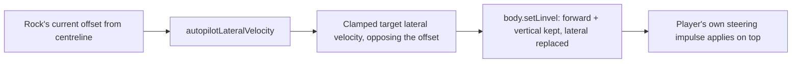

# Rock Runner: a self-driving centering assist

## The problem

Rock Runner's track is an endless, procedurally generated ribbon: heading and
height are each a sum of sine terms evaluated against the distance travelled,
so the curve shape is a pure function of the seed (see
[Rock Runner's endless track](./rock-runner-endless-track.md)). Sharp bends
are common, and a player who steers a beat late clips the outer wall. "Self
driving" is a Config-panel toggle that continuously tries to hold the rock to
the middle of the track, without taking control away from the player.

## Velocity, not impulse

The rock's own steering is impulse-based: a discrete push added to whatever
momentum the rock already carries, capped by a lateral speed limit and a wall
standoff so the push can never overpower the body faster than the physics
lets it accelerate. An assist built the same way — an added corrective
impulse — was tried first, but an added force always has to fight whatever
momentum is already there; a rock drifting hard toward a wall needs several
frames of accumulated impulse before its actual velocity turns around.

The assist instead commands the rock's lateral velocity directly:

Each frame, while the toggle is on, the rock's current velocity is
decomposed into its forward and lateral components against the track's local
frame (the same `sample.forward` / `sample.right` vectors steering already
uses). The forward and vertical (gravity, jump) components are left exactly
as they are; only the lateral component is replaced outright with a target
value proportional to, and opposing, the rock's current offset from the
centreline — a proportional controller, not a nudge. Because it's a direct
velocity command rather than a force, the correction is felt immediately
rather than building up over several frames, and a jump or a wall bounce
still behaves exactly as it would without the assist, since only the lateral
axis is touched.

## Blending with the player

The centering command runs first each frame, then the player's own
steering impulse is applied on top exactly as it always was — so holding
left or right still moves the rock further than the assist alone would,
rather than fighting a competing correction. The rock is a normal dynamic
physics body throughout: collisions, restitution and jumping are unaffected,
since the assist only ever overwrites the lateral component of velocity, one
axis out of three.

## Where it lives

Rock Runner's tunables already follow one pattern: a single reactive
`RockConfig` object is read directly by the run loop every frame, and
registered into both the elements panel and the Config panel from the same
field schema. The toggle is one more field on that object —
`autopilot: boolean`, defaulting off — following the boolean-field
convention already used by Maze Game's own auto-mode toggle. The correction
gain and maximum centering speed are tuned constants, not exposed controls:
this is one on/off option, not a tuning surface.

## Verification

`rockMotion.test.ts` covers `autopilotLateralVelocity` directly (sign
correctness — an offset to one side commands velocity toward the other —
and clamping to the maximum centering speed), plus the small
`lateralPushAllowed` / `clampLateralMagnitude` helpers pulled out of the
player's own `steerImpulseMagnitude` along the way, with the existing suite
serving as a regression check that player-only steering is unchanged. In the
browser: toggle Self driving on mid-run from the Config panel and watch the
rock hold to the middle through a run of curves with no input, then confirm
manual steering still moves it further without fighting the assist.
