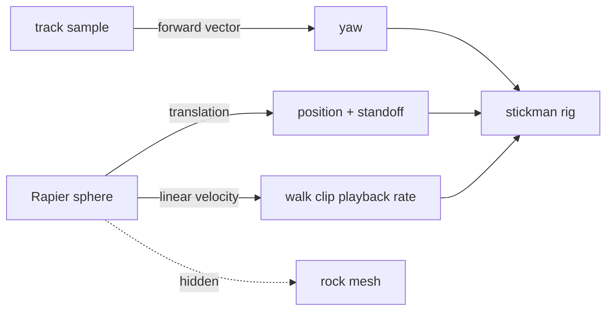
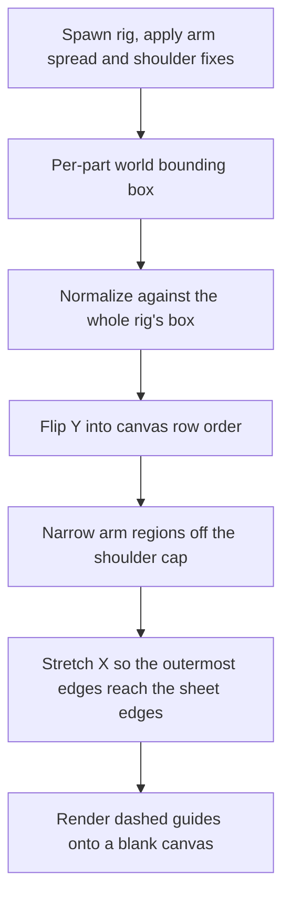
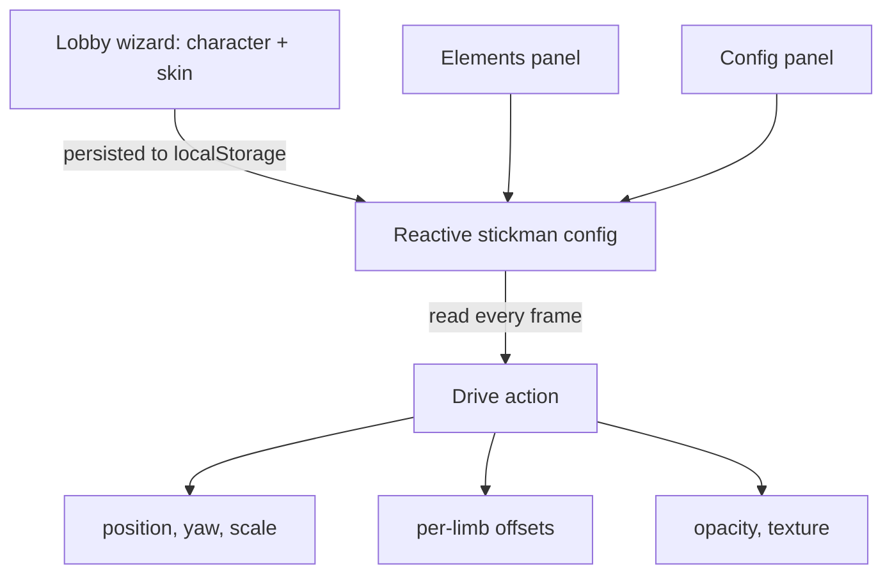

# Dressing a rig in a flat drawing

Rock Runner lets the player swap the rolling boulder for a running stickman. The
stickman is a costume, not a character: it has no physics of its own, wears a
flat hand-drawable picture rather than an authored material set, and can be
taken apart limb by limb from the panel. This page covers how the drawing sheet
was produced, how one flat image is made to wrap a rig built from a dozen
separate meshes, how the body was split into editable parts, how those
properties reach the running scene, and why the figure floated above the track
until its feet were measured rather than guessed.

## A costume, not a character

The rock is an invisible sphere with a textured mesh on it. Everything the game
knows how to do — steering, jumping, the self-driving assist, the speed ramp,
the chase cameras, the multiplayer ghosts — is written against that sphere. The
cheapest way to add a second body was therefore to add no body at all: hide the
rock's mesh, and each frame copy the sphere's position onto a stickman rig,
yawed to face along the track instead of inheriting the sphere's tumbling roll.



Nothing downstream of the sphere had to change, which is what made the whole
feature affordable. What did change per character is how that shared sphere is
tuned: a running figure pushed and gravity-pulled as hard as a boulder reads as
being flung rather than running, so five of the sphere's own figures — drive
impulse, base and ceiling speeds, jump impulse, gravity scale — are overridden
by a small per-character preset instead of duplicating the whole physics config.

The walk cycle's playback rate is driven by the sphere's own forward speed
rather than a constant, clamped at zero so a backward bounce cannot play the
clip in reverse. Standing still holds the pose; topping out looks like a sprint.

## One picture, or twelve

The rig is not one mesh. It is roughly a dozen parts — torso, two arms, two
legs, shoulder caps, several head pieces — and, as is normal for a GLB, each
part's own UVs already span the full `[0,0]→[1,1]`. Applying one image to that
rig applies it once per part: the whole picture is squeezed onto the torso, then
squeezed again onto each arm, each leg, each fragment of the head. A simple line
drawing becomes a near-solid blob, because every part is showing you the entire
sheet at once.

The fix is to stop treating the parts as separate surfaces and give them one
shared coordinate frame. Every vertex in the rig is projected onto a single
world-space plane — the rig's own bounding box, normalized — so a UV coordinate
now means "this point on the sheet", the same way for every mesh in the rig.
This lives in `remapUVsToWorldProjection` in `@webgamekit/threejs`, run once at
spawn.

Which plane a vertex projects onto is decided by its world normal:

| World normal direction                        | What it gets                 |
| --------------------------------------------- | ---------------------------- |
| Facing the viewer's side of the rig           | Sheet coordinate, X mirrored |
| Facing away                                   | Sheet coordinate, X direct   |
| Side, top, bottom (within the threshold band) | A single corner texel        |

That last row is the technique's price, and it is why this rig was chosen over
the rounder character model the maze game uses. A near-planar body has almost no
surface pointing sideways, so collapsing those faces to one texel is invisible.
On a rounded rig — cylindrical limbs, a spherical head — most of the surface
falls in that band and the model comes out mostly untextured.

The mirroring on one side is what makes the sheet wrap like a folded piece of
paper rather than appearing twice. It also means the two faces of the rig share
one column of the image: whatever is painted at the left of the sheet appears on
one limb from behind and on the opposite limb from the front. A drawing that is
not left/right symmetric will swap sides depending on which way the character is
being watched. This is inherent to a single mirrored planar projection, not a
bug to be fixed later.

## A template drawn from the rig itself

Once one shared sheet exists, the question becomes: where on that sheet does
each body part actually land? Guessing produces a drawing whose head sits on the
torso. The answer was measured instead.



Each step exists for a reason found by looking at the result:

- The measurement is taken **after** the arm spread, shoulder re-parenting and
  rest-pose straightening described below, because those move the parts. A
  template measured before them describes a rig that no longer exists.
- The bounding boxes are normalized against the rig's own box — the same frame
  the projection uses — so the numbers are directly sheet coordinates rather
  than world units that would have to be converted.
- Y is flipped because textures default to `flipY` and a canvas draws top-down,
  while the rig's world-up points the other way.
- The arm regions are narrowed from their outer edge only. An arm node's
  bounding box also contains its shoulder cap, which is visibly wider than the
  arm capsule, so the raw box drew a guide wider than the arm renders. The inner
  edge stays flush against the torso, where the arm genuinely sits.
- The whole set is stretched on X so the outermost edges reach the sheet's
  edges, rather than leaving a blank margin that no part of the rig ever samples
  and a person drawing on the sheet would waste effort filling.

The sheet itself is deliberately plain: white, with dashed guide outlines and
faint labels, an ellipse for the head and rectangles for everything else, plus a
solid centre line to mirror by eye. No filled colour regions — the default
stickman skin is line art on blank ground, and a template full of pre-coloured
blocks is something to fight rather than draw on.

One thing to know before drawing on it: each region carries **the rig's own name
for that part**, and those names are not internally consistent — the region
named for the left arm and the one named for the left leg sit on opposite sides
of the sheet. The names were kept as the model gives them so a region on the
sheet matches the control that moves it, rather than renamed to look tidy and
then disagree with the panel.

The same generator, with fills instead of guides, produced the Astronaut skin —
a helmet visor in the head band, a chest emblem and striped sleeves — which
exists mainly as proof that the measured regions are right: if the stripes land
on the arms, the sheet is correct.

## Splitting the body into parts

The rig's limbs are rigid meshes parented to named nodes, not bound to a skin.
That single fact is what makes per-limb editing possible at all: moving a node's
rest position translates its mesh rigidly, and the walk cycle only writes
rotation on top, so a nudge survives the animation instead of being overwritten
sixty times a second.

The panel exposes five groups. They do not map onto the rig as their names
suggest:

| Panel part           | Rig nodes                                     | Note                                 |
| -------------------- | --------------------------------------------- | ------------------------------------ |
| Head                 | Three unnamed mesh nodes hanging off the root | The rig has no node called "head"    |
| Torso                | `torso`                                       |                                      |
| Arm left / Arm right | `leftArm`, `rightArm`                         | Shoulder caps re-parented onto these |
| Legs                 | `leftLeg`, `rightLeg`                         | One control drives both              |

The mapping was not read off the node names, which is exactly why it is right.
It was found by inflating one group's Size to 3 in the live panel and
screenshotting which limb grew. Three rounds of that resolved every group,
including the head, which no name in the file identifies.

Three quirks of the rest pose had to be corrected before anything else could be
measured or drawn:

- **The arms sit tucked against the torso.** Visually cramped, and worse for
  texturing: with the silhouettes touching, no drawing can tell the arm apart
  from the body behind it. They now start spread. The spread lives in the
  panel's own default value for Arm X, not baked in underneath it, so the number
  the panel shows is the spread actually applied. It is kept small — the torso's
  rounded shoulder corner is not part of the arm mesh and does not stretch to
  follow, so spreading too far reopens the gap it was meant to close.
- **The shoulder caps are parented to the torso**, not to the arm they sit
  against. Spreading an arm left its shoulder behind and opened a seam. They are
  re-parented onto their arm while preserving world transform, so they now
  travel with it through both the spread and the walk cycle's swing.
- **Each arm rests at an 11.25° outward lean** — a relaxed stance in the
  authored model, not a defect. Straightened before the projection measures
  anything, so the sheet's straight-up-and-down arm regions line up with arms
  that are actually straight up and down.

Each part's rest transform is captured once, at spawn, and never re-read. Panel
offsets are then applied as absolute offsets from that fixed baseline. Read
per-frame instead, a nudge would compound onto whatever the previous frame had
already applied and the limb would drift away every frame the slider was held.

One non-visual correction belongs here too. The model loader always builds a
real collider for a kinematic body, but this rig never touches physics — its
position is written straight onto the mesh. That orphaned collider sat solid at
the spawn point forever, an invisible wall the player's own sphere eventually
ran into once the track curved back past it. It is now flagged as a sensor:
still present, but producing no collision response.

## Changing properties while it runs

Every stickman property is cosmetic, which shapes how it is delivered. There is
no body to push a value onto and no material to rebuild, so the config is a
plain reactive object that the run loop reads every frame. A slider is felt on
the very next frame with nothing to apply it.



Four decisions matter more than the field list:

**It is one player, not two things.** The stickman's controls are folded into
the rock's existing "Player" entry as a nested group rather than getting a row
of their own, and are left out entirely when a plain rock is running. A route
gets one config-panel schema, so the same nested group is merged into that
schema too, and both panels edit the same object — they cannot disagree.

**Nested paths needed a real traversal.** The parts fields nest two levels deep
(`parts.head.x`), which a single-level property lookup cannot reach. The
getter and setter walk the remaining path segments, the same way the config
panel's own generic traversal already did for its half of the merged schema.

**Skin and Texture are one field wearing two hats.** Picking a catalogue skin
resolves its URL onto the same `texture` field a raw upload writes to, via a
watcher rather than at the call site — so a skin chosen in the lobby, a skin
chosen in the panel, and an uploaded file all arrive the same way. The upload
control gained a live thumbnail, which also exposed a general bug in the shared
panel component: object-shaped select options were rendering the whole object as
their label instead of the label text, for any select in the app that used that
form.

**Applying is memoized.** Opacity forces a material recompile check and a
texture load is not cheap at all, so both are skipped unless the value actually
changed since the last frame, or a restart swapped in a rig that has never had
them applied.

That texture application carried one non-obvious finding. Three.js turns
`depthWrite` off whenever a material is transparent, which is correct for smooth
alpha blending but wrong for an alpha-tested cutout, where every pixel is either
fully opaque or fully discarded and there is no blending order to get wrong. At
the default, the character stopped occluding the track's grass sprites — the
scenery drew over the player. Forcing depth writes back on fixed it.

Finally, Scale multiplies the player's shared Size rather than replacing it, so
resizing the player from either panel moves whichever body is currently visible.

## The height issue

The stickman floated. Then, once placed, it sat frozen at the wrong height for
the whole countdown and popped into place the instant the run began. Two
separate causes, often mistaken for one.

**The rig's origin is not at its feet, and the sphere's centre is not the
ground.** The physics body reports the centre of a sphere resting on the deck,
which is one radius above the surface, and the rig hangs some distance below its
own origin. Placing the rig at the sphere's reported position therefore misses
by both amounts at once. Written out, the placement is:

```
y = sphereCentre.y − rockRadius − feetOffset × scale + manualNudge
```

where `feetOffset` is measured once at spawn as the rig's bounding-box floor
relative to its origin, divided by the spawn scale so the figure is stored **in
the rig's own local units**. Stored that way, it stays correct at any scale; a
fixed offset in world units only ever looks right at the one size it was tuned
at. The manual nudge is the panel's Ground offset — a fine-tune on top of a
computed standoff, not the standoff itself, which is the difference between a
control that helps and a control that has to be re-found every time anything
else changes.

**The countdown holds the drive loop idle.** All of the above lives in the
per-frame drive action, which does not run until the countdown finishes. During
the countdown the rig sat at whatever the spawn call left it at — the sphere's
raw centre height — for as long as loading and counting took.

The fix is not to move the placement earlier but to duplicate it: the spawn does
the same work the first running frame would do, so the very first visible frame
is already correct.

| Property            | Why it had to be seeded at spawn                                           |
| ------------------- | -------------------------------------------------------------------------- |
| Ground standoff     | Otherwise stands at sphere-centre height through the countdown             |
| Yaw                 | Otherwise faces the rig's authored default, unrelated to the track heading |
| Texture and opacity | Otherwise the skin pops in the moment the rock takes off                   |

A related timing bug lived next door: the countdown clock started before the
asynchronous rig load finished, so the "3" sat frozen on screen for however long
loading took. The countdown now waits for the spawn.

## What this technique cannot do

Worth stating plainly, since all four are consequences of the approach rather
than unfinished work:

- **Rounded rigs come out untextured.** The projection only paints surfaces
  facing front or back. This is why the flatter rig was chosen.
- **A static drawing cannot follow a swinging arm.** The walk cycle rotates the
  arms; the sheet does not rotate with them. The mismatch is smallest with arms
  near their rest angle, which is part of why the rest lean was straightened.
- **Left and right swap between views.** One mirrored sheet serves both faces of
  the rig, so an asymmetric design shows its sides reversed from the front. This
  is the projection's `wrapped` layout, which is what this game uses. A `split`
  layout was added later for the avatar editor, giving each face its own half of
  the sheet; a texture authored for one layout is meaningless in the other, so
  adopting it here would mean re-authoring every skin as two panels.
- **The ground standoff assumes the default sphere radius.** The rig's scale
  follows the live radius, but the standoff subtracts the constant default, so
  tuning Size mid-run leaves the feet off by the difference. The Ground offset
  field absorbs it manually.

Multiplayer ghosts do not yet carry the skin or character choice — that one is
unfinished work rather than an inherent limit.
