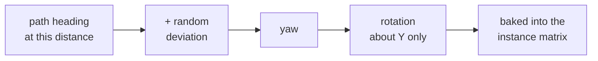

# Rotating flat illustrations so they read as scenery

Rock Runner dresses its world entirely in 2D illustrations — trees, bushes,
flowers, grass, rocks — standing on a track that curves continuously. Each one is
a single textured quad. This is how they are turned to face the player, why the
turn is baked rather than computed each frame, and why a couple of degrees of
deliberate error matters more than the alignment itself.

## The problem a flat picture has

A quad has no thickness. Seen face-on it reads as a tree; seen edge-on it
disappears entirely, and seen from anywhere between it reads as a picture of a
tree lying at an angle. Any world dressed this way has to keep its quads pointed
somewhere near the viewer, and the usual answer is billboarding: rotate every
quad towards the camera every frame.

That answer is expensive here for a reason particular to this game. The scenery
is instanced — thousands of quads share one draw call per texture per chunk — and
an instanced mesh stores its transforms in one buffer. Rotating them per frame
means rewriting that whole buffer every frame and re-uploading it, which trades
away most of what instancing bought.

## The constraint that makes the cost unnecessary

The chase camera is not free. It sits behind the rock and looks along the track,
so its heading at any point is the path's heading at that point, give or take the
smoothing that keeps it from snapping through corners.

That turns a per-frame problem into a build-time one. A quad does not need to
know where the camera is if it can be aligned to the path instead: the two agree
closely enough that the difference never reads as a picture lying at an angle.
The alignment is therefore computed once, when the instance is placed, and never
touched again.

## Why the rotation is about one axis only

The quad is rotated about the world's vertical axis and nothing else. This is not
a simplification — it is the whole requirement.

A tree is defined as much by standing upright as by its silhouette. Rotating it
about any horizontal axis tips it over, and because the illustration is flat, a
tipped tree does not read as a leaning tree: it reads as a picture of a tree
falling through the ground. Only the vertical axis preserves what the image is
supposed to depict.

This is also why a true camera-facing billboard would be wrong even if it were
free. Pointing a quad _at_ a camera that sits above the rock would pitch it
backwards. Scenery billboards want the yaw of a camera-facing rotation and none
of its pitch, which is exactly what aligning to the path heading gives.

| Axis              | Effect on a flat tree                          | Verdict           |
| ----------------- | ---------------------------------------------- | ----------------- |
| Vertical (yaw)    | Turns to face the viewer, stays upright        | The only one used |
| Lateral (pitch)   | Tips forward or back, sinks through the ground | Never             |
| Along-path (roll) | Leans sideways, reads as falling over          | Never             |

## Why exact alignment is the wrong target

Giving every instance the path's heading exactly is the obvious thing to do, and
it looks wrong. Quads that share a heading are parallel planes, and parallel
planes catch light and edges identically, so a stand of trees stops reading as
individual objects and starts reading as one flat backdrop. The illusion breaks
not because the quads are flat but because they are flat _in unison_.

The fix is to spoil the alignment slightly. Each instance takes the path heading
plus a small symmetric random deviation, so no two neighbours are quite parallel
and the eye stops finding the shared plane.

How much deviation depends on what the illustration depicts:

| Family                 | Deviation         | Why                                                                                                                                |
| ---------------------- | ----------------- | ---------------------------------------------------------------------------------------------------------------------------------- |
| Grass, flowers, bushes | About two degrees | Enough to break the shared plane; more would show the quad edge on small, wide images                                              |
| Trees, rocks           | About ten degrees | Tall and narrow, so they tolerate far more turn before the edge is visible, and they benefit most from looking individually placed |

The general rule is that a quad's tolerance for rotation is set by its aspect: a
tall narrow image can turn a long way before its edge becomes a visible sliver,
while a short wide one cannot.

The same random deviation is applied to size, for the same reason. Uniform scale
is as detectable as uniform heading.

## Degrees at the edge, radians inside

The elements panel exposes rotation variation in degrees, because that is the
unit anyone tuning scenery thinks in, and a slider reading `0.18` for ten degrees
is unusable. Everything downstream works in radians, because that is what the
rotation maths takes.

The conversion belongs at exactly one place: the boundary where panel
configuration becomes placement configuration. Converting anywhere later means
some values in the system are degrees and some are radians with nothing in the
type to say which, and that mistake is silent — a value wrong by a factor of
fifty-seven still renders, just wrongly.

## What this approach gives up

Baking the rotation trades correctness at unusual viewing angles for costing
nothing per frame. The trade is invisible from the chase camera and visible from
the free camera: fly out sideways and the scenery reveals itself as a field of
quads all turned the same way, because they were aligned to a path heading rather
than to where you are now.

That is the right trade for a game played from behind a rolling rock, and it
would be the wrong one for a game that lets the player orbit freely. The
deciding question is not whether billboards should face the camera — it is
whether the camera is constrained enough that something cheaper predicts it.

## What generalises

- A per-frame problem is often a build-time one in disguise. Look for a
  constraint on the camera before writing code that runs every frame.
- Instancing changes the economics of anything per-instance and per-frame. Work
  that is cheap on one mesh becomes a buffer re-upload on thousands.
- Rotating a flat stand-in is a question about what the image depicts, not about
  geometry. Upright things must stay upright, which rules out every axis but one.
- Uniformity is what breaks these illusions, not flatness. A small deliberate
  error in a repeated value is usually worth more than accuracy in it.
